# Emergency Light

A step-by-step beginner tutorial designed to learn the basics of creating UV coordinates using the Zen UV addon for models intended for use in game engines.

<table>
<tr>
    <td><strong>EN</strong></td>
    <td><a href="../emergency_light_ukr/">UA</a></td>
    <td><a href="../emergency_light_rus/">RU</a></td>
</tr>
</table>

In this tutorial, you will learn the basic rules of creating UV unwraps and how to use the Zen UV tools for quick and comfortable work. You will receive basic information about the rules and recommendations for creating UV coordinates for game engines.

The tutorial covers the main stages that are optimal steps for processing any model:

- Model preparation
- Initial unwrap
- Checking the initial unwrap
- Step-by-step unwrapping of parts
- Packing
- Optimization

## Prepare scene

### Download example

1. Check that internet connection is enabled in Blender (this option is available since Blender 4.2).
    - Click on "Internet Connection" icon.
    - Enable internet access.

    

2. Using the [examples panel](../../help.md#examples), select and download the example called "Emergency Light Tutorial" by clicking on the "Download" button to the right of the title.

    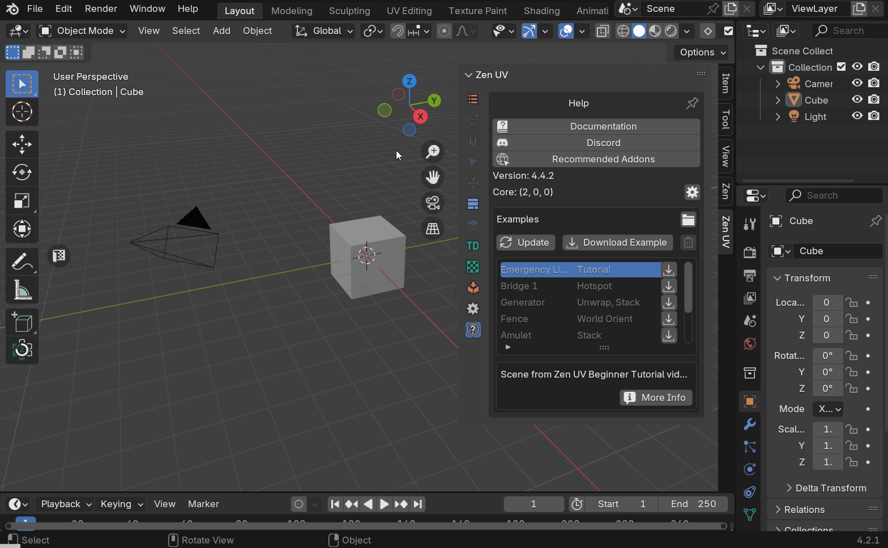

3. When the scene is downloaded, click the "Open" button that appears in place of the "Download" button.

    

4. Select "Emergency Light" object and switch to Edit Mesh mode.

    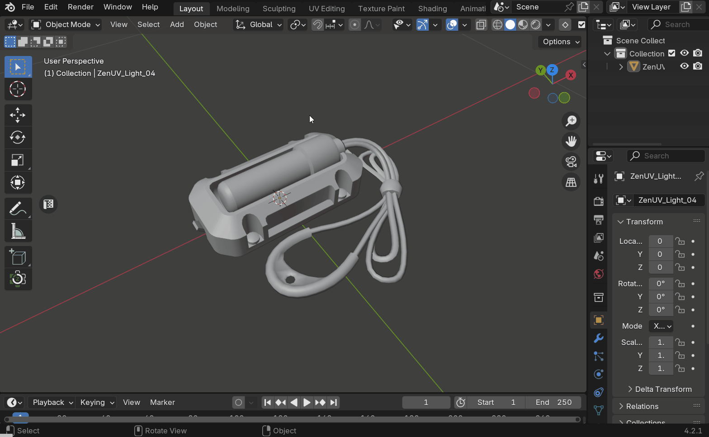

### Prepare model

1. Zen UV uses [**global mark system**](../../unwrap.md#mark-by-angle) by default. Let's change mark settings to mark Seam and Sharp at the same time.
    - Select [**Unwrap**](../../unwrap.md) tab and find "Properties" button placed to the right of "Mark by Angle" button.
    - Press it and in popup menu enable "Mark Sharp Edges" option.

    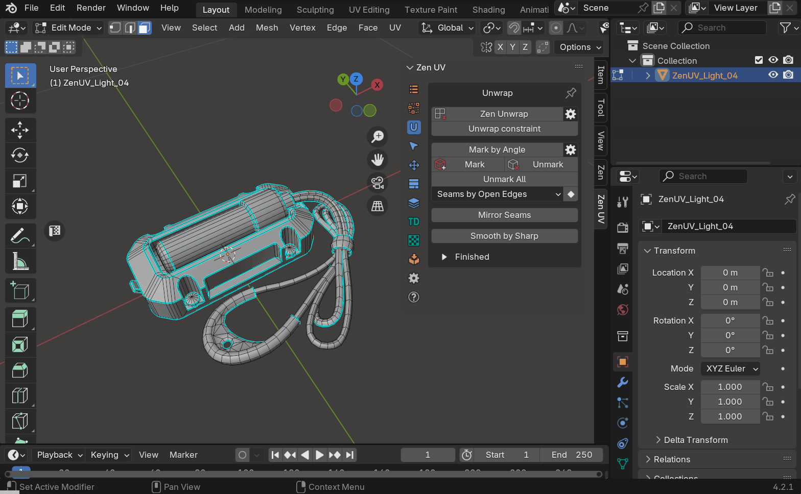

2. Press [**Unmark all**](../../unwrap.md#unmark-all) button in [**Unwrap**](../../unwrap.md) tab to clear all existing Seams and Sharp edges.

    

3. Let's check than there are no islands marked as [**Finished**](../../unwrap.md#finishing-system). [**Finished**](../../unwrap.md#finishing-system) tags helps to visually control islands state (finished/not finished) and prevents Zen Unwrap operator to re-unwrap [**Finished**](../../unwrap.md#tag-finished) islands.
    - Select all polygons.
    - Expand [**Finished**](../../unwrap.md#finishing-system) panel in [**Unwrap**](../../unwrap.md) tab and press [**Tag Unfinished**](../../unwrap.md#tag-unfinished).

    

4. Delete all UV Maps.
    - Switch to [**Advanced UV Maps**](../../adv_uv-maps.md) tab.
    - Select all UV Maps.
    - Press "-" (delete) button.

    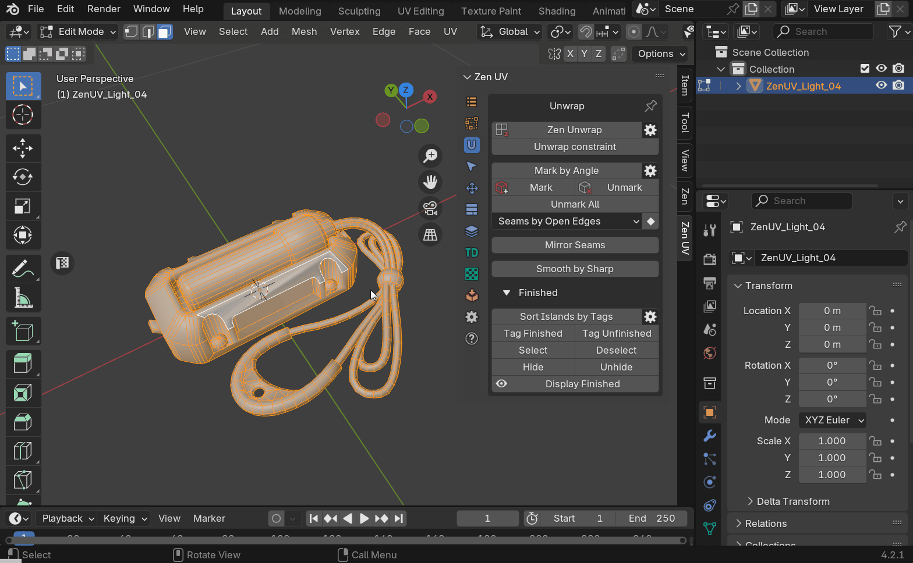

    !!! tip
        Zen UV automatically control UV Maps and will create new one if there are no, so there is no necesserity to create UV Map manually.

5. An important part of the prepare is to check the scale of the objects for which UV coordinates will be created. The scale of each object should be equal to (1.00, 1.00, 1.00), as it can affect the work of the unwrap operators. Also, an incorrect scale can affect the relative size of islands when [packing](../../pack.md) and when setting [textel density](../../texel_density.md). Editing the scale of objects is performed in Object Mode.
    - Turn on Object Mode.
    - In the 3D View main menu, click **Object - Apply - Apply Object Transform**.
    - Make sure that the object scale is (1.00, 1.00, 1.00).

    

    !!! tip
        Scaling and other object transformations are used primarily for animation and other purposes. If you're working with objects that have animations or form a hierarchy, performing **Object - Apply - Apply Object Transform** is dangerous because it will distort the animation and destroy the hierarchy.

### Initial unwrap

1. Now when everything is ready, we can start unwrapping. The first step is to split the model into UV islands. At this stage, it doesn't matter how well these islands are unwrapped. We just separate them. We will mark the seams depending on the edge angle. Sharper edges will be marked as seams and thus define the places where the model will be split.
    - Turn on Edit Mode
    - Press "Mark By Angle" in [**Unwrap**](../../unwrap.md) tab.

    

2. Almost all **Zen UV** operations could be executed in **3D View**, but it is more comfortable to visually control them in **UV Editor**. There is a special **UV Editor** gizmo widget in **3D View**.
    - Press [**Open UV Editor**](../../sticky_uv_editor.md#sticky-uv-editor) button placed at the left center part of **3D View** viewport. The button works as toggle, so if **UV Editor** is open it will be closed.

    

3. We have created seams depending on the edge angle, but have not yet divided the model into islands. To do this, we will use the [Zen Unwrap](../../unwrap.md#zen-unwrap) operator, which works depending on what is selected. So at this stage, make sure that nothing is selected. In the mode when nothing is selected, [Zen Unwrap](../../unwrap.md#zen-unwrap) simply splits the model into UV islands along the existing seams. If something is selected, the result will be different.
    - Deselect all.
    - Press [**Zen Unwrap**](../../unwrap.md#zen-unwrap) button from [**Unwrap**](../../unwrap.md) tab.

    

Other modes of [**Zen Unwrap**](../../unwrap.md#zen-unwrap) operator will be demonstrated later in this tutorial.

### Switch on checker texture

1. At this stage, we have a basic division of the model into islands, but this is not enough. We need to visually check the model, create additional islands, and in the process straighten the existing islands if necessary. At this stage, it is important to improve the perception of artifacts in order to complete the work as quickly as possible. One of the most effective methods is to assign a special texture consisting of squares.If you see on the model that the squares are distorted or have a shape that is far from square, this means that the mapping in this place is incorrect. We are applying the special checking texture using [**Zen UV Checker**](../../checker.md) module.
    - Press "Checker Texture" button in [**UV Checker**](../../checker.md) tab.

    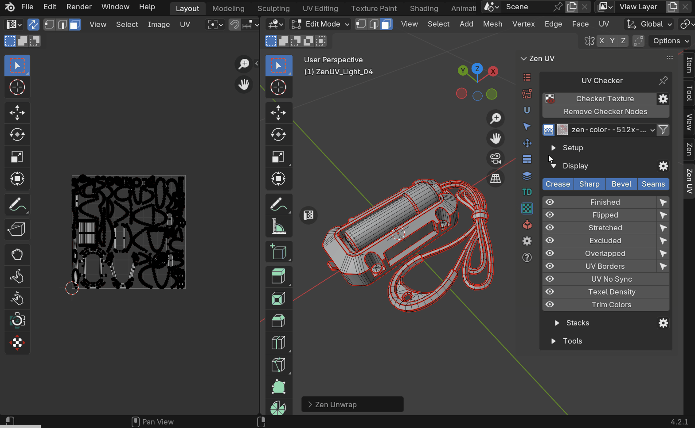

2. Colored textures are also created to determine the location of the island on the texture. But in our case, it doesn't matter. So let's switch the texture to monochrome. This will reduce the amount of information to be perceived and therefore reduce tiredness from work.
    - Open drop-down menu below "Checker Texture" button and select texture [**zen-mono-2048x2048**](../../checker.md#checker-textures-selector).

    

3. The next step is not important for this model, but you may need it in the future. Let's disable the display of all types of edges except seam. These properties duplicate the native display system options, but now they are in close access in the UV Checker panel. Remember about the tiredness of information overload.
    - Disable "Crease", "Sharp", "Bevel" in [**Blender draw system panel**](../../checker.md#blender-draw-system). Check that only "Seams" are left.

    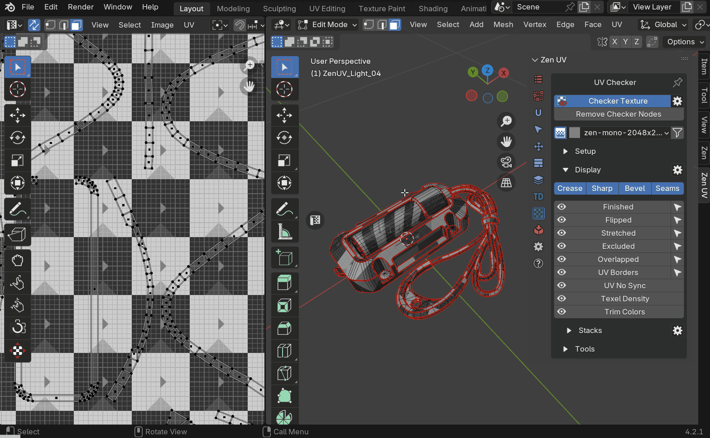

4. Textures for checking usually have a rather aggressive look and interfere with the perception of islands in **UV Editor**. **Zen UV** has the ability to darken the current texture for comfortable perception. 
    - Use the [Darken Image](../../checker.md#darken-image) operator located in the [UV Checker](../../checker.md) panel of the main addon panel in **UV Editor**.

    

    !!! tip
        [**Darken Image**](../../checker.md#darken-image) could be also found in UV Editor overlay properties.

5. Also we can simply delete texture in **UV Editor** because in this tutorial we will not use it for analysis in this context. 
    - Find active image property in the top of **UV Editor** and delete it.

    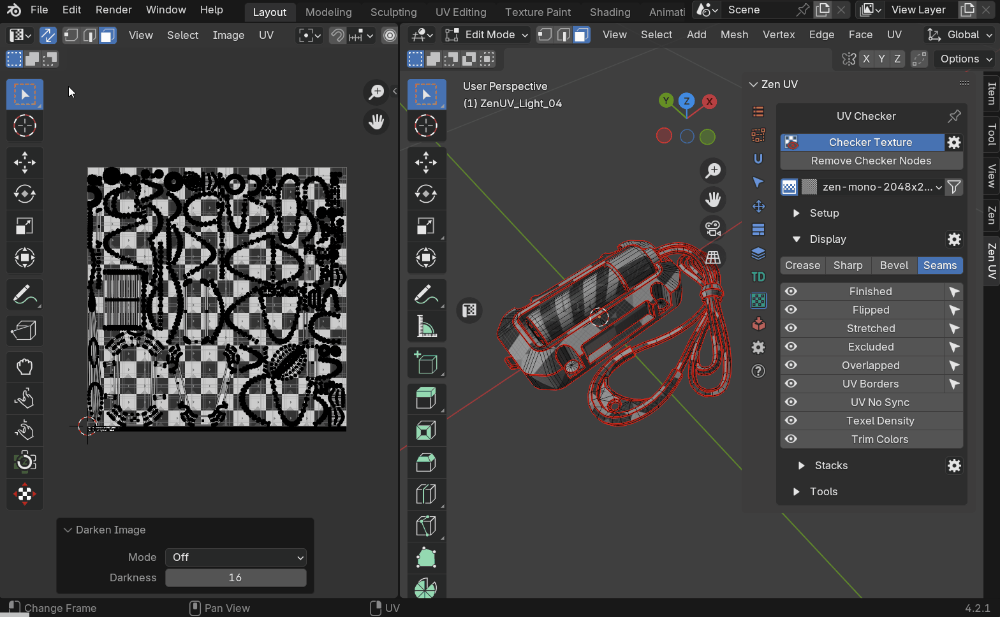

## Unwrap

Preparation is completed. Let's continue with model unwrapping.
It is convenient to divide this process into steps. Our model consists of several parts. So let's conditionally divide it into stages corresponding to each part separately.

### Unwrap internal cylindrical part

1. Let's start from cylindrical part. 
    - Select it in "UV Editor".
    - Press [**Isolate Island**](../../select.md#isolate-islands-toggle) button in [**Select**](../../select.md) tab.

    !!!tip
        This operator works like a toggle. This means that if you press it again now, everything that is hidden will appear again. It works in the same way as for 3D View and UV Editor.

    

    The main operator for creating islands in the Zen UV addon is [Zen Unwrap](../../unwrap.md#zen-unwrap). This is a multifunctional context operator. It performs different tasks depending on the following:

    - Which selection mode is currently active.
    - What exactly is selected at the time of its start.
    - What additional properties are enabled.

    Zen Unwrap tracks three main selection modes.

    - Faces
    - Edges
    - Verices

    If **Blender** is in **Faces** selection mode, a new island will be created from the selected polygons, and the edges along the border of the selected polygons will be marked as **seams**. Let's use this to create the first island.

    - Select cap and press [**Zen Unwrap**](../../unwrap.md#zen-unwrap) in [**Unwrap**](../../unwrap.md) tab

    

    Several more islands will be created in the process. They may be incorrect or not the same as in the video, but it doesn't matter now.

2. Let's use the **Edges** selection mode to unwrap the next island.

    - Switch **Blender** to **Edges** selection mode. In this mode, [**Zen Unwrap**](../../unwrap.md#zen-unwrap) will create **seams** for the selected edges and perform the unwrap.
    - Select one edge on the longest cylinder and click [**Zen Unwrap**](../../unwrap.md#zen-unwrap).

    !!! tip
        The places where **seams** will be created can usually be too visible on the texture and will require additional masking. In order not to waste time on this, try to create gaps in places that are not very visible. So, in our case, it is recommended to select one of the lower edges because it will definitely be covered by the outer part of the model.

    

    As you can see, [**Zen Unwrap**](../../unwrap.md#zen-unwrap) follows your instructions exactly and unwraps the islands despite the fact that we change the selection type. You don't even need to open its settings to do this. As a result, we got the largest island of this part correctly unwrapped.

3. Unwrap the second cap. 
    - Switch **Blender** selection into **Faces** mode.
    - Select cap.
    - Press [**Zen Unwrap**](../../unwrap.md#zen-unwrap).

    

4. When using **Mark by Angle**, unwanted **seams** were created, which divided the model into more islands than necessary. To fix this, use the [**Zen Unwrap**](../../unwrap.md#zen-unwrap) operator again.
    - Select all the polygons of the largest cylinder and press [**Zen Unwrap**](../../unwrap.md#zen-unwrap). As a result, all the selected islands are merged into one, and the edge of the selected polygons are marked as **seams**.

    

5. At this point, we've finished creating the islands, but many of the islands are still deformed. You can switch to **edges** selection mode and follow the same steps as for the largest cylinder, but the islands that have a slightly more complex shape will not be aligned sufficiently. Let's use the [**Quadrify**](../../transform.md#quadrify-islands) operator, which aligns the islands created from quads into a square grid.
    - Switch to **edges** selection mode.
    - Select one lengthwise edge, and click the [**Quadrify**](../../transform.md#quadrify-islands) button in the [**Transform**](../../transform.md) panel.

    

    !!! tip
        Such usage of the Quadrify operator is fast but not always optimal. If you do not specify to the operator where you want to make a break, the island break will be created automatically and may not be in the optimal location. For full control over the creation of the gap, use the **Use Selected Edges** option. You can also create a gap before using Quadrify using other methods.

6. Let's change some operator properties.

    - Open the operator properties panel.
    - Activate the **Use Selected Edges** option. This will tell the operator to split the island along the selected edge.
    
    

    - Do the same for all remaining islands.

    

7. Now some islands in the UV Editor may overlap others. In order to make sure that each island is unwrapped correctly, we will perform a packing. This will improve the visual perception of all the islands.
    - Click the [**Pack Islands**](../../pack.md#pack-islands) button from the [**Pack**](../../pack.md#pack) panel.

    

8. We will continue working on other details soon, but first we will use the [**Finished**](../../unwrap.md#finishing-system) system. This will make it possible to visually control which islands have already been unwrapped and protect finished islands from being unwrapped again.
    - Go to the [**Unwrap**](../../unwrap.md) tab.
    - Expand the panel called Finished. 
    - Select all the islands.
    - Click the [**Tag as finished**](../../unwrap.md#tag-finished) button from the [**Finished**](../../unwrap.md#finishing-system) panel.

    

!!! tip
    Islands that are tagged **Finished** are sorted and moved to the right of the **UV Area**. This is the default behavior, but it can be disabled by switching off the **Auto Sort Islands** option to the right of the **Sort Islands by Tags** operator in the [**gear button**](../../unwrap.md#finished-preferences) dialog.

### Unwrap external part

1. Go to the next detail. To do this, we need to unhide all the parts of the model.
    - Click [**Isolate Island**](../../select.md#isolate-islands-toggle) from the [**Select**](../../select.md) panel to unhide all hidden islands.

    

    - Select the part of the model that looks like the outer shell.

    

    - Click [**Isolate Island**](../../select.md#isolate-islands-toggle) again. Now we have only the part we need visible. The other parts are hidden and will not get in the way.

    

2. This part has clear contours, correct seams, but some islands could be improved. The inner part is a cylinder that can be represented by one island instead of several. Let's create one island from the interior.
    - Select the entire interior except for the island, which is a polygon.
    - Click [**Zen Unwrap**](../../unwrap.md#zen-unwrap).

    

3. The created island may look better if you align it into a square grid. Use the [**Quadrify**](../../transform.md#quadrify-islands) operator. Please note. If you have the **Use Selected Edges** option activated, then you'd better switch to the faces selection mode. Because in the edges selection mode, the [**Quadrify**](../../transform.md#quadrify-islands) operator will break the island along the selected edges. Also, note that **Zen UV** is always trying to help you, and in order to tell the operator which island you want to work with, you do not need to select the entire island. It is enough to select one or more polygons.
    - Select one or more polygons in the island inside the current part, and then click [**Quadrify**](../../transform.md#quadrify-islands).

    

4. The next island is too large, cyclic, and inverted. To get rid of these problems, divide it into several smaller islands.
    - Select the side edges.
    - Click [**Zen Unwrap**](../../unwrap.md#zen-unwrap).

    

5. The island representing the upper end is correctly unwrapped, but we can make it more compact. Also, we need to make sure that the boundary edges of any island are aligned along the axes as much as possible. This will make gaps in the texture much less obvious.
    - Select one or more faces of the top island.
    - Click [**Select Island**](../../select.md#select-islands) from the [**Select**](../../select.md) panel.
    - Switch to the top view and use the **Project From View** operator to create a flat island from the selected polygons.

    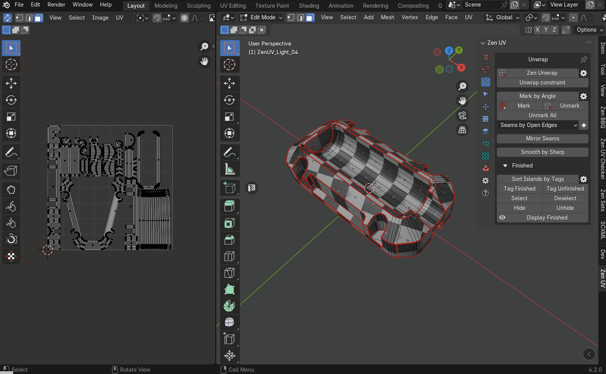

6. Splitting into islands is done. Make [**Pack**](../../pack.md#pack) and [**Tag Finished**](../../unwrap.md#tag-finished) in the same way as previous parts.

    

7. Click [**Isolate Island**](../../select.md#isolate-islands-toggle) to show all other parts and be ready for the next step of the tutorial.

### Unwrap small details

1. Isolate small details for more comfortable work.
    - Select all small details.
    - Click [**Isolate Island**](../../select.md#isolate-islands-toggle)

    

2. The [**Mark by Ange**](../../unwrap.md#mark-by-angle) operator worked correctly on all small parts except for cylindrical parts. Let's fix it.
    - Select one edge on each of the cylinders and click [**Zen Unwrap**](../../unwrap.md#zen-unwrap).

    

3. Go to the part that holds the wires together. It has been divided into several parts, which is not the optimal shape. It is enough to separate the ends and leave the rest as one island.
    - Select the entire part.
    - Deselect the ends.
    - Run [**Zen Unwrap**](../../unwrap.md#zen-unwrap).

    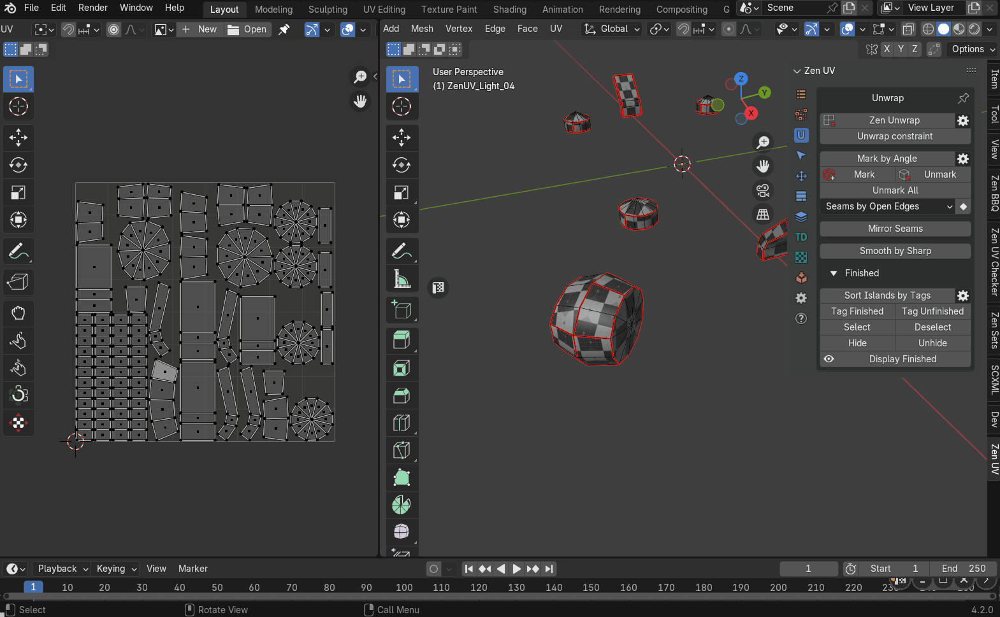

4. We have created one island, but its mapping is still incorrect (Rectangles are distorted on Checker texture). We need to break and flatten the radial island.
    - Select the pair of edges where you want to split.
    - Run [**Zen Unwrap**](../../unwrap.md#zen-unwrap).

    

5. At this stage, we have the correct split into islands, but some islands have stretches. Some other islands are not optimally shaped. We need to select and align all the islands that consist of quads.
    - Use the [**Select Quaded Islands**](../../select.md#select-quaded-islands) operator from the [**Select**](../../select.md) panel.

    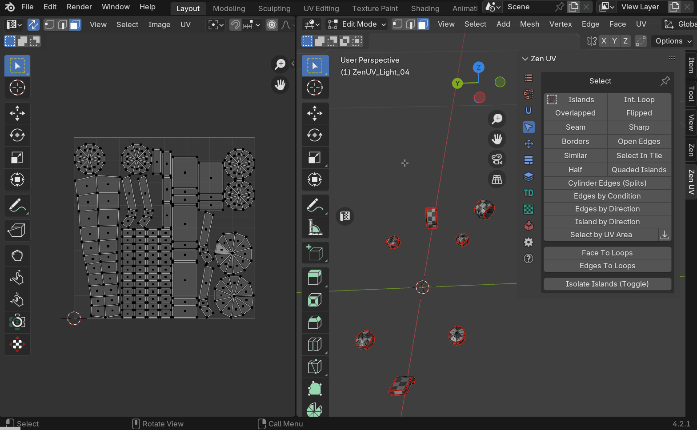

    - Use the [**Quadrify**](../../transform.md#quadrify-islands) operator to align all the selected islands into a square grid.

    

6. Make [**Pack**](../../pack.md#pack) and [**Tag Finished**](../../unwrap.md#tag-finished) to finalize unwrapping small details.

    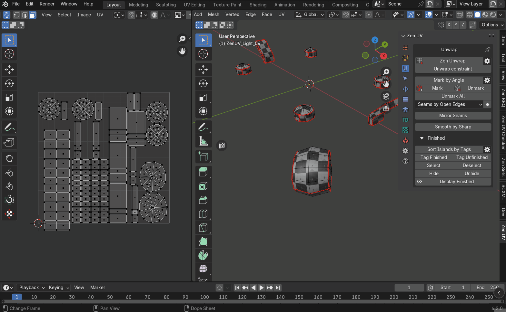

7. Click [**Isolate Island**](../../select.md#isolate-islands-toggle) to show all other parts and be ready for the next step of the tutorial.

### Unwrap wires

1. Isolate the wires for more comfortable work.
    - Select all the wires.
    - Click [**Isolate Island**](../../select.md#isolate-islands-toggle) to hide all unnecessary parts.

    

2. You can see that each wire is currently divided into several islands. Let's make sure that each wire is represented by a single island. Select all the polygons and click [**Zen Unwrap**](../../unwrap.md#zen-unwrap).

    

3. We have a split where each wire represents one island, but the unwrapping is incorrect. Let's unwrap the wires in the fastest way.
    - Make sure that all islands are selected.
    - Use the [**Quadrify**](../../transform.md#quadrify-islands) operator to align each island into an even grid.

    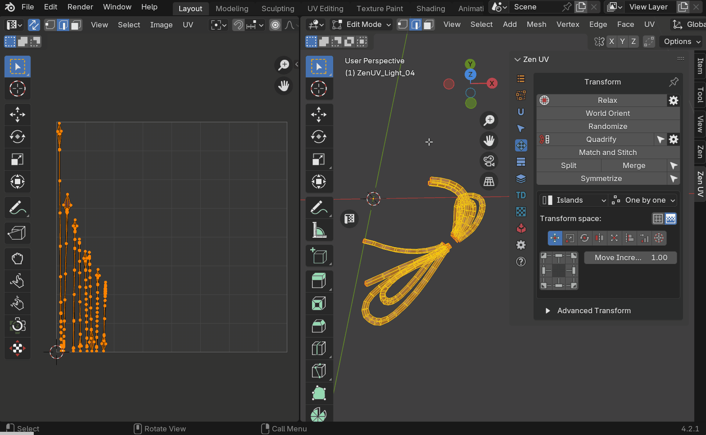

    !!! Tip
        In the case of unwrapping wires or other similar models, it is very convenient to use the **Use Selected Edges** option of the **Quadrify** operator, which we have reviewed earlier. This way we will get the breaks exactly where we need them on the first try.

4. Finally, we will pack for better visual control and mark the islands as finished.
    - Run [**Pack**](../../pack.md#pack).
    - Execute [**Tag Finished**](../../unwrap.md#tag-finished) to complete the wire unwrap.

    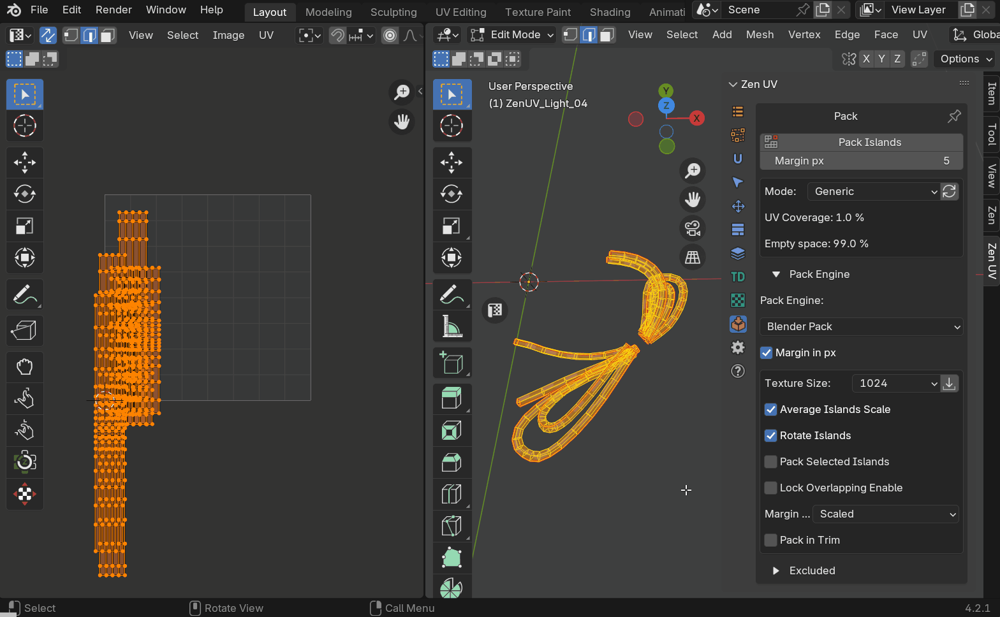

5. Click [**Isolate Island**](../../select.md#isolate-islands-toggle) to show all other parts and be ready for the next step of the tutorial.

### Unwrap handle

1. Isolate handle for more comfortable work. Let's use something from the [Finished](../../unwrap.md/#finishing-system) system.
    - Click [**Isolate Island**](../../select.md#isolate-islands-toggle) to display all the parts.
    - Click [Select](../../unwrap.md/#select-finished) in the [Finished](../../unwrap.md/#finishing-system) panel.
    - Click [Hide](../../unwrap.md/#hide) in the [Finished](../../unwrap.md/#finishing-system) panel.
    
    

2. This part consists of several islands, which is not an optimal solution. Let's create a single island instead of multiple islands.
    - Select all the islands that belong to the handle.
    - Deselect the ends that look like hexagons.
    - Click [**Zen Unwrap**](../../unwrap.md#zen-unwrap).

    

3. The island that was created as a result of the latter actions has an incorrect shape. Let's fix it.
    - Select the edges belonging to the hole and the edges belonging to the inner edge of the handle.
    - Click [**Zen Unwrap**](../../unwrap.md#zen-unwrap)

    

4. Now we have an unwrapped island. The presence of triangular faces in it does not allow to use the [**Quadrify**](../../transform.md#quadrify-islands) operator for maximum smoothing. Let's take this island as an example of how the [**Reshape Island**](../../transform.md#reshape-island) operator works. The essence of [**Reshape Island**](../../transform.md#reshape-island) is that it aligns the selected edge loops into a straight line and relaxes the remaining vertices.
    - Select all the edges that run lengthwise through the center of the island.
    - Click [**Reshape Island**](../../transform.md#reshape-island) to align the island.

    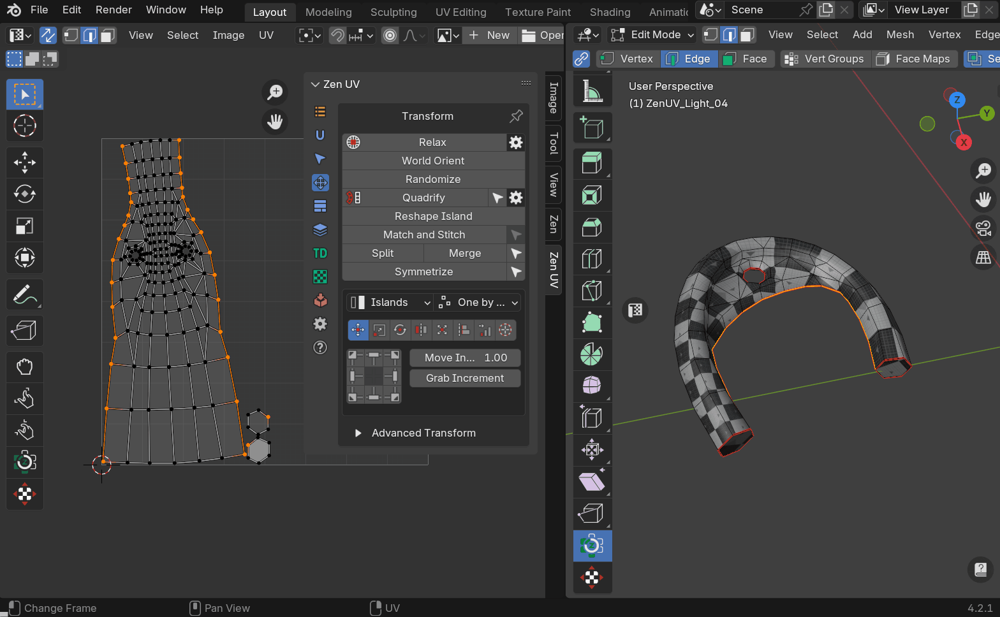

5. The island unwrapping can be considered complete. Let's mark it as finished. 
    - Run the [**Pack**](../../pack.md#pack) operator.
    - Select all the islands.
    - Tag them with [**Tag Finished**](../../unwrap.md#tag-finished) to complete the unwrapping of the handle.

    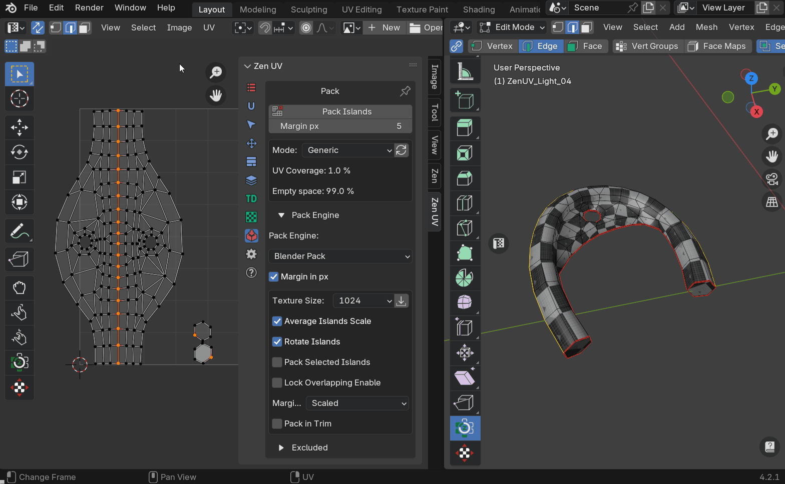

6. Click [**Isolate Island**](../../select.md#isolate-islands-toggle) to show all other parts and be ready for the next step of the tutorial.

## Pack

The previous stage of island creation and unwrapping is completed. Now it's time to place the islands on the texture in such a way as to reduce the amount of free space. All free space on the texture is a waste of resources.

### Final pack

1. Make sure there are no hidden parts. And then pack it up.
    - In the **3D View** in the main menu, click **Mesh - Show/Hide - Reveal Hidden**.
    - Use the [**Pack**](../../pack.md#pack-islands) operator to pack the islands.

    

### Reduce empty UV space by stacking

1. At this stage, we have tightly packed parts and the work can be considered complete. But if you analyze the construction of the model, you will notice that some islands look similar and are even copies of each other. For example, the cutouts for bolts, the bolts themselves, some small details, etc. To save space on the texture, identical islands can be stacked on top of each other. In terms of creating UV coordinates, this process is called **Stacking**.
    - Open the [**Stack**](../../stack.md) tab.
    - Click the [**Replicas**](../../stack.md#replicas) button. Now we have selected islands that have copies. These islands are called **Replicas**. And their prototypes remain unselected.

    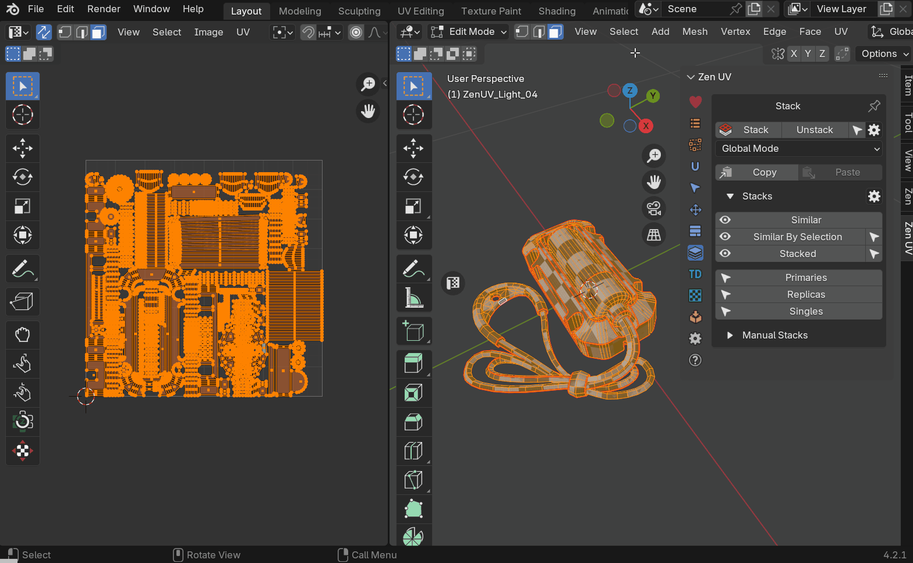

    - Move the selected islands away from the **UV Area**. Now only unique islands that do not have copies (**Singles**) and islands that are prototypes (**Primaries**) remain in the **UV Area**.

    

2. In this tutorial, we are using the [**Blender Pack Engine**](../../pack.md#pack-engine). The following steps for packing will be described for this engine.
    - Hide the islands that have been moved to the side.

    

    - Set the correct (desired) [**Texture Size**](../../pack.md#texture-size) in the [**Pack**](../../pack.md) panel. For this particular tutorial, the texture size does not matter, but you may plan to create a texture by another tutorial.

    

    - Set the required value to [**Margin**](../../pack.md#margin), which will ensure the correct appearance of the texture when the camera is moved away.

    

    - Repack using the [**Pack**](../../pack.md#pack-islands) button.

    

    - In the [**Stack**](../../stack.md) panel, switch the system to **Selected** mode.
    - In order to show hidden **Replicas** in the **3D View** in the main menu, click **Mesh - Show/Hide - Reveal Hidden**.
    - Select everything except **Replicas**.
    - Click [**Stack**](../../stack.md#stack) to stack the unselected **Replicas** in place of the selected **Primaries**.

    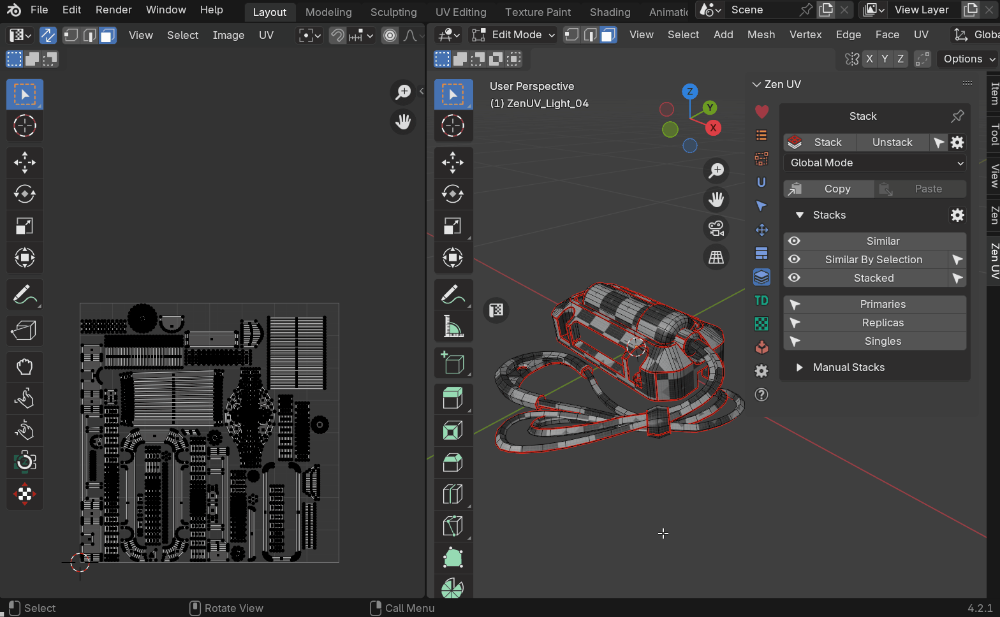

The packing and stacking is completed. There are only a few final steps left to complete the model.

## Set sharp edges

1. Correctly set sharp edges are not only a guarantee of a good appearance of the model, but also a guarantee of baking **normal map** without errors.
    - Use the [**Sharp by UV Borders**](../../unwrap.md#sharp-by-uv-borders) operator. This operator marks the edges that are the boundary edges of the islands as **sharp**.

    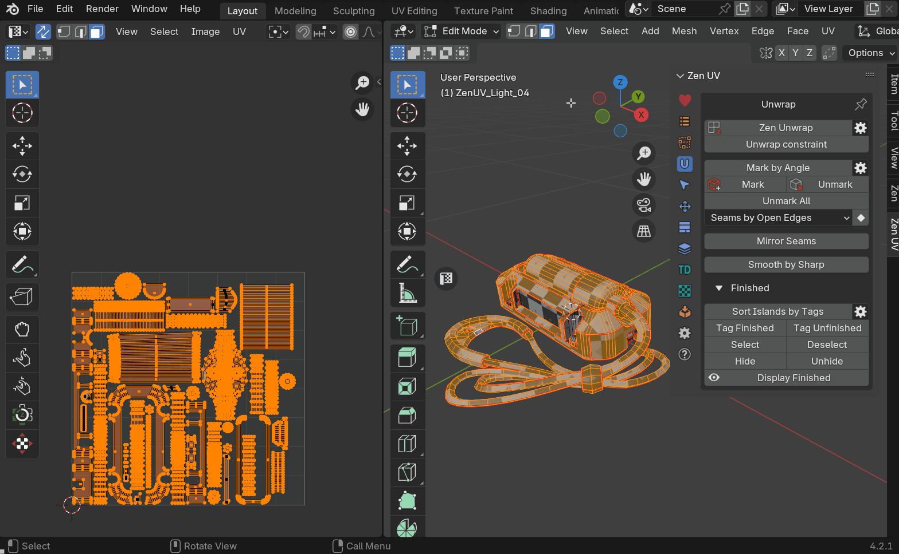

    - In the operator settings, turn on the **Unmark sharp** option. This will erase any sharp edges that have been previously set.

    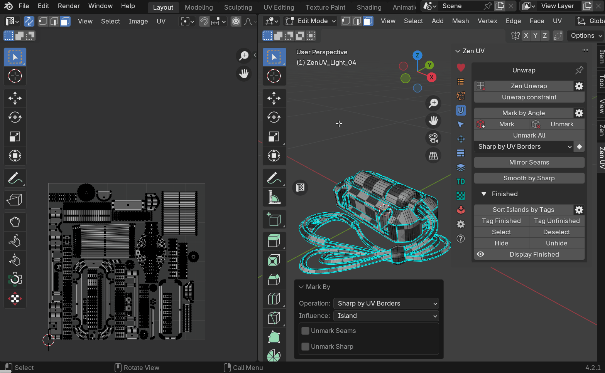

2. There are two ways to set the edge sharpness in Blender.

    - By setting the polygon property to Shade Smooth / Shade Sharp.
    - By using the Sharp edge property.

    Both methods can work simultaneously, which often leads to artifacts when using the normal map.
    Since we have already set the sharp edges as we need them using the Sharp edge property, let's exclude the possibility of the Smooth/Sharp polygon property affecting the sharpness of the edges. In Zen UV, there is a [Smooth by Sharp](../../unwrap.md#smooth-by-sharp-toggle) operator.

    - Click the [Smooth by Sharp](../../unwrap.md#smooth-by-sharp-toggle) button. This will set all polygon smoothing to match sharp edges.

    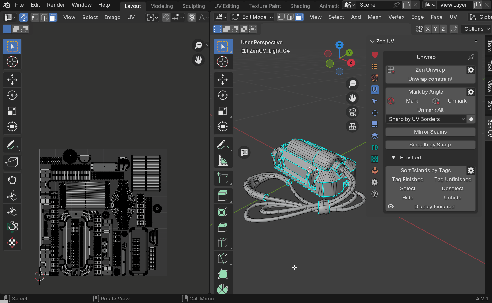

Now the **Emergency light** model has correct and optimized UV coordinates and is ready for texture creation and normal map baking.

!!! tip
    You can manually adjust the correct display of **Sharp Edges**. To do this, follow the steps described below.

    - In Blender since version 4.1:
        - Switch to Object Mode.
        - From the 3D View main menu, select **Object - Shade Smooth**.

    - In Blender versions before 4.1:
        - Switch to Object Mode.
        - From the 3D View main menu, select **Object - Shade Auto Smooth**.
        - In the operator settings, turn on the “Auto Smooth” option.
        - Set the Angle parameter to 180 degrees.
