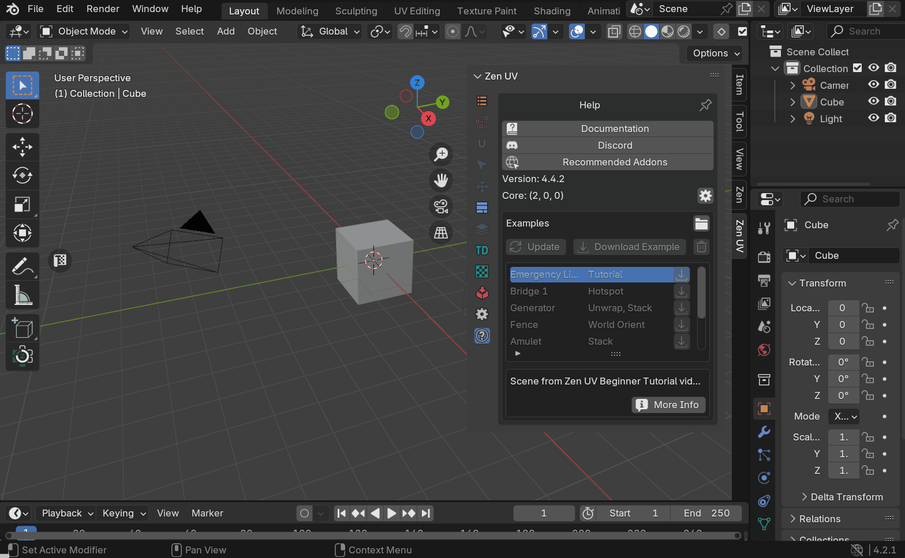
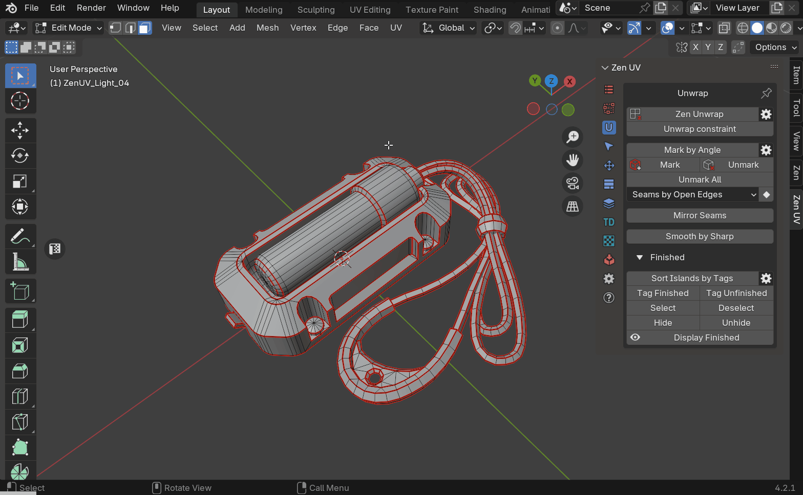
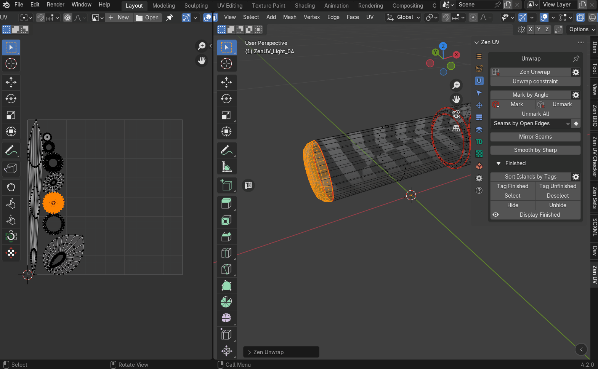
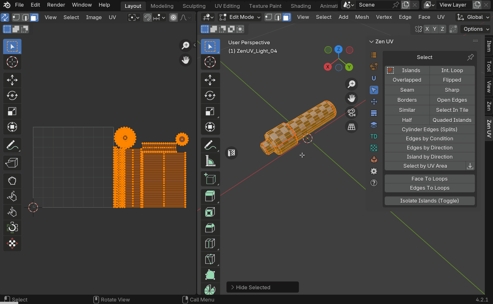
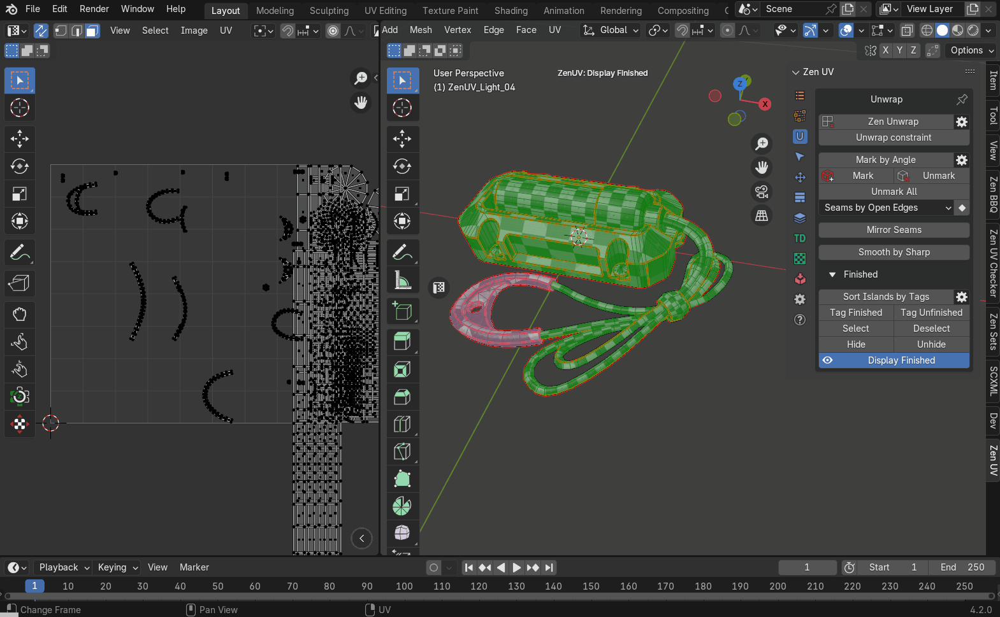
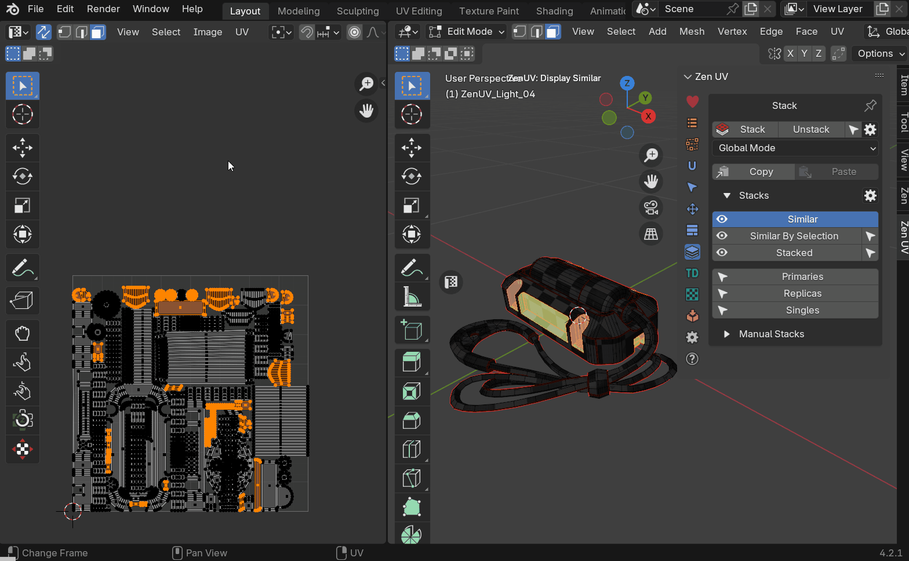

<table>
<tr>
    <td><strong>RU</strong></td>
    <td><a href="../emergency_light_eng/">EN</a></td>
    <td><a href="../emergency_light_ukr/">UA</a></td>
</tr>
</table>

# Фонарь аварийного освещения

Пошаговый туториал базового уровня, предназначенный для изучения основ создания UV-координат с помощью аддона Zen UV для моделей, в ходе которого вы узнаете основные правила создания развертки и научитесь использовать инструменты Zen UV для быстрой и комфортной работы. Вы получите базовую информацию о правилах и рекомендациях по созданию UV-координат для игровых движков.

В туториале рассмотрены основные этапы, которые являются оптимальными шагами для обработки любой модели:

- Подготовка модели
- Начальная развертка
- Анализ начальной развертки
- Пошаговая развертка частей
- Упаковка
- Оптимизация

## Подготовка сцены

### Загрузка примера

1. Убедитесь, что подключение к Интернету включено в Blender (эта опция доступна, начиная с версии Blender 4.2).
    - Нажмите на иконку подключения к Интернету. Если иконка отсутствует, значит доступ к интернету уже активирован.
    - Разрешите доступ к интернету активацией опции **Allow Online Access**.

    

2. Используя [examples panel](../../help.md#examples) выберите и загрузите пример, который называется Emergency Light Tutorial нажав кнопку Download справа от названия.

    

3. Когда сцена скачается, нажмите кнопку Open, появившуюся на месте кнопки Download.

    

4. Выберите объект с названием Emergency Light и перейдите в режим редактирования.

    

### Подготовка модели

1. По умолчанию Zen UV использует [систему глобальной маркировки](../../unwrap.md#mark-by-angle). Настроим так, чтобы Seam и Sharp маркировались одновременно.
    - Откройте вкладку [Unwrap](../../unwrap.md). Настройки находятся в меню на кнопке с шестерней справа от кнопки Mark by Angle.
    - Откройте меню и активируйте Mark Sharp Edges.

    

2. Чтобы стереть все существующие Seams и Sharp, во вкладке [Unwrap](../../unwrap.md) нажмите кнопку [Unmark all](../../unwrap.md#unmark-all).

    

3. Проверим нет ли островов тегированных как [Finished](../../unwrap.md#finishing-system). Система [Finished](../../unwrap.md#finishing-system) служит для визуального контроля за состоянием островов (закончены/не закончены) и не позволяет оператору Zen Unwrap развертывать острова если они тегированы как [Finished](../../unwrap.md#tag-finished).
    - Выделите все полигоны в модели.
    - На вкладке [Unwrap](../../unwrap.md) откройте панель [Finished](../../unwrap.md#finishing-system) и нажмите кнопку [Tag Unfinished](../../unwrap.md#tag-unfinished).

    

4. Удалите все имеющиеся UV координаты.
    - Перейдите во вкладку [Advanced UV Maps](../../adv_uv-maps.md).
    - Выделите все имеющиеся UV карты.
    - Нажмите кнопку "-".

    

!!! tip
    Нет необходимости создавать новую UV Map. Zen UV работает с UV координатами и следит за тем, чтобы были текущие UV Maps. Если таковых нет, то они будут созданы автоматически.

5. Важной частью подготовки является проверка масштаба объектов, для которых будут создаваться UV координаты. Масштаб каждого объекта должен быть равным (1.00, 1.00, 1.00, 1.00), поскольку он может влиять на работу операторов развёртки. Также некорректный масштаб может влиять на относительный размер островов при [паковке](../../pack.md) и при установке [плотности текселя](../../texel_density.md) ([Texel Density](../../texel_density.md)). Редактирование масштаба объектов выполняется в режиме Object Mode.
    - Включите Object Mode.
    - В главном меню 3D View нажмите **Object - Apply - Apply Object Transform**.
    - Убедитесь что масштаб объекта составляет (1.00, 1.00, 1.00).

    

    !!! tip
        Масштабирование и другие трансформации объектов используются в основном для создания анимации и в других целях. Если вы работаете с объектами, которые имеют анимацию или образуют иерархию, выполнять **Object - Apply - Apply Object Transform** опасно, поскольку это приведет к искажению анимации и нарушению иерархии.

### Начальная развёртка
1. Сейчас, когда все подготовлено, мы можем начинать развёртку. Этап первый – это разделение модели на UV острова. На этом этапе не имеет значения, насколько эти острова корректно развернуты. Мы только разделяем. Произведем разметку швов в зависимости от остроты рёбер. Более острые рёбра будут отмечены как швы и тем самым определят места где будет разделена модель.
    - Включите Edit Mode.
    - Во вкладке [Unwrap](../../unwrap.md) нажмите кнопку Mark By Angle.

    

2. Почти все операции в Zen UV могут быть выполнены в 3D View, но нет более комфортного способа взаимодействовать с UV Maps чем использовать UV Editor. Для того чтобы быстро открыть UV Editor, воспользуйтесь виджетом в 3D View.
    - Нажмите кнопку  с буквой "T" расположенную слева по центру 3D View viewport. В случае если UV Editor уже открыт, по нажатию на эту кнопку он закроется. [Open UV Editor area](../../sticky_uv_editor.md#sticky-uv-editor)

    

3. Мы создали швы в зависимости от остроты рёбер (edges), но еще не разделили модель на острова. Для разделения используем оператор [Zen Unwrap](../../unwrap.md#zen-unwrap) работающий в зависимости от того, что выделено. На данном этапе убедитесь, что ничего не выделено. В режиме когда ничего не выделено [Zen Unwrap](../../unwrap.md#zen-unwrap) просто разделяет модель на UV острова по существующим seams. Если что-то выделено, результат будет другим.
    - Убедитесь, что ничего не выделено.
    - Нажмите [Zen Unwrap](../../unwrap.md#zen-unwrap) в панели [Unwrap](../../unwrap.md).

    

Другие режимы работы [Zen Unwrap](../../unwrap.md#zen-unwrap) мы рассмотрим в ходе этого туториала.

### Включаем текстуру для проверки

1. На этом этапе мы имеем базовое разделение модели на острова, но этого недостаточно. Нужно визуально проверить модель, создать дополнительные острова и в процессе расправить уже существующие острова, если это необходимо. На этом этапе важно улучшить восприятие атрефактов для того, чтобы выполнить работу как можно быстрее. Одним из самых действенных методов является назначение специальной текстуры, состоящей из квадратов. Если вы видите на модели искривленный квадрат, значит, в этом месте есть проблемы с разглаживанием острова. Наложим эту специальную текстуру используя [Zen UV Checker](../../checker.md).
    - На панели [UV Checker](../../checker.md) нажмите кнопку Checker Texture.

    

2. Цветные текстуры также используются для определения положения острова на текстуре. Однако в нашем случае это не имеет значения, поэтому переключим текстуру на монохромную. Это уменьшит количество визуальной информации, что снизит нагрузку на восприятие и уменьшит усталость от работы.
    - Откройте drop-down меню ниже кнопки Checker Texture и выберите текстуру с названием ['zen-mono-2048x2048' texture image](../../checker.md#checker-textures-selector)

    

3. Следующий шаг не важен для этой модели, но может пригодиться в будущем. Выключим отображение всех типов edges кроме seam. Эти свойства являются копией нативной системы отображения, но теперь они в близком доступе на панели UV Checker. Помним об усталости от переизбытка информации.
    - В [Blender draw system](../../checker.md#blender-draw-system) отключите свойства отображения Crease, Sharp, Bevel. Оставьте включенным только отображение Seams.

    

4. Текстуры для проверки обычно выглядят довольно агрессивно и мешают восприятию островов в UV Editor. Zen UV имеет возможность затемнить текущую текстуру для комфортного восприятия. 
    - Используйте оператор [Darken Image](../../checker.md#darken-image) находящийся в панели [UV Checker](../../checker.md) основной панели аддона в UV Editor.

    

    !!! tip
        [DarkenImage](../../checker.md#darken-image) также можно найти в настройках оверлея в UV Editor.

5. Для этого туториала можно просто удалить текстуру из UV Editor, поскольку в данном случае она не имеет практического применения. 
    - Найдите строчку с названием текстуры сверху рабочей зоны UV Editor и нажмите кнопку с крестиком.

## Развёртка

Предварительный этап подготовки завершен, и мы переходим к развёртке модели. Чтобы упростить процесс, удобно разделить работу на части. Наша модель состоит из нескольких деталей, поэтому условно разделим её на этапы, соответствующие каждой из них.

### Развёртка внутренней цилиндрической части

1. Начнём с цилиндрической детали. 
    - В UV Editor полностью выделите цилиндрическую деталь.
    - Нажмите кнопку [Isolate Island](../../select.md#isolate-islands-toggle) с панели [Select](../../select.md).

    !!! tip
        Этот оператор работает как переключатель: если нажать его еще раз, все, что было скрыто, снова станет видимым. Он одинаково функционирует как в 3D View, так и в UV Editor.

    

    Основной оператор для создания островов в аддоне Zen UV это Zen Unwrap. Это многофункциональный контекстный оператор. Он выполняет разные задачи в зависимости от следующего:

    - Какой режим выделения активен сейчас.
    - Что именно выделено на момент его запуска.
    - Какие дополнительные настройки включены.

    Zen Unwrap отслеживает три основных режима выделения.

    - Faces
    - Edges
    - Verices

    В случае если Blender находится в режиме выделения **Faces**, будет создан новый остров из выделенных полигонов, а ребра по краю выделенных полигонов будут маркированы как seams.

    - Выделите торец и нажмите кнопку [Zen Unwrap](../../unwrap.md#zen-unwrap) из панели [Unwrap](../../unwrap.md)

    

    В процессе будет создано еще несколько островов. Они могут быть не корректными или не такими как в представленном видео, но сейчас это не важно.

2. Используем режим выделения **Edges** для развертывания следующего острова.

    - Переключите Blender в режим выделения **Edges**. В этом режиме [Zen Unwrap](../../unwrap.md#zen-unwrap) создаст seams для выделенных рёбер и выполнит развёртку.
    - Выделите одно ребро на длинном цилиндре и нажмите [Zen Unwrap](../../unwrap.md#zen-unwrap).

    !!! tip
        Места, где будут созданы швы (seams), обычно могут быть слишком заметны на текстуре и потребуют дополнительной маскировки. Чтобы сэкономить время, старайтесь создавать разрывы в менее заметных областях. В нашем случае рекомендуется выделить одно из нижних рёбер, так как оно будет закрыто внешней частью модели.

    

    Как видите [Zen Unwrap](../../unwrap.md#zen-unwrap) точно придерживается ваших указаний и делает развёртку островов несмотря на то что мы изменяем тип выделения. Для этого даже не нужно открывать его настройки. В результате мы получили корректно развернутый самый большой остров этой детали..

3. Развернем второй торец детали. 
    - Переключите режим выделения Blender в **Faces**.
    - Выделите торец.
    - Нажмите [Zen Unwrap](../../unwrap.md#zen-unwrap).

    

4. При использовании Mark by Angle были созданы нежелательные seams, что разделило модель на большее количество островов, чем необходимо. Чтобы исправить это, снова воспользуемся оператором [Zen Unwrap](../../unwrap.md#zen-unwrap).
    - Выделите все полигоны самого большого цилиндра и нажмите [Zen Unwrap](../../unwrap.md#zen-unwrap).
В результате все выделенные острова объединились в один, и край выделенных полигонов был помечен как seams.

    

1. На этом этапе мы завершили создание островов, но многие из них остались деформированными. Можно переключиться в режим выделения **Edges** и выполнить те же действия, что и для самого большого цилиндра, однако острова с более сложной формой все равно останутся недостаточно выровненными. Используем оператор [Quadrify](../../transform.md#quadrify-islands) выравнивающий в ровную решетку острова созданные из квадов.
    - Переключитесь в режим выделения **Edges**.
    - Выделите одно продольное ребро и нажмите кнопку [Quadrify](../../transform.md#quadrify-islands) в панели [Transform](../../transform.md).

    

    !!! tip
        Такое использование оператора Quadrify является самым быстрым, но не всегда оптимальным. Если не указать, где именно нужно сделать разрыв, он будет создан автоматически, и, возможно, не в самом удачном месте. Для полного контроля используйте опцию **Use Selected Edges**. Также вы можете предварительно создать разрыв перед применением Quadrify, используя другие методы

2. Выполним некоторые настройки оператора.
    - Откройте панель настроек оператора.
    - Активируйте опцию **Use Selected Edges**. Это укажет оператору, что нужно сделать разделение острова по выделенному ребру.
    
    

    - Выполните те же действия для всех оставшихся островов.

    

3. Сейчас некоторые острова в UV Editorе могут перекрывать другие. Для того чтобы убедиться в корректном развертывании каждого острова, выполним упаковку. Это улучшит общее визуальное восприятие всех островов.
    - Нажмите кнопку [Pack Islands](../../pack.md#pack-islands) с панели [Pack](../../pack.md#pack).

    

4. Вскоре мы продолжим работать над другими деталями, но сперва используем систему [Finished](../../unwrap.md#finishing-system). Это сделает возможным визуально контролировать, какие острова уже развернуты, и защитит готовые острова от повторного развертывания.
    - Перейдите на вкладку [Unwrap](../../unwrap.md).
    - Разверните панель которая называется Finished. 
    - Выделите все острова.
    - Нажмите кнопку [Tag as finished](../../unwrap.md#tag-finished) из панели [Finished](../../unwrap.md#finishing-system)

    

!!! tip

    Острова, помеченные тегом Finished, сортируются и перемещаются правее UV Area. Это поведение по умолчанию, но его можно отключить, если деактивировать опцию Auto Sort Islands, находящуюся правее оператора Sort Islands by Tags в диалоговом окне с [кнопкой-шестерней](../../unwrap.md#finished-preferences).

### Развёртка внешней части

1. Переходим к следующей детали. Для этого необходимо показать все детали модели.
    - Нажмите кнопку [Isolate Island](../../select.md#isolate-islands-toggle) из панели [Select](../../select.md)

    

    - Выделите часть модели, которая выглядит как внешняя часть.

    

    - Нажмите кнопку [Isolate Island](../../select.md#isolate-islands-toggle) снова. Теперь мы видим только нужную нам деталь. Остальные детали спрятаны и они не будут мешать.

    

2. Эта деталь имеет четкие контуры и корректные швы, но некоторые острова можно улучшить. Внутренняя часть представляет собой цилиндр, который можно объединить в один остров вместо нескольких. Давайте создадим один остров для внутренней части.
    - Выделите всю внутреннюю часть кроме острова, который представляет собой многоугольник.
    - Нажмите [Zen Unwrap](../../unwrap.md#zen-unwrap).

    

3. Созданный остров может выглядеть лучше если выровнять его в ровную решетку. Используйте оператор [Quadrify](../../transform.md#quadrify-islands). Обратите внимание. Если у вас активирована опция **Use Selected Edges**, то лучше перейти в режим выделения **Faces**. Ведь в режиме выделения edges оператор Quadrify разорвёт остров по выделенным edges. Также обратите внимание на то, что Zen UV все время пытается вам помочь и для того, чтобы указать оператору с каким островом вы хотите работать, не обязательно выделять весь остров. Достаточно выделить один или несколько полигонов.
    - Выделите один или несколько полигонов в острове внутренней части текущей детали и нажмите [Quadrify](../../transform.md#quadrify-islands).

    

4. Следующий остров слишком велик, замкнут и вывернут. Для того чтобы избавиться от этих недостатков, разделите его на несколько островов меньшего размера.
    - Выделите боковые рёбра.
    - Нажмите [Zen Unwrap](../../unwrap.md#zen-unwrap).

    

5. Остров, представляющий верхний торец, разложен корректно, но его можно сделать более компактным. Также необходимо следить за тем, чтобы граничные ребра любого острова были максимально выровнены по осям. Это сделает разрывы на текстуре менее заметными.
    - Выделите один или несколько faces верхнего острова.
    - Нажмите [Select Island](../../select.md#select-islands) с панели [Select](../../select.md).
    - Перейдите в вид сверху и используйте оператор **Project From View**, который создаст ровный остров из выбранных полигонов.

    

6. Разделение на острова завершено. Выполните [Pack](../../pack.md#pack) и [Tag Finished](../../unwrap.md#tag-finished) как было описано для предыдущей детали.

    

7. Нажмите [Isolate Island](../../select.md#isolate-islands-toggle), чтобы показать все детали и подготовиться к следующему этапу туториала.

### развёртка мелких частей

1. Изолируем мелкие детали для более комфортной работы.
    - Выделите все мелкие детали.
    - Нажмите кнопку [Isolate Island](../../select.md#isolate-islands-toggle).

    

2. На всех мелких деталях, кроме цилиндрических, оператор [Mark by Ange](../../unwrap.md#mark-by-angle) сработал корректно. Давайте исправим это.
    - Выделите по одному ребру на каждом из цилиндров и нажмите [Zen Unwrap](../../unwrap.md#zen-unwrap).

    

3. Перейдите к детали скрепляющей провода. Она была разделена на несколько частей, что не является оптимальной развёрткой. Достаточно отделить торцы, а остальное оставить одним островом.
    - Выделите всю деталь.
    - Снимите выделение с торцов.
    - Нажмите [Zen Unwrap](../../unwrap.md#zen-unwrap).

    

4. Мы создали единый остров, но его развёртка не корректная. Нужно разорвать и разровнять радиальный остров.
    - Выделите пару рёбер, где нужно разделить.
    - Нажмите [Zen Unwrap](../../unwrap.md#zen-unwrap).

    

5. На этом этапе мы получили корректное разделение на острова, но некоторые из них имеют растяжения, а другие — не оптимальную форму. Необходимо выделить и выровнять все острова, состоящие из квадов.
    - Используйте оператор [Select Quaded Islands](../../select.md#select-quaded-islands) с панели [Select](../../select.md).

    

    - Используйте оператор [Quadrify](../../transform.md#quadrify-islands) чтобы выровнять все выделенные острова в ровную решетку.

    

6. Выполните [Pack](../../pack.md#pack) и [Tag Finished](../../unwrap.md#tag-finished) для завершения развёртки мелких деталей.

    

7. Нажмите [Isolate Island](../../select.md#isolate-islands-toggle), чтобы показать все детали и подготовиться к следующему этапу туториала.

### Развёртка проводов

1. Изолируем провода для более комфортной работы.
    - Выделите все провода.
    - Нажмите [Isolate Island](../../select.md#isolate-islands-toggle), чтобы скрыть все лишние детали.

    

2. Видно что сейчас каждый провод разделен на несколько островов. Сделаем так, чтобы каждый провод был представлен ​​одним островом. 
    - Выделите все полигоны и нажмите [Zen Unwrap](../../unwrap.md#zen-unwrap).

    

3. Мы получили разделение, при котором каждый провод представлен отдельным островом, но развёртка выполнена некорректно. Давайте развернем провода самым быстрым способом.
    - Убедитесь, что все острова выделены.
    - Используйте оператор [Quadrify](../../transform.md#quadrify-islands) чтобы выровнять каждый остров в ровную решетку.

    

    !!! Tip
        В случае развёртки проводов или других подобных моделей очень удобно пользоваться опцией **Use Selected Edges** оператора Quadrify, которую мы рассматривали ранее. Таким образом мы получим разрывы именно там, где нужно с первой попытки.

4. В завершение упакуем острова для лучшего визуального контроля и пометим их как завершенные (Finished).
    - Выполните [Pack](../../pack.md#pack).
    - Выполните [Tag Finished](../../unwrap.md#tag-finished) для завершения развертывания проводов.

    

5. Нажмите [Isolate Island](../../select.md#isolate-islands-toggle), чтобы показать все детали и подготовиться к следующему этапу туториала.

### Развёртка резинового крепления

1. Изолируем крепления для более удобной работы. Давайте используем кое-что из [Finished](../../unwrap.md/#finishing-system) системы.
    - Нажмите [Isolate Island](../../select.md#isolate-islands-toggle) для отображения всех частей.
    - Нажмите [Select](../../unwrap.md/#select-finished) в панели [Finished](../../unwrap.md/#finishing-system).
    - Нажмите кнопку [Hide](../../unwrap.md/#hide) в панели [Finished](../../unwrap.md/#finishing-system).

    

2. Эта деталь состоит из нескольких островов, что не является оптимальным решением. Давайте создадим один остров вместо нескольких.
    - Выделите все острова принадлежащие креплению.
    - Снимите выделения с торцов, которые выглядят как шестиугольники.
    - Нажмите [Zen Unwrap](../../unwrap.md#zen-unwrap).

    

3. Остров созданный в результате последних действий имеет не корректную развёртку. Давайте исправим это.
    - Выделите рёбра принадлежащие отверстию и ребра принадлежащие внутреннему краю крепления.
    - Нажмите [Zen Unwrap](../../unwrap.md#zen-unwrap).

    

4. Теперь у нас есть развёрнутый остров. Присутствие в нем треугольных faces не позволяет использовать оператор Quadrify для максимального разглаживания. Рассмотрим на примере этого острова работу оператора [Reshape Island](../../transform.md#reshape-island). Суть работы [Reshape Island](../../transform.md#reshape-island) заключается в том, что он разравнивает выделенные лупы рёбер в ровную линию, а остальные вершины расслабляет.
    - Полностью выделите ребра, проходящие вдоль центра острова.
    - Нажмите [Reshape Island](../../transform.md#reshape-island) для выравнивания острова.

    

5. На этом развёртку детали можно считать оконченой. Давайте маркируем её острова как завершённые. 
    - Нажмите [Pack](../../pack.md#pack).
    - Выделите все острова.
    - Маркируйте с помощью [Tag Finished](../../unwrap.md#tag-finished) для завершения развёртки крепления.

    

6. Нажмите [Isolate Island](../../select.md#isolate-islands-toggle), чтобы показать все детали и подготовиться к следующему этапу туториала.

## Паковка

Предварительный этап создания островов и развёртки завершен. Пришло время разместить острова на текстуре таким образом, чтобы осталось как можно меньше свободного места. Все свободное место на текстуре – это нерациональное использование ресурсов.

### Финальная паковка

1. Убедитесь, что не осталось скрытых деталей. И выполните паковку.
    - В **3D View** в главном меню нажмите **Mesh - Show/Hide - Reveal Hidden**.
    - Выполните паковку используя оператор [Pack](../../pack.md#pack-islands).

    

### Уменьшение свободного места с помощью стаков (оверлапов)

1. На этом этапе имеем плотно упакованные детали и работу можно считать завершенной. Но если проанализировать конструкцию модели, можно заметить, что некоторые острова выглядят похоже и даже являются копией друг друга. Например, вырезы под болты, сами болты, некоторые мелкие детали и т.д. Для экономии места на текстуре одинаковые острова можно сложить один на другой. С точки зрения создания UV координат этот процесс называется **Stacking**.
    - Перейдите на вкладку [Stack](../../stack.md).
    - Нажмите кнопку [Replicas](../../stack.md#replicas). Теперь есть выделенные острова, которые имеют копии. Эти острова называются **Replicas**. Причем, их прототипы остались не выделенными.

    

    - Переместите выделенные острова в сторону от UV Area. Теперь у **UV Area** остались только уникальные острова не имеющие копий (**Singles**), и острова, которые являются прототипами (**Primaries**).

    

1. В этом туториале мы используем [Blender Pack Engine](../../pack.md#pack-engine). Следующие шаги для стаковки будут описаны именно для этого паковщика.
    - Спрячьте острова, которые были перемещены в сторону.

    

    - Установите корректный (желательный) [Texture Size](../../pack.md#texture-size) в палитре [Pack](../../pack.md). Для этого туториала размер текстуры не имеет значения, но возможно вы планируете создать текстуру по другому туториалу.

    

    - Установите необходимую величину [Margin](../../pack.md#margin), что обеспечит корректный вид текстуры при отдалении камеры.

    

    - Выполните повторную упаковку используя кнопку [Pack](../../pack.md#pack-islands).

    

    - В панели [Stack](../../stack.md) переключите систему в режим **Selected**.
    - Для того чтобы показать скрытые **Replicas** в 3D View в главном меню нажмите **Mesh - Show/Hide - Reveal Hidden**.
    - Выделите всё кроме **Replicas**.
    - Нажмите [Stack](../../stack.md#stack) для того, чтобы стаковать не выделенные **Replicas** на места выделенных **Primaries**.

    

Паковка закончена. Осталось несколько финальных шагов.

## Установка острых рёбер (Sharp Edges)

1. Корректно установленные sharp edges это не только залог хорошего внешнего вида модели, но также залог запекания **normal map** без ошибок.
    - Используйте оператор [Sharp by UV Borders](../../unwrap.md#sharp-by-uv-borders). Этот оператор помечает ребра, являющиеся граничными для островов, как sharp.

    

    - В настройках оператора включите **Unmark sharp**. Это сотрёт все предварительно установленные sharp edges.

    

2. В Blender острота рёбер может быть установлена двумя путями.

    - Как результат установки свойства полигона Shade Smooth / Shade Sharp.
    - С помощью свойства ребра Sharp.

    Оба способа могут действовать одновременно, что часто приводит к артефактам при использовании карты нормалей (normal map).
    Поскольку мы уже установили sharp edges так как нам нужно с помощью свойства рёбер Sharp, исключим возможность влияния свойства полигонов Smooth/Sharp на остроту рёбер. В Zen UV для этого существует оператор [Smooth by Sharp](../../unwrap.md#smooth-by-sharp-toggle).

    - Нажмите кнопку [Smooth by Sharp](../../unwrap.md#smooth-by-sharp-toggle). Это установит все сглаживания полигонов в соответствие с sharp edges.

    

Теперь модель **Emergency light** имеет корректные и оптимизированные UV координаты и полностью готова для создания текстуры и запекания normal map.

!!! tip
    Настройку корректного отображения **Sharp Edges** можно выполнить вручную. Для этого выполните шаги описанные ниже.

    - В Blender начиная с версии 4.1:
        - Перейдите в режим Object Mode.
        - В главном меню 3D View выполните оператор **Object - Shade Smooth**.

    - В версиях Blender до 4.1:
        - Перейдите в режим Object Mode.
        - В главном меню 3D View выполните оператор **Object - Shade Auto Smooth**.
        - В настройках оператора включите опцию «Auto Smooth».
        - Установите параметр Angle равным 180 градусов.