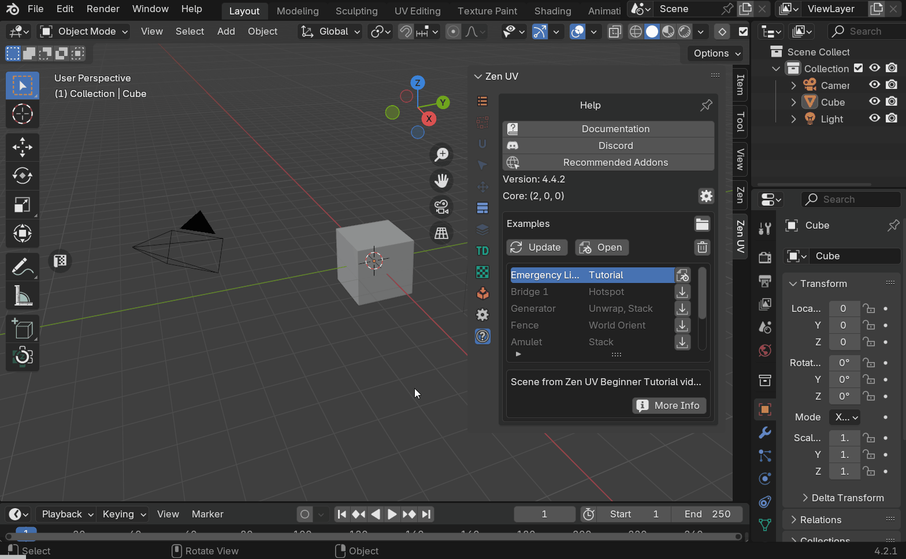
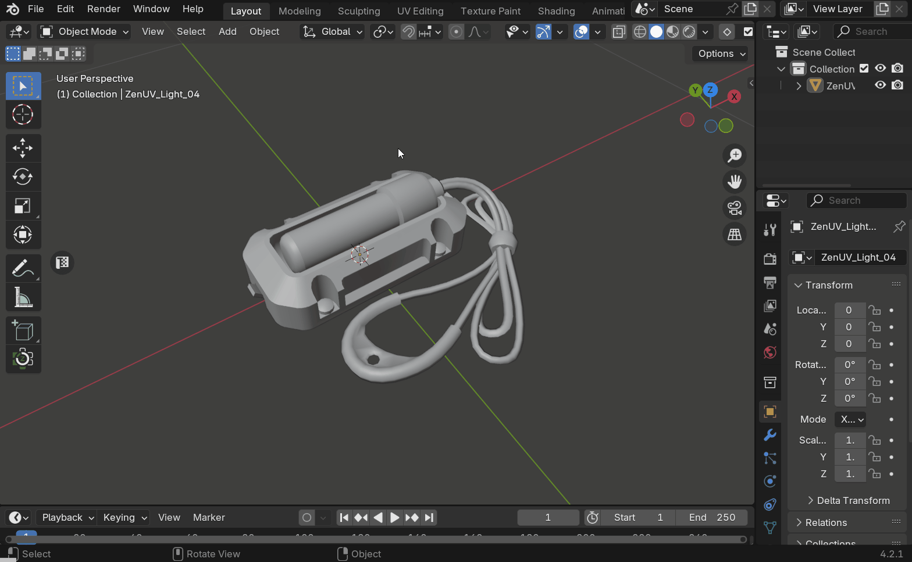
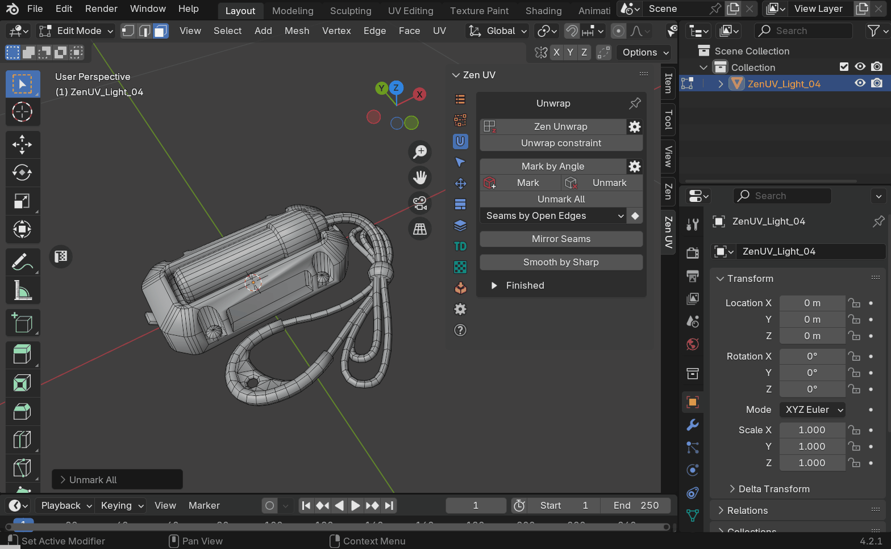
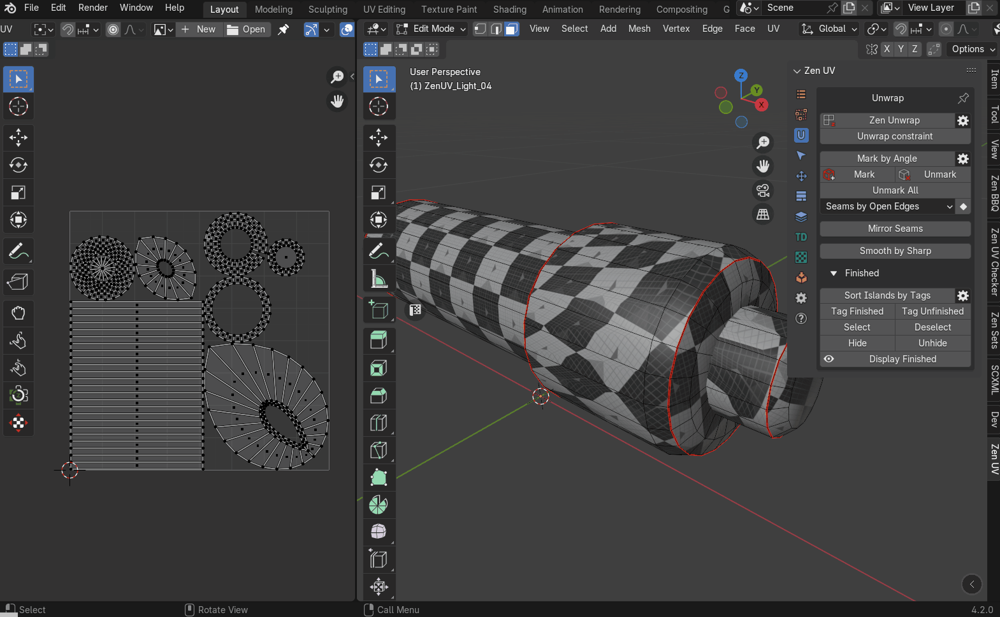
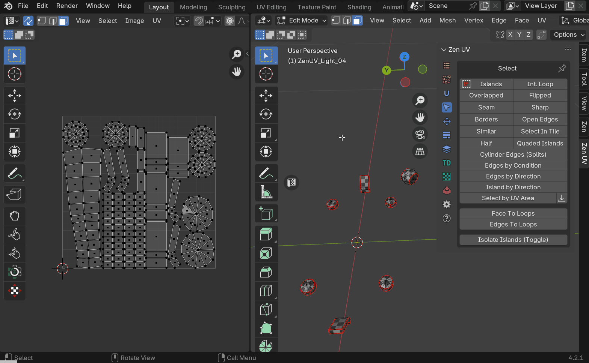
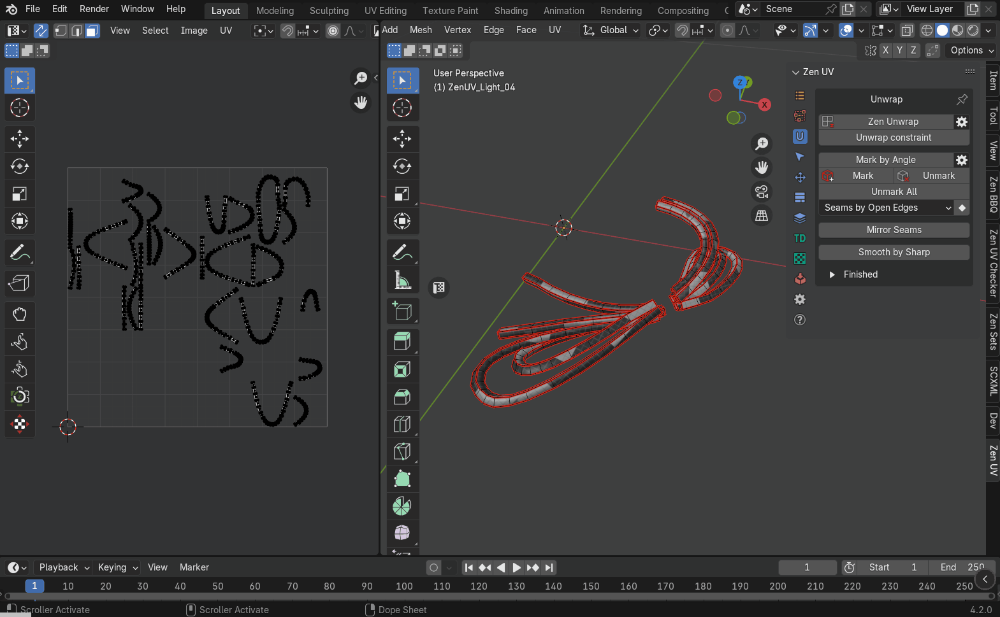
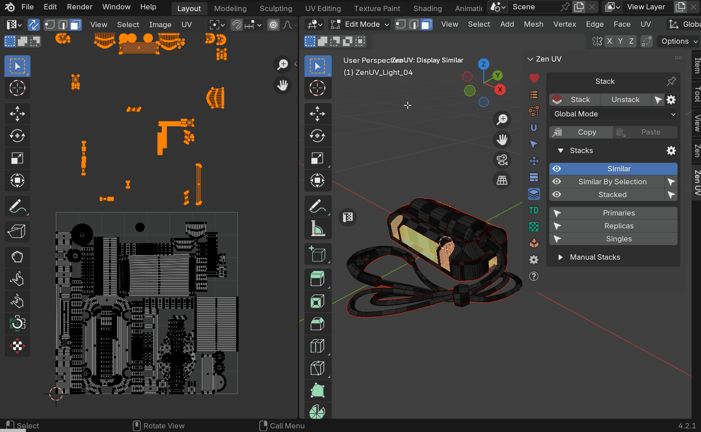
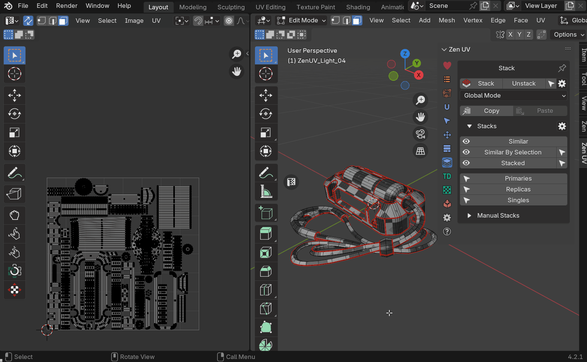

# Ліхтар аварійного освітлення

<table>
<tr>
    <td><strong>UA</strong></td>
    <td><a href="../emergency_light_eng/">EN</a></td>
    <td><a href="../emergency_light_rus/">RU</a></td>
</tr>
</table>

Покроковий туторіал для вивчення основ Zen UV.

## Підготовка сцени

### Завантаження прикладу

1. Переконайтеся, що в Blender увімкнено підключення до Інтернету (ця опція доступна починаючи з версії Blender 4.2).
    - Натисніть на іконку «Підключення до Інтернету». Якщо іконка відсутня, значить доступ до інтернету вже активовано.
    - Дозвольте доступ до інтернету активацією опції **Allow Online Access**.

    

2. Використовуючи [examples panel](../../help.md#examples) виберіть та скачайте приклад що зветься Emergency Light Tutorial натиснувши на кнопку Download справа від назви.

    

3. Коли сцена скачається, натисніть кнопку Open що з'явилася на місці кнопки Download.

    

4. Виберіть об'єкт з назвою Emergency Light та перейдіть в режим редагування.

    

### Підготовка моделі

1. По замовчуванню Zen UV використовує [систему глобального маркування](../../unwrap.md#mark-by-angle). Змінимо налаштування так, щоб Seam та Sharp маркувалися одночасно.
    - Перейдіть на вкладку [Unwrap](../../unwrap.md). Налаштування знаходяться в меню на кнопці з шестернею справа від кнопки Mark by Angle.
    - Відкрийте меню та активуйте опцію Mark Sharp Edges.

    

2. Для того щоб стерти всі наявні Seams та Sharp, у вкладці [Unwrap](../../unwrap.md) натисніть кнопку [Unmark all](../../unwrap.md#unmark-all).

    

3. Перевіримо чи немає островів що теговані як [Finished](../../unwrap.md#finishing-system). Система [Finished](../../unwrap.md#finishing-system) служить для візуального контролю за станом островів (закінчені/не закінчені) та не дозволяє оператору [Zen Unwrap](../../unwrap.md#zen-unwrap) розгортати острови якщо вони теговані як [Finished](../../unwrap.md#tag-finished).
    - Виділіть всі полігони моделі.
    - У вкладці [Unwrap](../../unwrap.md) розгорніть панель з назвою [Finished](../../unwrap.md#finishing-system) та натисніть кнопку [Tag Unfinished](../../unwrap.md#tag-unfinished).

    

4. Видаліть можливі наявні UV координати.
    - Перейдіть у вкладку [Advanced UV Maps](../../adv_uv-maps.md).
    - Виділіть всі можливі наявні UV Maps.
    - Натисніть кнопку "-" (delete).

    

    !!! tip
        Нема необхідності створювати нову UV Map. Zen UV працює з UV координатами а отже слідкує за тим, щоб були наявні UV Maps. Якщо таких немає, то вони будуть створені автоматично.

5. Важливою частиною підготовки є перевірка масштабу об'єктів, для яких створюватимуться UV координати. Масштаб кожного об'єкта повинен бути рівним (1.00, 1.00, 1.00), оскільки він може впливати на роботу операторів розгортки. Також некоректний масштаб може впливати на відносний розмір островів при [пакуванні](../../pack.md) та при встановленні [щільності текселю](../../texel_density.md) ([Texel Density](../../texel_density.md)). Редагування масштабу об'єктів виконується в режимі Object Mode.
    - Ввімкніть Object Mode.
    - В головному меню 3D View натисніть **Object - Apply - Apply Object Transform**.
    - Переконайтеся що масштаб об'єкта становить (1.00, 1.00, 1.00).

    

    !!! tip
        Масштабування та інші трансформації об'єктів використовуються переважно для створення анімації та в інших цілях. Якщо ви працюєте з об'єктами що мають анімацію або утворюють ієрархію, виконувати **Object - Apply - Apply Object Transform** небезпечно, оскільки це приведе до спотворення анімації та руйнування ієрархії.

### Початкова розгортка
1. Зараз, коли все підготовлено, ми можемо починати робити розгортку. Етап перший це розділення моделі на UV острови. На цьому етапі не має значення наскільки ці острови коректно розгорнуті. Ми тільки розділяємо. Зробимо розмітку швів в залежності від гостори edge. Більш гострі edges будуть помічені як шви і тим самим зададуть місця де модель буде розділена.
    - Ввімкніть Edit Mode.
    - У вкладці [Unwrap](../../unwrap.md) натисніть кнопку Mark By Angle.

    

2. Майже всі операції в Zen UV можуть бути виконані у 3D View, але нема більш комфортного способу взємодіяти з UV Maps ніж використати UV Editor. Для того щоб швидко відкрити UV Editor, скористайтеся віджетом у 3D View.
    - Натисніть на кнопку з літерою "T" розміщену зліва по центру "3D View" viewport. У випадку якщо UV Editor уже відкритий, після натискання на цю кнопку він закриється. [Open UV Editor area](../../sticky_uv_editor.md#sticky-uv-editor)

    

3. Ми створили шви в залежності від гостроти edge але ще не розділили модель на острови. Для розділення використаємо оператор [Zen Unwrap](../../unwrap.md#zen-unwrap) який працює в залежності від того, що виділено. То ж на даному етапі переконайтеся що нічого не виділено. В режимі коли нічого не виділено [Zen Unwrap](../../unwrap.md#zen-unwrap) просто розділяє модель на UV острови по існуючим seams. Якщо щось виділено, результат буде іншим.
    - Переконайтеся що нічого не виділено.

    - Натисніть [Zen Unwrap](../../unwrap.md#zen-unwrap) з панелі [Unwrap](../../unwrap.md).

    

Інші режими робти [Zen Unwrap](../../unwrap.md#zen-unwrap) ми розглянемо в продовж цього туторіалу.

### Вмикаємо текстуру для перевірки

1. На цьому етапі ми маємо базове розділення моделі на острови, але цього не достатньо. Потрібно візуально перевірити модель, створити додаткові острови, та в процесі розправити вже існуючі острови якщо це необхідно. На цьому етапі важливо покращити сприйняття атрефактів для того щоб виконати роботу якнайшвидше. Одним з самих дієвих методів є призначення спеціальної текстури що складається з квадратів. Якщо ви бачите на моделі викривлений квадрат, значить в цьому місці є проблеми з розглажуванням острову. Накладемо спеціальну текстуру використовуючи [Zen UV Checkr](../../checker.md).
    - На панелі [UV Checker](../../checker.md) натисніть кнопку Checker Texture.

    

2. Кольорові текстури створені також і для визначення місця положення острову на текстурі. Але для нашого випадку це не має значення. То ж змінимо текстуру на монохромну. Це зменшить кількість інформації для сприйтяття а отже зменшить втому від роботи.
    - Відкрийте drop-down меню нижче кнопки Checker Texture та виберіть текстуру з назвою ['zen-mono-2048x2048' texture image](../../checker.md#checker-textures-selector)

    

3. Наступний крок не важливий для цієї моделі, але може знадобиться в майбутньому. Вимкнемо відображення всіх типів edges крім seam. Ці властивості є копією нативної системи відображення але тепер вони в близькому доступі на панелі UV Checker. Пам'ятаємо про втому від збитку інформації.
    - В [Blender draw system](../../checker.md#blender-draw-system) відключіть властивості відображення Crease, Sharp, Bevel. Залиште ввімкненим тільки відображення Seams.

    

4. Текстури для перевірки зазвичай мають досить агресивний вигляд і заважають сприйняттю островів в UV Editor. Zen UV має можливість притемнити поточну текстуру для комфортного сприйняття. 
    - Використайте оператор [Darken Image](../../checker.md#darken-image) що знаходиться в панелі [UV Checker](../../checker.md) основної панелі аддону в UV Editor.

    

    !!! tip
        [Darken Image](../../checker.md#darken-image) також можна знайти в налаштуваннях оверлею в UV Editor.

5. У цьому туторіалі можна просто видалити текстуру з UV Editor, оскільки в даному випадку вона не відіграє практичної ролі в контексті UV Editor.
    - Знайдіть рядок з назвою текстури зверху робочої зони UV Editor та натисніть кнопку з хрестиком.

## Розгортання

Попередній етап підготовки завершено. Переходимо до розгортання моделі.
Роботу над будь-чим зручно розділяти на частини. Наша модель складається з кількох деталей, тож умовно розділимо її на етапи, що відповідають кожній деталі окремо.

### Розгортка внутрішньої циліндричної частини

1. Почнемо з циліндричної деталі. 
    - В UV Editor повністю виділіть циліндричну деталь.
    - Натисніть [Isolate Island](../../select.md#isolate-islands-toggle) з панелі [Select](../../select.md).

    !!!tip
        Цей оператор працює як перемикач: якщо натиснути його ще раз, все, що було приховано, з'явиться знову. Він однаково функціонує як у 3D View, так і в UV Editor.

    

    Основний оператор для створення островів в аддоні Zen UV — Zen Unwrap. Це багатофункціональний контекстний інструмент, який виконує різні завдання залежно від наступних умов:

    - Який режим виділення активний зараз.
    - Що саме виділено на момент його запуску.
    - Які додаткові налаштування ввімкнено.

    Zen Unwrap відслідковує три основні режими виділення.

    - Faces
    - Edges
    - Verices

    У випадку якщо Blender знаходиться в режимі виділення Faces, буде створено новий острів з виділених полігонів, а ребра по краю виділених полігонів буде марковано як seams.

    - Виділіть торець та натисніть кнопку [Zen Unwrap](../../unwrap.md#zen-unwrap) з панелі [Unwrap](../../unwrap.md)

    

    В процесі буде створено ще декілька островів. Вони можуть бути не коректними або не такими як в предсталеному відео, але зараз це не важливо.

2. Використаємо режим виділення Edges для розгортання наступного острова.

    - Перемкніть Blender в режим виділення Edges. В цьому режмі [Zen Unwrap](../../unwrap.md#zen-unwrap) створить seams для виділених ребер та виконає розгортання.
    - Виділіть одне ребро на найдовшому циліндрові та натисніть [Zen Unwrap](../../unwrap.md#zen-unwrap).

    !!! tip
        Місця в яких будуть створені seams, зазвичай можуть бути занадто помітними на текстурі і будуть потребувати додаткового маскування. Щоб не витрачати на це час, намагайтеся створювати розриви в мало помітних місцях. То ж в нашому випадку рекомендується виділити якесь з нижніх ребер оскільки воно точно буде закрите зовнішньою частиною моделі.

    

    Як бачите, [Zen Unwrap](../../unwrap.md#zen-unwrap) точно виконує ваші вказівки та здійснює розгортання островів, не дивлячись на те що ми змінюємо тип виділення. При цьому навіть не потрібно відкривати його налаштування. У результаті ми отримали правильно розгорнутий найбільший острів цієї деталі.

3. Розгорнемо другий торець деталі. 
    - Перемкніть режим виділення Blender в faces.
    - Виділіть торець.
    - Натисніть [Zen Unwrap](../../unwrap.md#zen-unwrap).

    

4. При використанні Mark by Angle було створено не бажані seams що розділило модель на більшу кількість островів ніж потрібно. Щоб виправити це знову скористуємось оператором [Zen Unwrap](../../unwrap.md#zen-unwrap).
    - Виділіть всі полігони найбільшого циліндра та натисніть [Zen Unwrap](../../unwrap.md#zen-unwrap).
Як результат всі виділені острови об'єдналися в один, і край виділених полігонів був маркований як seams.

    

5. На цьому етапі ми завершили створення островів, але багато з них залишилися деформованими. Можна перемкнутися в режим виділення edges та виконати ті самі дії, як і для найбільшого циліндра, проте острови зі складнішою формою залишаться недостатньо вирівняними. Використаємо оператор [Quadrify](../../transform.md#quadrify-islands), який вирівнює в рівну сітку острови, створені з квадів
    - Перемкніться в режим виділення edges.
    - Виділіть один поздовжній edge, та натисніть кнопку [Quadrify](../../transform.md#quadrify-islands) в панелі [Transform](../../transform.md).

    

    !!! tip
        Подібне використання оператора Quadrify є найшвидшим але не завжди оптимальним. Якщо не вказати оператору де саме потрібно зробити розрив, місце розриву острова буде створено автоматично і, можливо, не в оптимальному місці. Для повного контролю створення розриву використайте опцію **Use Selected Edges**. Також ви можете створити розрив до використання Quadrify використовуючи інші методи.

6. Виконаємо деякі налаштування оператора.
    - Відкрийте панель налаштувань оператора.
    - Активуйте опцію **Use Selected Edges**. Це вкаже оператору що потрібно зробити розділення острову по виділеному ребру.
    
    

    - Виконайте ті ж дії для всіх островів що залишилися.

    

7. Зараз деякі острови в UV Editor можуть перекривати інші. Для того щоб впевнитися в коректному розгортанні кожного острова виконаємо пакування. Це покращить візуальне сприйняття всіх островів.
    - Натисніть кнопку [Pack Islands](../../pack.md#pack-islands) з панелі [Pack](../../pack.md#pack).

    

8. Скоро ми продовжимо працювати над іншими деталями, але спершу використаємо систему [Finished](../../unwrap.md#finishing-system). Це зробить можливим візуально контролювати які острови вже розгорнені, та захистить готові острови від повторного розгортання.
    - Перейдіть до вкладки [Unwrap](../../unwrap.md).
    - Розгорніть панель що називається [Finished](../../unwrap.md#finishing-system). 
    - Виділіть всі острови.
    - Натисніть кнопку [Tag Finished](../../unwrap.md#tag-finished) з панелі [Finished](../../unwrap.md#finishing-system)

    

!!! tip

    Острови, позначені тегом Finished, автоматично сортуються і переміщуються праворуч від UV Area. Це поведінка за замовчуванням, але її можна вимкнути, деактивувавши опцію Auto Sort Islands, яка розташована праворуч від оператора Sort Islands by Tags у діалоговому вікні з [кнопкою-шестернею](../../unwrap.md#finished-preferences).

### Розгортання зовнішньої оболонки

1. Переходимо до наступної деталі. Для цього потрібно відобразити всі деталі моделі.
    - Натисніть [Isolate Island](../../select.md#isolate-islands-toggle) з панелі [Select](../../select.md)

    

    - Виділіть частину моделі що виглядає як зовнішня оболонка.

    

    - Натисніть [Isolate Island](../../select.md#isolate-islands-toggle) знову. Тепер ми маємо видиму тільки потрібну нам деталь. Iнші деталі заховано і вони не будуть заважати.

    

2. Ця деталь має чіткі контури, коректні seams, але деякі острови можна зробити кращими. Внутрішня частина є половиною циліндра що може бути представленим одним островом замість кількох. Створимо один острів з внутрішньої частини.
    - Виділіть всю внутрішню частину окрім острова що є полігоном.
    - Натисніть [Zen Unwrap](../../unwrap.md#zen-unwrap).

    

3. Створений острів може виглядати краще, якщо вирівняти його в рівну сітку. Для цього скористайтеся оператором [Quadrify](../../transform.md#quadrify-islands). Зверніть увагу: якщо у вас активовано опцію Use Selected Edges, краще перейти в режим виділення faces, оскільки в режимі виділення edges оператор Quadrify може розірвати острів по виділених ребрах. Також важливо зазначити, що Zen UV постійно намагається спростити роботу. Щоб вказати оператору, з яким островом ви хочете працювати, не обов'язково виділяти весь острів — достатньо обрати один або кілька полігонів.
    - Виділіть один або декілька полігонів в острові внутрішньої частини поточної деталі, та натисніть [Quadrify](../../transform.md#quadrify-islands).

    

4. Наступний острів занадто великий, циклічний та вивернутий. Для того, щоб позбавитися цих вад, розділіть його на декілька островів меншого розміру.
    - Виділіть бокові ребра.
    - Натисніть [Zen Unwrap](../../unwrap.md#zen-unwrap).

    

5. Острів що представляє верхній торець розкладений коректно, але можемо зробити його більш компактним. Також ми маємо слідкувати за тим, щоб граничні edges будь якого острова були максимально вирівняні по осям. Це зробить розриви на текстурі набагато менш помітними.
    - Виділіть один або декілька граней верхнього острова.
    - Натисніть [Select Island](../../select.md#select-islands) з панелі [Select](../../select.md).
    - Перейдіть у вигляд зверху та використайте оператор **Project From View** що створить рівний острів з вибраних полігонів.

    

6. Розподіл на острови завершено. Виконайте [Pack](../../pack.md#pack) та [Tag Finished](../../unwrap.md#tag-finished) як було описано для попередньої деталі.

    

7. Натисніть [Isolate Island](../../select.md#isolate-islands-toggle) щоб показати всі деталі та підготуватися до наступного етапу туторіала.

### Розгортка дрібних частин

1. Ізолюємо дрібні деталі для більш комфортної роботи.
    - Виділіть всі дрібні деталі.
    - Натисніть кнопку [Isolate Island](../../select.md#isolate-islands-toggle)

    

2. На всіх дрібних деталях, окрім циліндричних, оператор [Mark by Ange](../../unwrap.md#mark-by-angle) спрацював коректно. Давайте це виправимо.
    - Виділіть по одному ребру на кожному з циліндрів та натисніть [Zen Unwrap](../../unwrap.md#zen-unwrap).

    

3. Перейдіть до деталі що скріплює дроти. Вона була розділена на декілька частин що не є оптимальною розгорткою. Достатньо відокремити торці а решту лишити одним островом.
    - Виділіть всю деталь.
    - Зніміть виділення з торців.
    - Виконайте [Zen Unwrap](../../unwrap.md#zen-unwrap).

    

4. Ми створили суцільний острів, але його розгортка не коректна. Потрібно розірвати та розрівняти радіальний острів.
    - Виділіть пару ребер де потрібно розділити.
    - Виконайте [Zen Unwrap](../../unwrap.md#zen-unwrap).

    

5. На цьому етапі ми досягли коректного розподілу на острови, але деякі з них мають розтягнення, а інші — не оптимальну форму. Потрібно виділити та вирівняти всі острови, що складаються з квадів.
    - Використайте оператор [Select Quaded Islands](../../select.md#select-quaded-islands) з панелі [Select](../../select.md).

    

    - Використайте оператор [Quadrify](../../transform.md#quadrify-islands) щоб вирівняти всі виділені острови у рівну сітку.

    

6. Виконайте [Pack](../../pack.md#pack) та [Tag Finished](../../unwrap.md#tag-finished) для завершення розгортання дрібних деталей.

    

7. Натисніть [Isolate Island](../../select.md#isolate-islands-toggle) щоб показати всі деталі та підготуватися до наступного етапу туторіала.

### Розгортання дротів

1. Ізолюємо дроти для більш комфортної роботи.
    - Виділіть усі дроти.
    - Натисніть [Isolate Island](../../select.md#isolate-islands-toggle) щоб сховати всі зайві деталі.

    

2. Видно що на даний момент кожен дріт розділений на декілька островів. Зробімо так, щоб кожен дріт був представлений одним островом.
    - Виділіть всі полігони, та натисніть [Zen Unwrap](../../unwrap.md#zen-unwrap).

    

3. Ми отримали розділення де кожен дріт являє собою один острів, але розгортання не коректне. Давайте розгорнемо дроти найшвидшим способом.
    - Переконайтеся що виділено всі острови.
    - Використайте оператор [Quadrify](../../transform.md#quadrify-islands) щоб вирівняти відразу всі острови.

    

    !!! Tip
        При розгортанні дротів або подібних моделей дуже зручно використовувати опцію Use Selected Edges в операторі Quadrify, яку ми розглядали раніше. Таким чином, ми отримаємо розриви точно там, де потрібно, з першої спроби.

4. На завершення, для кращого візуального контролю, запакуємо острови та маркуємо їх як завершені.
    - Виконайте [Pack](../../pack.md#pack).
    - Виконайте [Tag Finished](../../unwrap.md#tag-finished) для завершення розгортання дротів.

    

5. Натисніть [Isolate Island](../../select.md#isolate-islands-toggle) щоб показати всі деталі та підготуватися до наступного етапу туторіала.

### Розгортання ручки

1. Ізолюємо ручку для більш комфортної роботи. Давайте використаємо дещо із [Finished](../../unwrap.md/#finishing-system) system.
    - Натисніть [Isolate Island](../../select.md#isolate-islands-toggle) щоб відобразити всі частини.
    - Натисніть [Select](../../unwrap.md/#select-finished) в панелі [Finished](../../unwrap.md/#finishing-system).
    - Натисніть [Hide](../../unwrap.md/#hide) в панелі [Finished](../../unwrap.md/#finishing-system).

    

2. Ця деталь складається з кількох островів, що не є оптимальним рішенням. Давайте об'єднаємо їх в один острів замість кількох.
    - Виділіть всі острови що належать ручці.
    - Зніміть виділення з торців що виглядають як шестикутники.
    - Натисніть [Zen Unwrap](../../unwrap.md#zen-unwrap).

    

3. Острів створений в результаті останніх дій має не коректну розгортку. Давйте виправимо це.
    - Виділіть edges що належать отвору та edges що належать внутрішньому краю ручки.
    - Натисніть [Zen Unwrap](../../unwrap.md#zen-unwrap)

    

4. Тепер ми маємо розгорнутий острів. Присутність в ньому трикутних граней не дозволяє використати оператор [Quadrify](../../transform.md#quadrify-islands) для вирівнювання в рівну сітку. Розглянемо на прикладі цього острова роботу оператора [Reshape Island](../../transform.md#reshape-island). Суть роботи [Reshape Island](../../transform.md#reshape-island) полягає в тому, що він розрівнює виділені лупи ребер в рівну лінію а решту вершин розслаблює.
    - Виділіть повністю ребра що проходять поздовжньо через центр острова.
    - Натисніть [Reshape Island](../../transform.md#reshape-island) для вирівнювання острова.

    

5. На цьому розгортання острова можна вважати завершеним. Давайте маркуємо його як завершений. 
    - Виконайте оператор [Pack](../../pack.md#pack).
    - Виділіть всі острови.
    - Маркуйте за допомогою [Tag Finished](../../unwrap.md#tag-finished) для завершення розгортання ручки.

    

6. Натисніть [Isolate Island](../../select.md#isolate-islands-toggle) щоб показати всі деталі та підготуватися до наступного етапу туторіала.

## Пакування

Попередній етап створення островів і їх розгортання завершено. Тепер потрібно розмістити острови на текстурі так, щоб залишилося якомога менше вільного місця. Усе вільне місце на текстурі — це нераціональне використання ресурсів.

### Фінальне пакування

1. Переконайтеся що не залишилося прихованих деталей. Та виконайте пакування.
    - У **3D View** в головному меню натисніть **Mesh - Show/Hide - Reveal Hidden**.
    - Виконайте пакування використавши оператор [Pack](../../pack.md#pack-islands).

    

### Зменшення вільного місця за допомогою стакування

1. На цьому етапі маємо щільно спаковані деталі і роботу можна вважати завершеною. Але якщо проаналізувати конструкцію моделі, можна помітити що деякі острови виглядають схоже і навіть є копією один одного. Наприклад вирізи під болти, самі болти, деякі дрібні деталі, тощо. Для економії місця на текстурі одинакові острови можна скласти один на інший. З точки зору створення UV координат цей процес називається **Stacking**.
    - Відкрийте вкладку [Stack](../../stack.md).
    - Натисніть кнопку [Replicas](../../stack.md#replicas). Тепер маємо виділені острови які мають копії. Ці острови називаються **Replicas**. Причому їх прототипи залишилися не виділеними.

    

    - Перемістіть виділені острови в сторону від UV Area. Тепер в UV Area залишилися тільки унікальнi острови що не мають копій (**Singles**), та острови що є прототипами (**Primaries**).

    

2. В цьому туторіалі ми використовуємо [Blender Pack Engine](../../pack.md#pack-engine). Наступні кроки для стакування будуть описані саме для цього рушія.
    - Сховайте острови що були переміщені в сторону.

    

    - Встановіть коректний (бажаний) [Texture Size](../../pack.md#texture-size) в панелі [Pack](../../pack.md). Для саме цього туторіалу розмір текстури не має значення, але можливо ви плануєте створити текстуру по іншому туторіалові.

    

    - Встановіть необхідну величину [Margin](../../pack.md#margin), що забезпечить коректний вигляд текстури при віддаленні камери.

    

    - Виконайте повторне пакування використовуючи кнопку [Pack](../../pack.md#pack-islands).

    

    - В панелі [Stack](../../stack.md) перемкніть систему в режим Selected.
    - Для того щоб показати сховані Replicas у 3D View в головному меню натисніть **Mesh - Show/Hide - Reveal Hidden**.
    - Виділіть все крім Replicas.
    - Натисніть [Stack](../../stack.md#stack) для того щоб стакувати не виділені Replicas на місця виділених Primaries.

    

Пакування та стакування закінчено. Залишилося декілька останніх кроків до повністю розгорнутої моделі.

## Установка гострих ребер

1. Коректно встановлені sharp edges це не тільки запорука гарного зовнішнього вигляду моделі, але також запорука запікання карти нормалей (normal map) без помилок.
    - Використайте оператор [Sharp by UV Borders](../../unwrap.md#sharp-by-uv-borders). Цей оператор маркує ребра що є крайніми ребрами островів як sharp.

    

    - В налаштуваннях оператора ввімкніть опцію **Unmark sharp**. Це зітре всі попередньо встановлені sharp edges.

    

2. В Blender гострота ребер може бути встановлена двома шляхами.

    - Як результат встановлення властивості полігону Shade Smooth / Shade Sharp.
    - За допомогою властивості ребра Sharp.

    Обидва способи можуть діяти одночасно, що часто приводить до артефактів при використанні карти нормалей (normal map).
    Оскільки ми вже встановили sharp edges так як нам потрібно за допомогою властивості ребер Sharp, виключимо можливість впливу властивості полігонів Smooth/Sharp на гостроту ребер. В Zen UV для цього існує оператор [Smooth by Sharp](../../unwrap.md#smooth-by-sharp-toggle).

    - Натисніть кнопку [Smooth by Sharp](../../unwrap.md#smooth-by-sharp-toggle). Це встановить всі згладжування полігонів у відповідність до sharp edges.

    

Тепер модель **Emergency light** має коректні та оптимізовані UV координати та повністю готова для створення текстури та запікання normal map.

!!! tip
    Налагодження коректного відображення **Sharp Edges** можна виконати вручну. Для цього виконайте кроки описні нижче.

    - В Blender починаючи з версії 4.1:
        - Перейдіть в режим Object Mode.
        - В головному меню 3D View виконайте оператор **Object - Shade Smooth**.

    - В версіях Blender до 4.1:
        - Перейдіть в режим Object Mode.
        - В головному меню 3D View виконайте оператор **Object - Shade Auto Smooth**.
        - В налаштуваннях оператора ввімкніть опцію "Auto Smooth".
        - Встановіть параметр Angle рівним 180 градусів.
