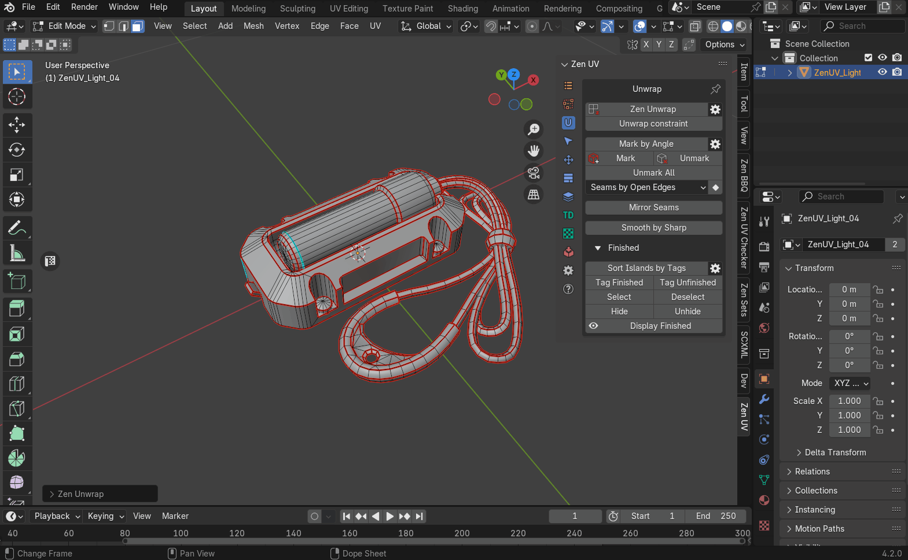
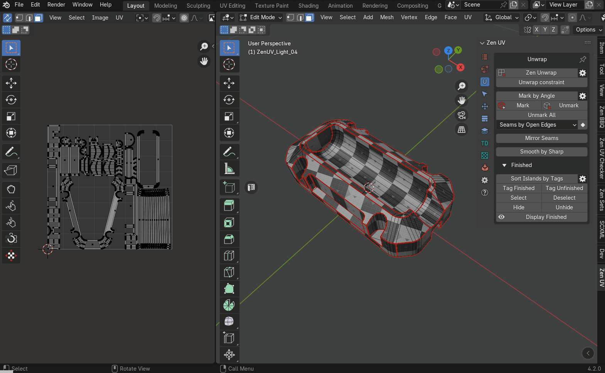
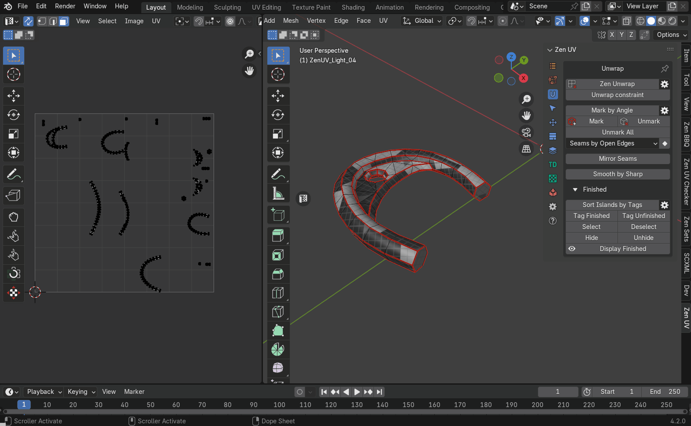
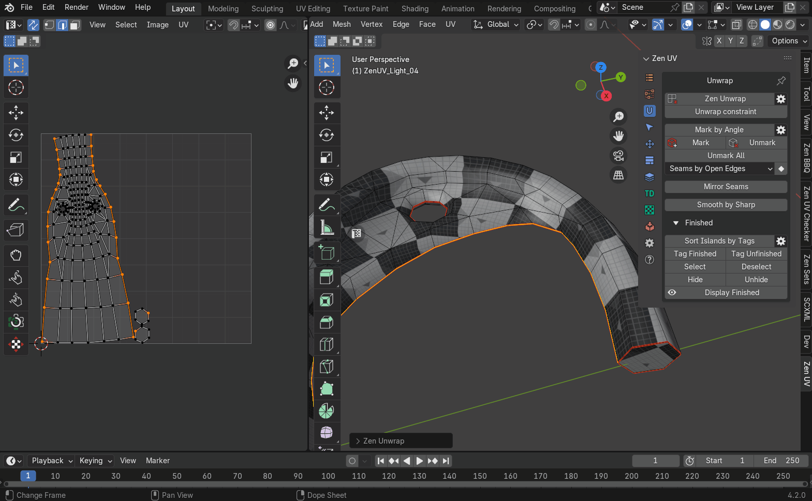
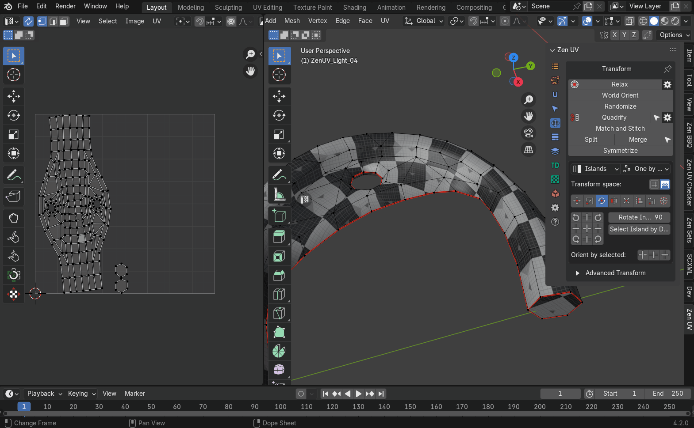
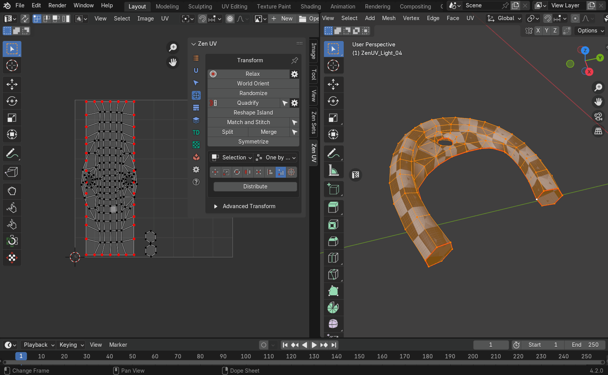

# Emergency Light

The example is maked as step-by-step guide to cover the basics of Zen UV

# Preparing

## Download Example
1. Використовуючи [examples panel](../help.md#examples) виберіть та скачайте приклад що звется Emergency Light Tutorial натиснувши на кнопку Download справа від назви
2. Коли сцена скачається, натисніть кнопку Open що з`явилася на місці кнопки Download
3. Виберіть об'єкт з назвою Emergency Light та перейдіть в режим редагування

    

## Reset UV Maps and Unmark All
1. По замовчуванню Zen UV використовує [систему глобального маркування](../unwrap.md#mark-by-angle). Зробимо налаштування так, щоб Seam та Sharp маркувалися одночасно. Перейдіть на вкладку [Unwrap](../unwrap.md). Налаштування знаходяться в меню на кнопці з шестернею справа від кнопки Mark by Angle. Відкрийте меню та активуйте опцію Mark Sharp Edges
2. Для того щоб стерти всі наявні Seams та Sharp, у вкладці [Unwrap](../unwrap.md) натисніть кнопку [Unmark all](../unwrap.md#unmark-all)
3. Перевіримо чи немає островів що теговані як [Finished](../unwrap.md#finishing-system). Система [Finished](../unwrap.md#finishing-system) служить для візуального контролю за станом островів (закінчені/не закінчені) та не дозволяє оператору Zen Unwrap розгортати острови якщо вони теговані як [Finished](../unwrap.md#tag-finished).
Виділіть всі полігони у моделі. У вкладці [Unwrap](../unwrap.md) розгорніть панель з назвою [Finished](../unwrap.md#finishing-system) та натисніть кнопку [Tag Unfinished](../unwrap.md#tag-unfinished).
4. Щоб стерти можливі наявні UV координати, перейдіть у вкладку [Advanced UV Maps](../adv_uv-maps.md), виділіть всі можливі наявні UV Maps, та натисніть кнопку "-". Нема необхідності створювати нову UV Map. Zen UV працює з UV координатами а от же слідкує за тим, щоб були наявні UV Maps. Якщо таких немає, то вони будуть створені автоматично.

    

## Initial Unwrap
1. Зараз, коли все підготовлено, ми можемо починати робити розгортку. Етап перший це розділення моделі на UV острови. На цьому етапі не має значення наскільки ці острови коректно розгорнуті. Ми тільки розділяємо. Зробимо розмітку швів в залежності від гостори edge. Більш гострі edges будуть помічені як шви і тим самим зададуть місця де модель буде розділена. То ж у вкладці [Unwrap](../unwrap.md) натисніть кнопку Mark By Angle.
2. Ми створили шви в залежності від гостроти edge але ще не розділили модель на острови. Для розділення використаємо оператор [Zen Unwrap](../unwrap.md#zen-unwrap) який працює в залежності від того, що виділено. То ж на даному етапі переконайтеся що нічого не виділено. В режимі коли нічого не виділено [Zen Unwrap](../unwrap.md#zen-unwrap) просто розділяє модель на UV острови по існуючим seams. Якщо щось виділено, результат буде інакшим. Якщо все вірно, натисніть [Zen Unwrap](../unwrap.md#zen-unwrap) з панелі [Unwrap](../unwrap.md). Інші режими робти [Zen Unwrap](../unwrap.md#zen-unwrap) ми розглянемо в продовж цього туторіалу.

    

## Switch on Checker Texture
1. На цьому етапі ми маємо базове розділення моделі на острови але цього не достатньо. Потрібно візуально перевірити модель, створити додаткові острови, та в процесі розправити вже існуючі острови якщо це необхідно. На цьому етапі важливо покращити сприйняття атрефактів для того щоб виконати роботу якнайшвидше. Одним з самих дієвих методів є призначення спеціальної текстури що складається з квадратів. Якщо ви бачите на моделі не квадрат а щось інше, значить в цьому місці є проблеми з розглажуванням острову. Накладемо цю спеціальну текстуру використовуючи [Zen UV Checkr](../checker.md) на панелі [UV Checker](../checker.md) натисніть кнопку Checker Texture.
2. Кольорові текстури створені також і для визначення місця положення острову на текстурі. Але для нашого випадку це не має значення. То ж перемкнем текстуру на монохромну. Це зменшить кількість інформації для сприйтяття а отже зменшить втому від роботи. Відкрийте drop-down меню нижче кнопки "Checker Texture" та виберіть текстуру з назвою ['zen-mono-2048x2048' texture image](../checker.md#checker-textures-selector)
3. Наступний крок не важливий для цієї моделі, але може знадобиться в майбутньому. Вимкнемо відображення всіх типів edges крім seam. Це копії нативної системи відображення але тепер вони в близькому доступі на панелі UV Checker. Пам'ятаємо про втому від збитку інформації.[Set only Seams to be displayed in the viewport](../checker.md#blender-draw-system)
4. Майже всі операції в Zen UV можуть бути виконані у 3D View, але нема більш комфортного способу взємодіяти з UV Maps ніж використати UV Editor. Для того щоб швидко відкрити UV Editor, натисніть на кнопку розміщену зліва по центру 3D View viewport з літерою "T". У випадку якщо UV Editor уже відкритий, після натискання на цю кнопку він закриється. [Open UV Editor area](../sticky_uv_editor.md#sticky-uv-editor)
5. Текстури для перевірки зазвичай мають досить агресивний вигляд і заважають сприйняттю островів в UV Editor. Для затемнення текстури в UV Editor використаємо оператор [DarkenImage](../checker.md#darken-image) що знаходиться в панелі [UV Checker](../checker.md) основної панелі аддону в UV Editor.

!!! tip
    [DarkenImage](../checker.md#darken-image) також можна знайти в налаштуваннях оверлею в UV Editor.

# Unwrapping

Попередній етап підготовки завершено. Переходимо до розгортання моделі.
Роботу над будь-чим зручно розділяти на частини. Наша модель складається з декількох деталей. То ж умовно розділимо на етапи що відповідають кожній деталі окремо.

## Unwrap Internal Cylindrical Part
1. Почнемо з циліндричної деталі. В UV Editor виділіть циліндричну деталь повністю, та натисніть [Isolate Island](../select.md#isolate-islands-toggle) з панелі [Select](../select.md). Цей оператор працює як перемикач. Це означає що якщо натиснути його зараз ще раз, то все що заховалося з`явиться знову. Він функціонує одинаково як для 3D View так і для UV Editor.

    

Основний оператор для створення островів в аддоні Zen UV це Zen Unwrap. Це багатофункціональний контекстний оператор. Він виконує різні задачі в залежності від наступного:

- Який режим виділення активний зараз.
- Що саме виділено на момент його запуску.
- Які додаткові налаштування ввімкнено.

Zen Unwrap відслідковує три основні режими виділення.

- Faces
- Edges
- Verices

У випадку якщо Blender знаходиться в режимівиділення faces, буде створено новий острів з виділених faces, а edges по краю виділених faces буде марковано як seams.

2. Використаємо цю властивість щоб створити перший острів. Виділіть cap та натисніть кнопку [Zen Unwrap](../unwrap.md#zen-unwrap) з панелі [Unwrap](../unwrap.md)

    

В процесі буде створено ще декілька островів. Вони можуть бути не коректними або не такими як в предсталеному відео, але зараз це не важливо.

Використаємо режим виділення edges для розгортання наступного острова. Для цього перемкніть Блендер в режим виділення Edges. В цьому режмі Zen Unwrap створить seams для виділених edges та виконає розгортання. То ж виділіть один edge на найдовшому циліндрові та натисніть Zen Unwrap.

!!! tip
    Місця в яких будуть створені seams, зазвичай можуть бути занадто помітними на текстурі і будуть потребувати додаткового маскування. Щоб не витрачати на це час, намагайтеся створювати розриви в мало помітних місцях. То ж в нашому випадку рекомендується виділити якийсь з нижніх edges оскільки він точно буде закритий зовнішньою частиною моделі.

Як бачите Zen Unwrap точно дотримується ваших вказівок і робе розгортання островів не дивлячись на те що ми змінюємо тип виділення. Для цього навіть не потрібно відкривати його налаштування. В результаті ми отримали коректно розгорнутий самий найбільший острів цієї деталі.

4. Розгорнемо другий cap нашої деталі. Для цього потрібно знову перемкнутися в режим виділення faces. Виділяємо cap, та натискаємо Zen Unwrap.

    

5. При використанні Mark by Angle було створено не бажані seams що розділило модель на більшу кількість островів ніж потрібно. Щоб виправити це знову скористуємось оператором Zen Unwrap. Виділіть всі faces найбільшого циліндра та натисніть Zen Unwrap. Як результат всі виділені острови об`эдналися в один і край виділених полігонів був маркований як seams.

    

6. Як видно, на цьому етапі ми закінчили створення островів, але багато островів залишилися деформованими. Можна перемкнутися в режим виділення edges та виконати ті самі дії як для найбільшого циліндра, але острови що мають трохи складнішу форму залишаться розрівняними не достатньо. Використаємо оператор [Quadrify](../transform.md#quadrify-islands) що вирівнює в рівну решітку острови створені з квадів. Перемкніться в режим виділення edges. Виділіть один поздовжній edge, та натисніть кнопку [Quadrify](../transform.md#quadrify-islands) в панелі [Transform](../transform.md). Виконаэмо деякы налаштування оператора. Відкрийте панель налаштувань оператора. Активуйте опцію **Use Selected Edges**. Це вкаже оператору що ми хочемо зробити розділення острову по виділеному edge. Виконайте ті ж дії для всіх островів що залишилися.

    

7. Зараз деякі острови в UV Editor можуть перекривати інші. Для того щоб впевнитися в коректному розгортанні кожного острова виконаємо пакування. Використаємо оператор [Pack Islands](../pack.md#pack-islands) з панелі [Pack](../pack.md#pack).

8. Скоро ми продовжимо працювати над іншими деталями, але спершу використаэмо систему [Finished](../unwrap.md#finishing-system). Це зробить можливим візуально контролювати які острови вже розгорнені, та захистить готові острови від повторного розгортання.
 - Перейдіть до вкладки [Unwrap](../unwrap.md).
 - Розгорніть панель що називається Finished. 
 - Виділіть всі острови та натисніть кнопку [Tag as finished](../unwrap.md#tag-finished) з панелі [Finished](../unwrap.md#finishing-system)

 !!! tip
    
    Острови що тегуються Finished зазнають сортування та переміщуються правіше від UV Area. Це поведінка за замовчуванням, але це можна відключити якщо відключити опцію "Auto Sort Islands" що знаходиться правіше оператора **Sort Islands by Tags** в діалозі з [кнопкою з шестернею](../unwrap.md#finished-preferences).

## Unwrap External Cover

1. Переходимо до наступної деталі. Для цього потрібно показати всі деталі моделі.
 - Натисніть [Isolate Island](../select.md#isolate-islands-toggle) з панелі [Select](../select.md)
 - Виділіть external cover mesh part, та натисніть [Isolate Island](../select.md#isolate-islands-toggle) знову. Тепер ми маємо видиму тільки потрібну нам деталь а інші не будуть заважати.

    

2. Ця деталь має чіткі контури, коректні seams але деякі острови можна зробити кращими. Внутрішня частина являє собою циліндр що може бути представленим одним островом замість кількох. Створимо один острів з внутрішньої частини.
- Виділіть всю внутрішню частину окрім острова що являє собою багатогранний полігон.
- Натисныть Zen Unwrap.

    

3. Створенй острів може виглядати краще якщо вирівняти його в рівну решітку. Використайте оператор [Quadrify](../transform.md#quadrify-islands). Зверніть увагу. Якщо у вас активовано опцію *Use Selected Edges*, то вам краще перейти в режим виділення faces. Адже в режимі виділення edges оператор Quadrify розірве острів по виділеним edges. Також зверніть увагу на те, що Zen UV весь час намагається вам допомогти і для того, щоб вказати оператору з яким островом ви хочете працювати, не обов`язково виділяти весь острів. Достатньо виділити один або декілька полігонів.
- Виділіть один або декілька полігонів в острові внутрішньої частини поточної деталі, та натисніть [Quadrify](../transform.md#quadrify-islands).

    

4. Unwrap by side cuts

    

5. Unwrap by creating project from view

    

6. Pack islands and tag as finished

    

## Unwrap Small Parts
1. Isolate small mesh parts

    

2. Unwrap by cuts

    

3. Unwrap part by selected polygons

    

4. Unwrap by cut to get rectangular shape

    

5. Quadrify rectangular-shaped islands

    

6. Pack islands and tag as finished

    

2. Unwrap by selected polygons

    

3. Quadrify
4. Tag as finished

    

## Unwrap Handle
1. Select and isolate islands

    

2. Unwrap to create one island

    

3. Create cuts and unwrap

    

4. [Relax](../transform.md#relax) island

    

5. [Orient by selected](../transform.md#rotate)

    

6. Make rectangular-shaped island:
    - align and distribute surrounded vertices
    
        

    - unwrap with 'Unfold Vertices' mode

        

7. Tag as finished

    

# Packing

Попередній етап створення островів та розгортання завершено, от же прийшов час розмістити острови на текстурі таким чином, щоб залишилося якнайменше вільного місця. Все вільне місце на текстурі це нераціональне використання ресурсів.

## Final Pack
1. Unhide all
2. Select all
3. Pack

    

## Reduce UV Space With Stacks
1. Select islands that can be identified as [replicas](../stack.md#replicas)

    

2. Hide replicas
3. Set texture size for packing
4. Set corresponding margin for packing
5. Pack islands

    

6. [Stack](../stack.md#stack) selected replicas

    

## Set Sharp Edges
1. Set [sharp by UV borders](../unwrap.md#sharp-by-uv-borders)
2. Mark
3. Enable option 'Unmark sharp'
4. [Smooth by sharp](../unwrap.md#smooth-by-sharp-toggle)

    
