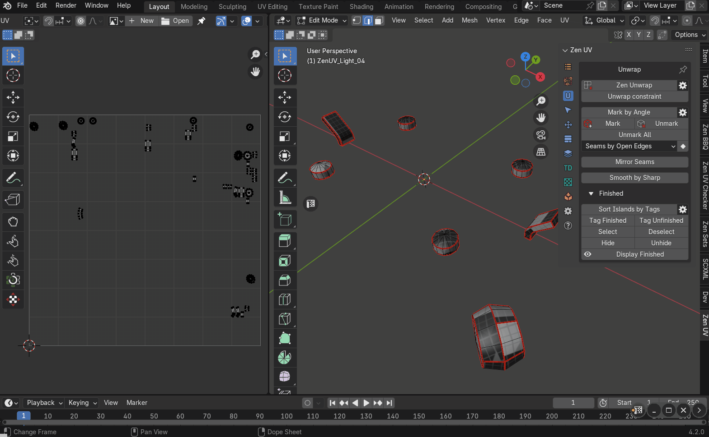
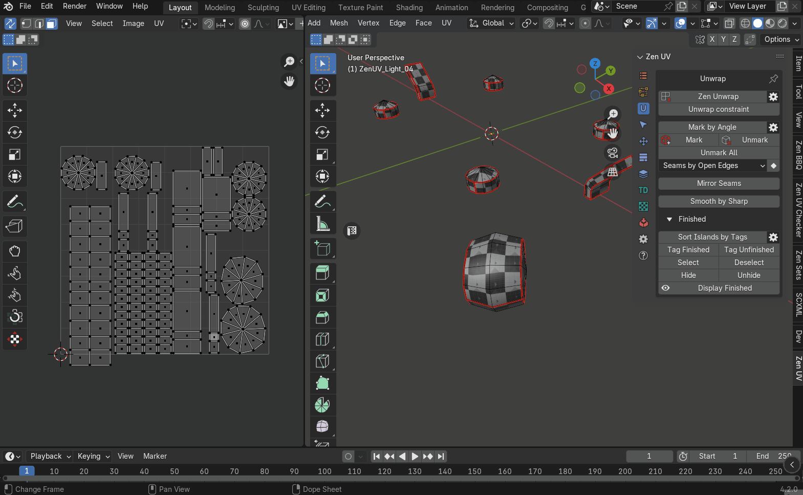
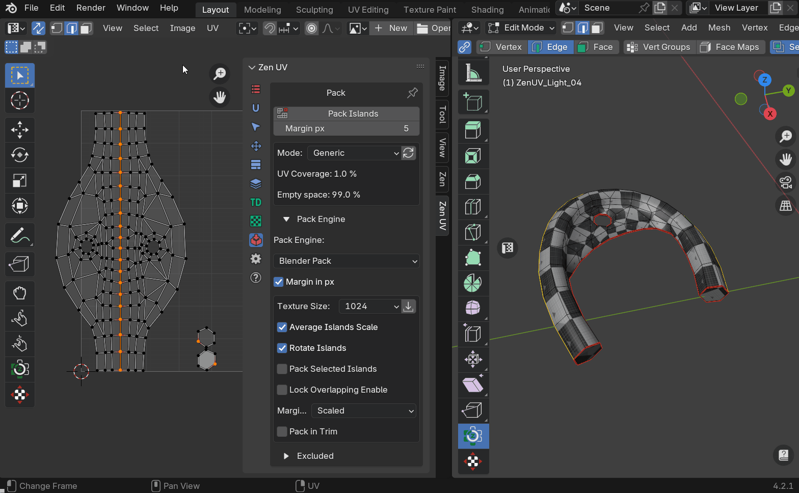

# Emergency Light

The example is maked as step-by-step guide to cover the basics of Zen UV

## Prepare

### Download example

1. Download example "Emergency Light Tutorial" using [examples panel](../help.md#examples) by pressing "Download" button in the right corner.

2. Press "Open" button when it appears after the scene is downloaded.

3. Select "Emergency Light" object and switch to Edit Mesh mode.

    

### Delete UV Maps and clear edge properties

1. Zen UV uses [global mark system](../unwrap.md#mark-by-angle) by default. Let's change mark settings to mark Seam and Sharp at the same time.
    - Select [Unwrap](../unwrap.md) tab and find "Properties" button placed to the right of "Mark by Angle" button.
    - Press it and in popup menu enable "Mark Sharp Edges" option.

2. Press [Unmark all](../unwrap.md#unmark-all) button in [Unwrap](../unwrap.md) tab to clear all existing Seams and Sharp edges.

3. Let's check than there are no islands marked as [Finished](../unwrap.md#finishing-system). [Finished](../unwrap.md#finishing-system) tags helps to visually control islands state (finished/not finished) and prevents Zen Unwrap operator to unwrap[Finished](../unwrap.md#tag-finished) islands.
    - Select all polygons.
    - Expand [Finished](../unwrap.md#finishing-system) panel in [Unwrap](../unwrap.md) tab and press [Tag Unfinished](../unwrap.md#tag-unfinished).

4. Delete all UV Maps.
    - Switch to [Advanced UV Maps](../adv_uv-maps.md) tab.
    - Select all UV Maps.
    - Press "-" (delete) button.

!!! tip
    Zen UV automatically control UV Maps and will create new one if there are no, so there is no necesserity to create manually UV Map.

### Initial unwrap
1. When everything is prepared we are starting from splitting 3D model into UV islands. Initial unwrap will split aproximately, so do not check the correctness, later we will adjust it. Let's make seams by edge sharpness. 3D Model will be splitted by the most sharp edges.
    - Press "Mark By Angle" in [Unwrap](../unwrap.md) tab.
2. When seams are created we are ready to split int UV islands by using [Zen Unwrap](../unwrap.md#zen-unwrap) operator. It depends on selection. If nothing is selected [Zen Unwrap](../unwrap.md#zen-unwrap) it simply splits by existing seams. If anything is selected the behaviour will be different
    - Deselect all.
    - Press [Zen Unwrap](../unwrap.md#zen-unwrap) button from [Unwrap](../unwrap.md) tab.

Other modes of [Zen Unwrap](../unwrap.md#zen-unwrap) operator will be demonstrated later in this tutorial.

### Switch on checker texture

1. At this stage, we have a basic division of the model into islands, but this is not enough. We need to visually check the model, create additional islands, and in the process straighten the existing islands if necessary. At this stage, it is important to improve the perception of artifacts in order to complete the work as quickly as possible. One of the most effective methods is to assign a special texture consisting of squares. If you see something other than a square on the model, it means that there are problems with smoothing the island in this place. We are applying the special checking texture using [Zen UV Checker](../checker.md) module.
    - Press "Checker Texture" button in [UV Checker](../checker.md) tab.

2. Colored textures are also created to determine the location of the island on the texture. But in our case, it doesn't matter. So let's switch the texture to monochrome. This will reduce the amount of information to be perceived and therefore reduce tiredness from work.
    - Open drop-down menu below "Checker Texture" button and select texture [zen-mono-2048x2048](../checker.md#checker-textures-selector)

3. The next step is not important for this model, but you may need it in the future. Let's disable the display of all types of edges except seam. These properties duplicate the native display system options, but now they are in close access in the UV Checker panel. Remember about information loss tiredness.
    - Disable "Crease", "Sharp", "Bevel" in [Blender draw system panel](../checker.md#blender-draw-system). Check that only "Seams" are left.

4. Almost all **Zen UV** operations could be executed in **3D View**, but it is more comfortable to visually control them in **UV Editor**. There is a special **UV Editor** gizmo widget in **3D View**.
    - Press [Open UV Editor](../sticky_uv_editor.md#sticky-uv-editor) button placed at the left center part of **3D View** viewport. The button works as toggle, so if **UV Editor** is open it will be closed.

5. The textures to be tested usually look quite saturated and interfere with the perception of the islands in **UV Editor**. **Zen UV** can make image more dark for better image readability. 
    - Use [Darken Image](../checker.md#darken-image) operator in [UV Checker](../checker.md) tab in **UV Editor** context.

!!! tip
    [DarkenImage](../checker.md#darken-image) could be also found in UV Editor overlay properties.

6. Also we can simply delete texture in **UV Editor** because in this tutorial we will not use it for analysis in this context. 
    - Find active image property in the top of **UV Editor** and delete it.

## Unwrap

Preparation is completed. Let's continue with model unwrapping.
It is convenient to divide this process into steps. Our model consists of several parts. So let's conditionally divide it into stages corresponding to each part separately

### Unwrap internal cylindrical part

1. Let's start from cylindrical part. 
    - Select it in "UV Editor".
    - Press [Isolate Island](../select.md#isolate-islands-toggle) button in [Select](../select.md) tab.

!!!tip
    This operator works like a toggle. This means that if you press it again now, everything that is hidden will appear again. If works in the same way as for 3D View and UV Editor.

The main operator for creating islands in the Zen UV addon is Zen Unwrap. This is a multifunctional context operator. It performs different tasks depending on the following:

- Which selection mode is currently active.
- What exactly is selected at the time of its start.
- What additional properties are enabled.

Zen Unwrap tracks three main selection modes.

- Faces
- Edges
- Verices.

2. If **Blender** is in **Faces** selection mode, a new island will be created from the selected polygons, and the edges along the edge of the selected polygons will be marked as **seams**. Let's use this to create the first island.
    - Select cap and press [Zen Unwrap](../unwrap.md#zen-unwrap) in [Unwrap](../unwrap.md) tab

Several more islands will be created in the process. They may be incorrect or not the same as in the video, but it doesn't matter now.

Let's use the **Edges** selection mode to expand the next island.

  - Switch **Blender** to **Edges** selection mode. In this mode, [Zen Unwrap](../unwrap.md#zen-unwrap) will create **seams** for the selected edges and perform the unwrap.
  - Select one edge on the longest cylinder and click [Zen Unwrap](../unwrap.md#zen-unwrap).

!!! tip
    The places where **seams** will be created can usually be too visible on the texture and will require additional masking. In order not to waste time on this, try to create gaps in places that are not very visible. So, in our case, it is recommended to select one of the lower edges because it will definitely be covered by the outer part of the model.

As you can see, [Zen Unwrap](../unwrap.md#zen-unwrap) follows your instructions exactly and unwraps the islands despite the fact that we change the selection type. You don't even need to open its settings to do this. As a result, we got the largest island of this part correctly unwrapped.

4. Unwrap the second cap. 
    - Switch **Blender** selection into **Faces** mode.
    - Select cap.
    - Press [Zen Unwrap](../unwrap.md#zen-unwrap).

5. When using **Mark by Angle**, unwanted **seams** were created, which divided the model into more islands than necessary. To fix this, use the [Zen Unwrap] operator again(../unwrap.md#zen-unwrap).
    - Select all the polygons of the largest cylinder and press [Zen Unwrap](../unwrap.md#zen-unwrap).
As a result, all the selected islands are merged into one, and the edge of the selected polygons are marked as **seams**.

6. At this point, we've finished creating the islands, but many of the islands are still deformed. You can switch to **edges** selection mode and follow the same steps as for the largest cylinder, but the islands that have a slightly more complex shape will not be aligned sufficiently. Let's use the [Quadrify](../transform.md#quadrify-islands) operator, which aligns the islands created from quads into a square grid.
    - Switch to **edges** selection mode.
    - Select one vertical edge, and click the [Quadrify](../transform.md#quadrify-islands) button in the [Transform](../transform.md) panel.

Let's change some operator properties.
    - Open the operator properties panel.
    - Activate the **Use Selected Edges** option. This will tell the operator to split the island along the selected edge.
    - Do the same for all remaining islands.

7. Now some islands in the UV Editor may overlap others. In order to make sure that each island is deployed correctly, we will perform a packing. This will improve the visual representation of all the islands.
    - Click the [Pack Islands](../pack.md#pack-islands) button from the [Pack](../pack.md#pack) panel.

8. We will continue working on other details soon, but first we will use the [Finished] system(../unwrap.md#finishing-system). This will make it possible to visually control which islands have already been unwrapped and protect finished islands from being unwrapped again.
    - Go to the [Unwrap] tab(../unwrap.md).
    - Expand the panel called Finished. 
    - Select all the islands.
    - Click the [Tag as finished](../unwrap.md#tag-finished) button from the [Finished](../unwrap.md#finishing-system) panel

!!! tip

    Islands that are tagged **Finished** are sorted and moved to the right of the **UV Area**. This is the default behavior, but it can be disabled by disabling the **Auto Sort Islands** option to the right of the **Sort Islands by Tags** statement in the [gear button] dialog (../unwrap.md#finished-preferences).

### Unwrap external part

1. Go to the next detail. To do this, you need to show all the details of the model.
    - Click [Isolate Island](../select.md#isolate-islands-toggle) from the [Select](../select.md) panel
    - Select the part of the model that looks like the outer shell.
    - Click [Isolate Island](../select.md#isolate-islands-toggle) again. Now we have only the part we need visible. The other parts are hidden and will not get in the way.

    

2. This part has clear contours, correct **seams**, but some islands could be improved. The inner part is a cylinder that can be represented by one island instead of several. Let's create one island from the interior.
    - Select the entire interior except for the island, which is a polygon.
    - Click [Zen Unwrap](../unwrap.md#zen-unwrap).

    

3. The created island may look better if you align it into a square grid. Use the [Quadrify] operator(../transform.md#quadrify-islands). Please note. If you have the **Use Selected Edges** option activated, then you'd better switch to the faces selection mode. Because in the edges selection mode, the **Quadrify** operator will break the island along the selected edges. Also, note that **Zen UV** is always trying to help you, and in order to tell the operator which island you want to work with, you do not need to select the entire island. It is enough to select one or more polygons.
    - Select one or more polygons in the island inside the current part, and then click [Quadrify](../transform.md#quadrify-islands).

    

4. The next island is too large, cyclic, and inverted. To get rid of these problems, divide it into several smaller islands.
    - Select the side edges.
    - Click [Zen Unwrap](../unwrap.md#zen-unwrap).

    

5. The island representing the upper end is correctly unwrapped, but we can make it more compact. Also, we need to make sure that the boundary edges of any island are aligned along the axes as much as possible. This will make gaps in the texture much less noticeable.
    - Select one or more faces of the top island.
    - Click [Select Island](../select.md#select-islands) from the [Select](../select.md) panel.
    - Switch to the top view and use the **Project From View** operator to create a flat island from the selected polygons.

    

6. Splitting into islands is done. Make [Pack](../pack.md#pack) and [Tag Finished](../unwrap.md#tag-finished) in the same way as previous details.

7. Click [Isolate Island](../select.md#isolate-islands-toggle) to show all other parts and be ready for the next step of the tutorial.

    

### Unwrap small details

1. Isolate small details for more comfortable work.
    - Select all small details.
    - Click [Isolate Island](../select.md#isolate-islands-toggle)

    

2. The [Mark by Ange](../unwrap.md#mark-by-angle) operator worked correctly on all small parts except for cylindrical parts. Let's fix it.
    - Select one edge on each of the cylinders and click [Zen Unwrap](../unwrap.md#zen-unwrap).

    

3. Go to the part that holds the wires together. It has been divided into several parts, which is not the optimal layout. It is enough to separate the ends and leave the rest as one island.
    - Select the entire part.
    - Deselect the ends.
    - Run [Zen Unwrap](../unwrap.md#zen-unwrap).

    

4. We have created a solid island, but its scan is not correct. You need to break and flatten the radial island.
    - Select the pair of edges where you want to split.
    - Run [Zen Unwrap](../unwrap.md#zen-unwrap).

    

5. At this stage, we have the correct split into islands, but some islands have stretches. Some other islands are not optimally shaped. You need to select and align all the islands that consist of quads.
    - Use the [Select Quaded Islands](../select.md#select-quaded-islands) operator from the [Select](../select.md) panel.
    - Use the [Quadrify](../transform.md#quadrify-islands) operator to align all the selected islands into a square grid.

    

6. Make [Pack](../pack.md#pack) and [Tag Finished](../unwrap.md#tag-finished) to finalize unwrapping small details.

7. Click [Isolate Island](../select.md#isolate-islands-toggle) to show all other parts and be ready for the next step of the tutorial.

    

### Unwrap wires

1. Isolate the wires for more comfortable work.
    - Select all the wires.
    - Click [Isolate Island](../select.md#isolate-islands-toggle) to hide all unnecessary parts.

    

2. You can see that each wire is currently divided into several islands. Let's make sure that each wire is represented by a single island. Select all the polygons and click [Zen Unwrap](../unwrap.md#zen-unwrap).

    

3. We have a split where each wire represents one island, but the unwrapping is not correct. Let's unwrap the wires in the fastest way.
    - Make sure that all islands are selected.
    - Use the [Quadrify] operator(../transform.md#quadrify-islands) to align each island into an even grid.

!!! tip
    This is the fastest way to use the Quadrify operator, but it is not always optimal. If all polygons of an island are selected, the island break will be created automatically and may not be in the optimal location. For full control over the creation of the gap, use the **Use Selected Edges** option. You can also create a gap before using Quadrify using other methods.

4. Finally, we will pack for better visual control and mark the islands as complete.
    - Run [Pack](../pack.md#pack).
    - Execute [Tag Finished](../unwrap.md#tag-finished) to complete the wire unwrap.

    

5. Click [Isolate Island](../select.md#isolate-islands-toggle) to show all other parts and be ready for the next step of the tutorial.

## Unwrap handle

1. Isolate handle for more comfortable work.
    - Select the handle that is attached to the wire.
    - Click [Isolate Island](../select.md#isolate-islands-toggle) to hide unneccessary details.

    

2. This part consists of several islands, which is not an optimal solution. Let's create a single island instead of multiple islands.
    - Select all the islands that belong to the handle.
    - Deselect the ends that look like hexagons.
    - Click [Zen Unwrap](../unwrap.md#zen-unwrap).

    

3. The island that was created as a result of the latter actions has an incorrect layout. Let's fix it.
    - Select the edges belonging to the hole and the edges belonging to the inner edge of the handle.
    - Click [Zen Unwrap](../unwrap.md#zen-unwrap)

    

4. ТNow we have an unfolded island. The presence of triangular faces in it does not allow you to use the **Quadrify** operator for maximum smoothing. Let's take this island as an example of how the [Reshape Island](../transform.md#reshape-island) operator works. The essence of [Reshape Island](../transform.md#reshape-island) is that it flattens the selected edge loops into a straight line and relaxes the remaining vertices.
    - Select all the edges that run horizontally through the center of the island.
    - Click [Reshape Island](../transform.md#reshape-island) to align the island.

5. The Island unwrapping can be considered complete. Let's mark it as complete. 
    - Run the [Pack](../pack.md#pack) statement.
    - Select all the islands.
    - Tag them with [Tag Finished](../unwrap.md#tag-finished) to complete the unwrapping of the handle.

    

6. Click [Isolate Island](../select.md#isolate-islands-toggle) to show all other parts and be ready for the next step of the tutorial.

## Pack

The previous stage of island creation and unwrapping is completed. Now it's time to place the islands on the texture so that there is as little free space as possible. All free space on the texture is a waste of resources.

### Final pack

1. Make sure there are no hidden parts. And then pack it up.
    - In the **3D View** in the main menu, click **Mesh - Show/Hide - Reveal Hidden**.
    - Use the [Pack](../pack.md#pack-islands) operator to pack the islands.

    

### Reduce UV space with stack system

1. At this stage, we have tightly packed parts and the work can be considered complete. But if you analyze the construction of the model, you will notice that some islands look similar and are even copies of each other. For example, the cutouts for bolts, the bolts themselves, some small details, etc. To save space on the texture, identical islands can be stacked on top of each other. In terms of creating UV coordinates, this process is called **Stacking**.
    - Open the [Stack] tab (../stack.md).
    - Click the [Replicas](../stack.md#replicas) button. Now we have selected islands that have copies. These islands are called **Replicas**. And their prototypes remain unselected.
    - Move the selected islands away from the **UV Area**. Now only unique islands that do not have copies (**Singles**) and islands that are prototypes (**Primaries**) remain in the **UV Area**.

    

2. In this tutorial, we are using the [Blender Pack Engine](../pack.md#pack-engine). The following steps for packing will be described for this engine.
    - Hide the islands that have been moved to the side.
    - Set the correct (desired) [Texture Size](../pack.md#texture-size) in the [Pack](../pack.md) panel. For this particular tutorial, the texture size does not matter, but you may plan to create a texture for another tutorial.
    - Set the required value to [Margin](../pack.md#margin), which will ensure the correct appearance of the texture when the camera is moved away.
    - Repack using the [Pack](../pack.md#pack-islands) button.

    

    - In the [Stack](../stack.md) panel, switch the system to **Selected** mode.
    - In order to show hidden **Replicas** in the **3D View** in the main menu, click **Mesh - Show/Hide - Reveal Hidden**.
    - Select everything except **Replicas**.
    - Click [Stack](../stack.md#stack) to stack the unselected **Replicas** in place of the selected **Primaries**.

    

The packing and stacking is completed. There are only a few final steps left to complete the model.

## Set sharp edges

1. Correctly set sharp edges are not only a guarantee of a good appearance of the model, but also a guarantee of baking **normal map** without errors.
    - Use the [Sharp by UV Borders] operator (../unwrap.md#sharp-by-uv-borders). This operator marks the edges that are the boundary edges of the islands as **sharp**.
    - In the operator settings, turn on the **Unmark sharp** option. This will erase any sharp edges that have been previously set.
    - Click the [Smooth by Sharp] button (../unwrap.md#smooth-by-sharp-toggle). This will set all polygon smoothing to match the sharp edges.

    

Now the **Emergency light** model has correct and optimized **UV** coordinates and is ready for texturing and baking the **normal map**.
