# Unwrap

!!! Panel
     | 3D Viewport | UV Editor| 
     |---|---|  
     | 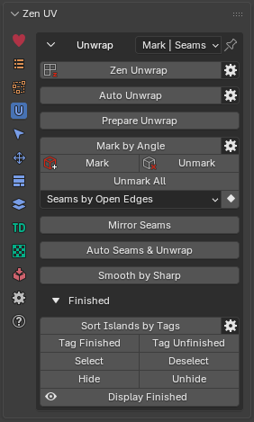 | 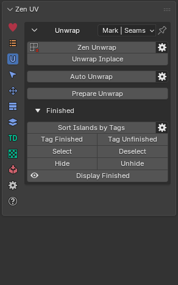 | 

## Unwrap Inplace

Unwrap Islands and Faces keeping their Size, Orientation and Location in UV Space.

!!! Properties
    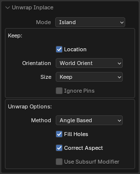

- **Mode** - Choose what to unwrap Islands or Faces.
    - *Islands* - Affect selected Islands.
    - *Faces* - Affect selected Faces only.
- **Location** - Restore Islands Location and gabarit.
- **Orientation** - What Orientation to use after unwrapping.
    - *Keep* - Preserve initial orientation. 
    - *World Orient* - Aligns UV to match their world orientation.
    - *Skip* - Leaves the orientation of UV unchanged, without any adjustment after Unwrap.
- **Size** - Preserve initial size.
    - *Keep* - UV Island size will be adjusted by initial width or height depending with the Orientation results.
    - *Global Preset* - Set value described in the Texel Density panel as [Global TD Preset](texel_density.md/#global-td-preset).
    - *Skip* - Leaves the size of UV unchanged, without any adjustment after Unwrap.
- **Ignore Pins** - Ignore Pins.
- **Fill Holes** - Virtual fill holes in meshes before unwrapping.
- **Correct Aspect** - Map UVs taking image aspect ratio into account.
- **Use Subsurf Modifier** - Map UVs taking vertex position after subsurf into account.

!!! Note
    Available only in UV Editor.

---

## Prepare Unwrap

Prepares the object for unwrapping. Remove all UV maps, seams, sharp edges, and finished UV marks.
Apply all geometry modifications before resetting for a clean unwrap

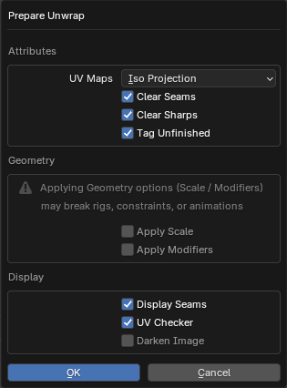

- **UV Maps** - Choose how to prepare the UV maps.
    - *Remove All* - Remove all existing UV maps from the mesh before preparing for a new unwrap.
    - *Iso Projection* - Create a default UV isometric unwrap projection for the active mesh.
    - *Skip* - Skip editing UV maps.
- **Clear Seams** - Remove all marked UV seams from mesh edges before preparing for a new unwrap.
- **Clear Sharps** - Remove all sharp edge markings from the mesh before preparing for a new unwrap.
- **Tag Unfinished** - Remove all finished island marks and tag the mesh as unfinished for a fresh unwrap

!!! Note
    The **Apply Scale** and **Apply Modifiers** options may destroy animation data. A warning is shown in the operator properties.

---

!!! Warning
    Applying Geometry options (Scale / Modifiers)
    may break rigs, constraints, or animations.

- **Apply Scale** - Apply object scale transformations before preparing the mesh for UV unwrapping.
- **Apply Modifiers** - Apply all geometry modifiers to the mesh before preparing for UV unwrapping.
---

- **Display Seams** - Display UV unwrapping seams and switch off all other overlays (Crease, Sharp, Bevel).
- **UV Checker** - Enable a UV checker texture overlay to visually inspect UV layout quality during unwrapping.
- **Darken Image** - Darken the UV checker or background image overlay to improve contrast during inspection.

---
## Mark System
!!! Panel
    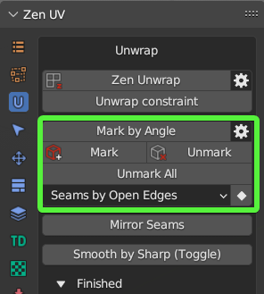

---
### Mark by Angle

Mark edges as Seams and/or Sharp edges by Angle.

!!! Global Mark Settings
    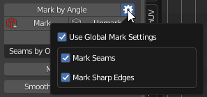

    - **Use Global Mark Settings**. In this mode, all the operators from the Mark System use the settings below. If off, every operator uses its own settings.
    - **Mark Seams**. Automatically assign Seams
    - **Mark Sharp Edges**. Automatically assign Sharp edges

!!! Tip
    This operator supports the ability to [save default properties](user_interface.md/#save-as-default-operator-properties).

!!! Properties
    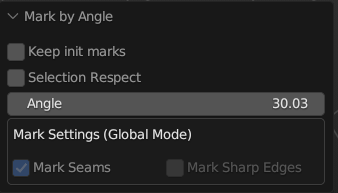

- **Keep init marks** - Keep the state of intital Seams and Sharp edges.
- **Selection Respect** - Mark only within current selection.
- **Mark Settings** - Mark Settings (Global and Local modes) to Mark Seams and Sharp Edges.
---
### Mark 

Mark selected edges or face borders as Seams and/or Sharp edges.

!!! Properties
    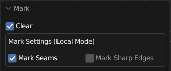

- **Clear** - Clear marking inside of selected Faces.
- **Mark Settings** - Mark Settings (Global and Local modes) to Mark Seams and Sharp Edges.

---
### Unmark 

Unmark selected edges or face borders as Seams and/or Sharp edges.

!!! Properties
    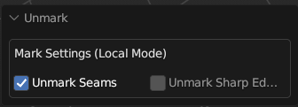

- **Mark Settings** - Mark Settings (Global and Local modes) to Mark Seams and Sharp Edges.

---
### Unmark All

Remove all the Seams and/or Sharp edges from the mesh.

!!! Properties
    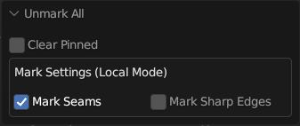

- **Clear Pinned** - Clear all the Pins.
- **Mark Settings** - Mark Settings (Global and Local modes) to Mark Seams and Sharp Edges.

---
## Conversion System
!!! Panel
    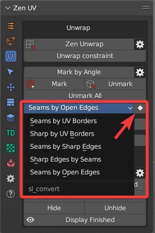

- **Seams by UV Borders** - Mark Seams by existing UV Borders.
- **Sharp by UV Borders** - Mark Sharp by existing UV Borders.
- **Seams by Sharp Edges** - Mark Seams by existing Sharp edges.
- **Sharp Edges by Seams** - Mark Sharp edges by existing Seams.
- **Seams by Open Edges** - Mark Seams by Open Edges. The way that looks in the viewport.

---
## Mirror Seams

Mirror Seams along selected Axis (`X`,`Y`,`Z`) in a given direction (`+` or `-`). If the source side has no seams, the operator will halt without performing any actions to prevent the loss of adjusted seams.

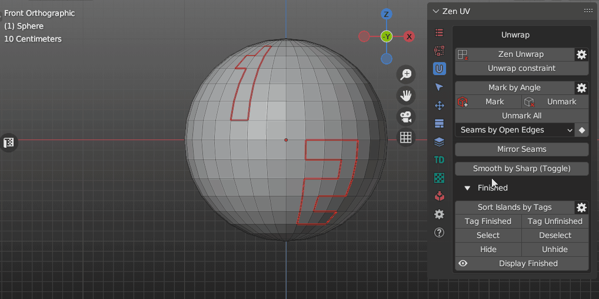

Instead of **Replacing** existing marked Seams you can **Add** them.

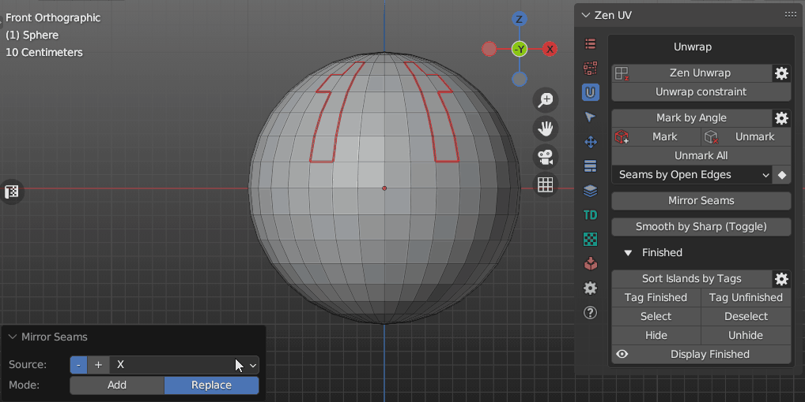

Holding `Shift` you can select both directions and flip Seams along the selected Axis and direction.

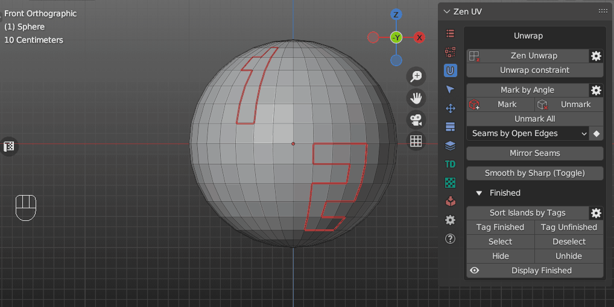

---
## Smooth by Sharp
Before Blender v 4.1.0 - Toggle between Auto Smooth 180° (with sharp edges) and regular smooth modes

Since Blender v 4.1.0: - Sets the "Shade Smooth" mode for all the mesh faces

For more details, refer to the ["Emergency Light Tutorial"](tutorial/emergency_light/emergency_light_eng.md#set-sharp-edges).

--- 

## Finishing System

Finishing system helps to Mark, Sort and Display Islands that you have already unwrapped. It can be used to check the progress of unwrapping as well as prevent Finished Islands from accidental Unwraping.

!!! Panel
    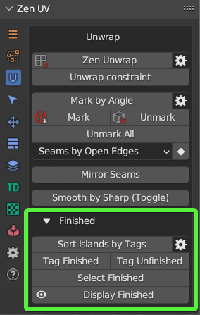

---
### Sort Islands by Tags

Finished Islands move to the right side from Main UV Tile, Unfinished — to the left.

!!! Properties
    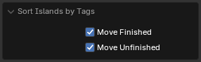

- **Move Finished** - Determines whether to move islands marked as Finished
- **Move Unfinished** - Determines whether to move islands marked as Finished

|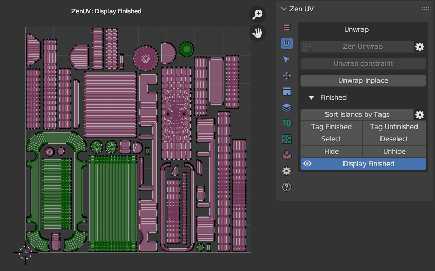|
|---|
|Sot Islands by Tags|

---
### Tag Finished

Tag Islands as Finished and move them to the right sied from main UV Tile. These Islands won't be unwrapped.

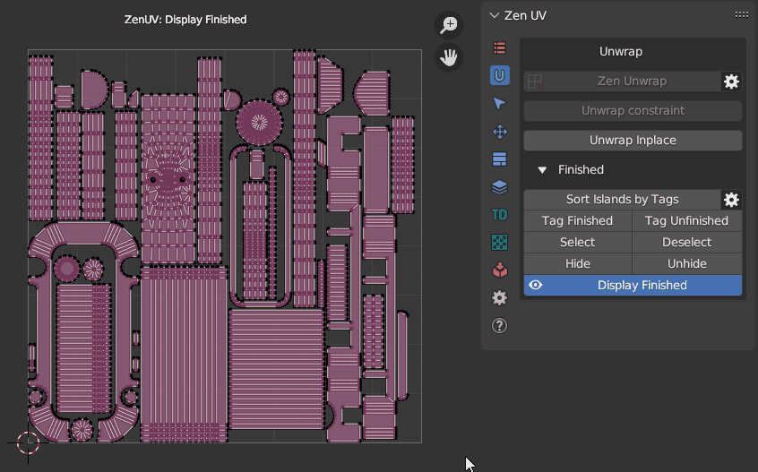

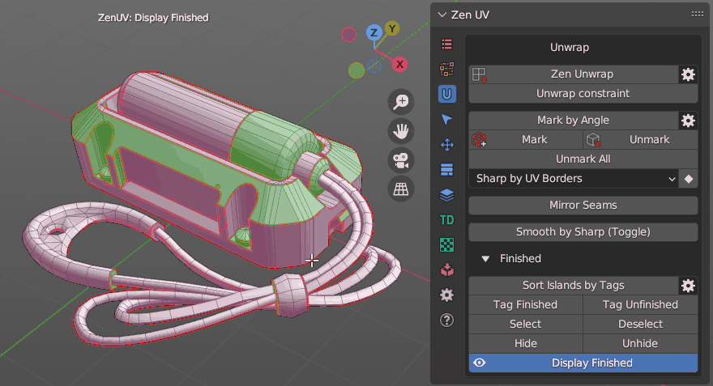

!!! Warning
    Islands tagged as Finished are locked for Unwrapping. To unlock them use **Tag Unfinished** operator.

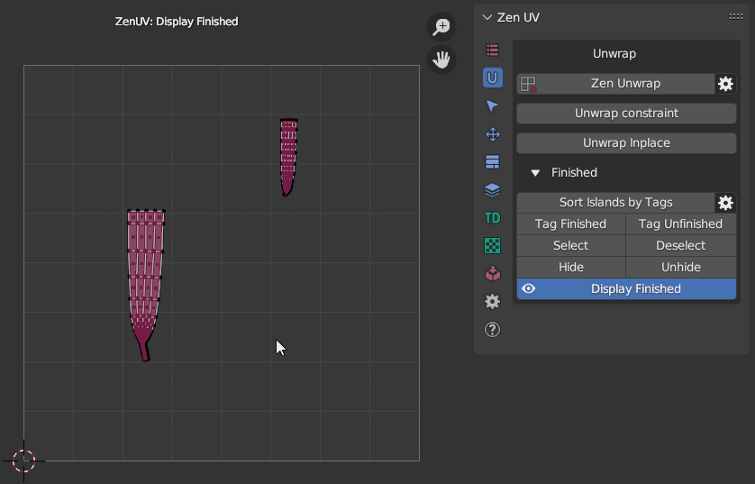

---
### Tag Unfinished

Tag Islands as Unfinished and move them to the left sied from main UV Tile. 

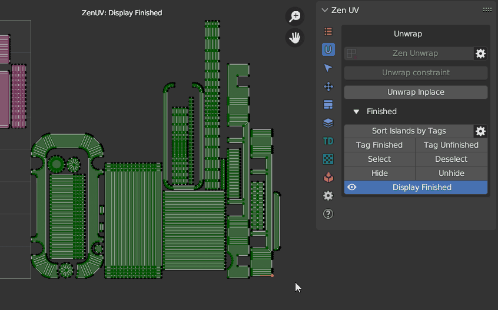

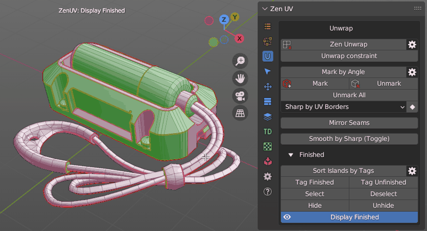

---
### Select Finished

Select Islands tagged as Finished.

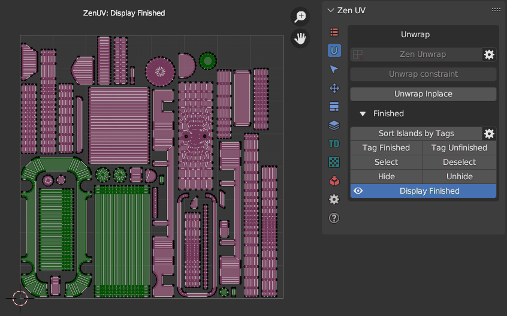

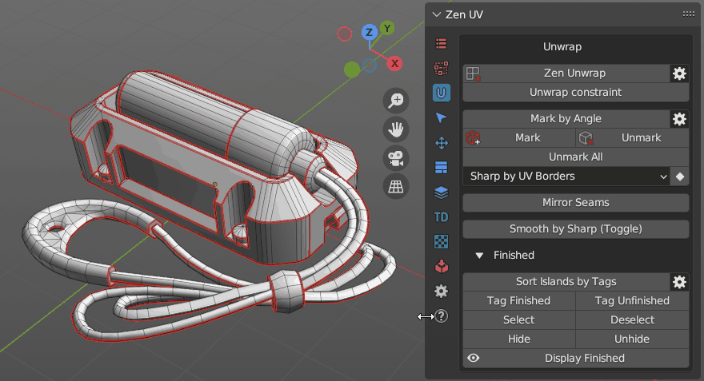

---
### Deselect Finished

Deselect Islands tagged as Finished.

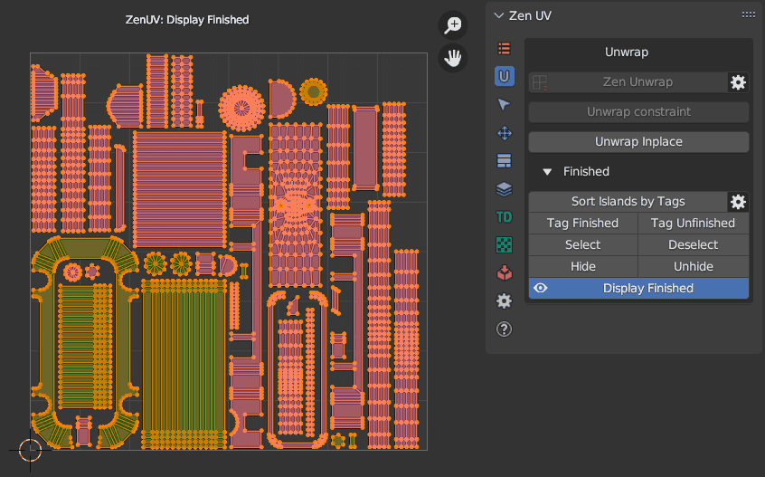

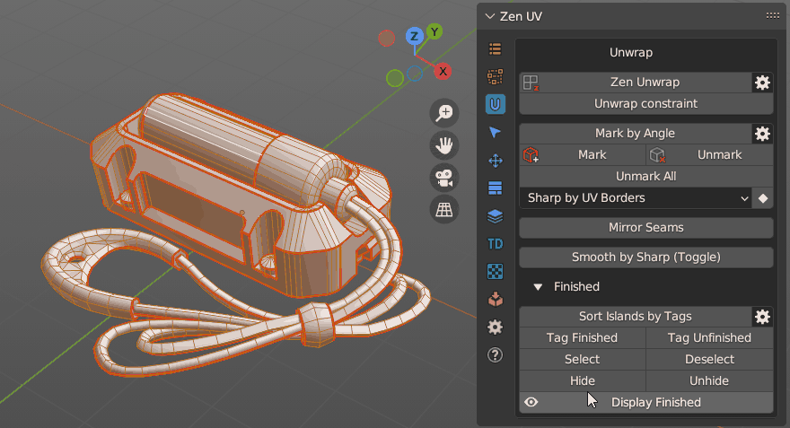

---
### Hide

Hide Islands tagged as Finished.

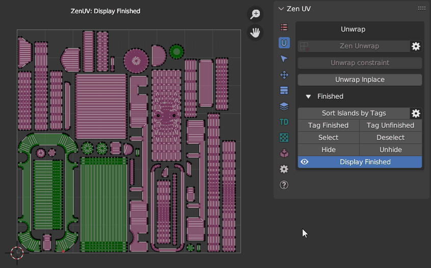

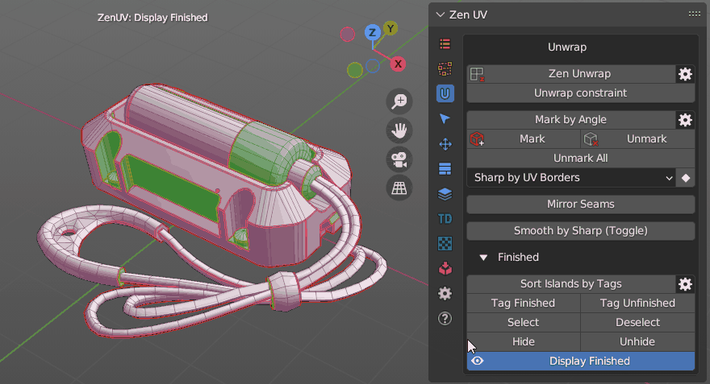

---
### Unhide

Unhide Islands tagged as Finished.

---
### Display Finished (Toggle)

Display Finished/Unfinished Islands in the viewport.

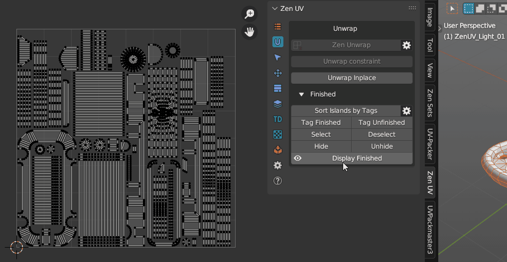

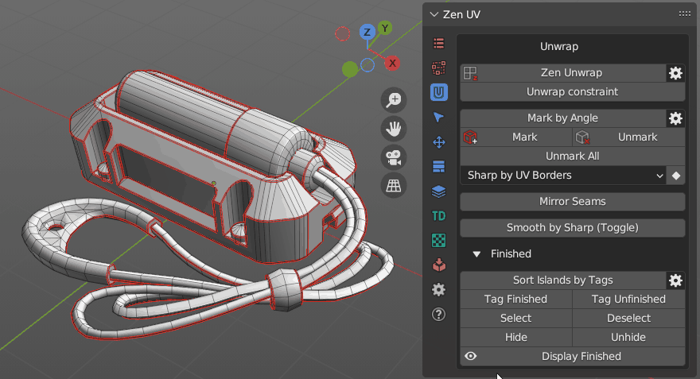

---
### Finished preferences

!!! Properties
    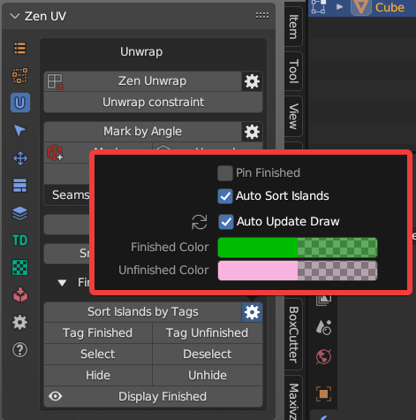

- **Pin Finished** - Pin Islands after Tag Finished operation.
- **Auto Sort Islands** - Automatically Sort Islands by Tags. Finished Islands move to the right side from Main UV Tile, Unfinished — to the left
- **Auto Update Draw** - Update draw cache every time when mesh is changed.
- **Finished Color** - Finished Islands viewport display color.
- **Unfinished Color** - Unfinished Islands viewport display color.