# Unwrap

!!! Panel
     | 3D Viewport | UV Editor| 
     |---|---|  
     |  |  | 

## Zen Unwrap

Magic button to Mark (Seams, Sharp), Set TD, Pack and Sort processed Islands. Zen Unwrap is a context-dependent operator and result of its operation depends on what was selected at the time it was run.

!!! Tip
    This operator supports the ability to [save default properties](user_interface.md/#save-as-default-operator-properties).

---

### Basic rules:

- The operator does not work in the **UV Sync Selection Off** mode of the **UV Editor**.
- The properties of the operator show the current selection mode. It matches Blender's selection mode.
- Use only a single mesh selection Mode (Vert, Edge or Face). Multiple Selection Modes will not work (Vert + Edge, etc.).
- The operator works the same way in the **UV Editor** and in the **3D Viewport**.
- Zen Unwrap always operates on islands in the active UV Map.
- If the marking is disabled in the operator, the division into islands will still occur. Seams will remain and lead to desync of what is happening in **UV Editor** and **3D Viewport**.

!!! tip
    Zen Unwrap will ignore existing UV Borders if they are not marked as Seams.
    
    - To mark them use [**Seams by UV Borders**](#conversion-system) operator.
    - To save not only UV Borders but Islands [**Tag Finished**](#tag-finished) operator. 
  
---

### Processing Mode
The main operating mode switch.

!!!Panel
    

    - **Whole Mesh**. The processing will be done for the whole mesh. All already unwrapped islands will be re-unwrapped.
    - **Selected Only**. Processing will only be performed on the mesh selection.
    - **Seam Switch**. This mode will switch seams with subsequent unwrapping. Only selected edges with seams will be included in the switching process. The seams that are in the selection will be deleted (Unmarked). New seams will be assigned according to the selection mode (Face, Edge).
    - **Unfold Vertices**. In this case, regardless of the Select Mode, any selection will be treated as vertices. Selected vertices will be relaxed.

---

### The behavior of the operator if nothing is selected:

For using this just make sure you have no selection and press the Zen Unwrap button.

- If nothing is selected, the operator assumes that you want to unwrap the whole mesh. This mode can be used if you have already marked seams in some way and just want to unfold islands.
- When you start the operator, it may already be in **Processing Mode - Selected Only**. In this case, you will get a warning that the entire meshes will be unwrapped. If this suits you - confirm your action by pressing Ok.

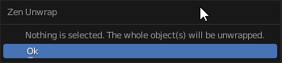

- In case you have no marked seams and nothing selected, the operator will offer options for creating seams. Select the one you want.

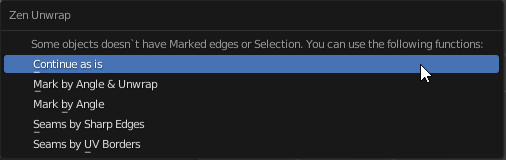

---

### The behavior of the operator if something is selected:

The main modes of operation are **Face** and **Edge**. Vertex mode is used as an auxiliary mode.

#### Face selection mode.

This mode will create seams around the selected polygons. The entire mesh will be unwrapped based on the existing (and newly added) seams, depending on the **Processing Mode**. In fact, you will create a new island from the selected polygons.

In case the object has no open edges (for example, a sphere), and you select all polygons before running the **Zen Unwrap** operator, the following situation may occur:  
the operator first removes all seams (since all polygons are selected) and cannot create new ones, because there are no borders available.  

As a result, you will receive a warning in the form of a popup message.

#### Edge selection mode.

In this mode, all selected edges will be marked as seams and then the mesh will be unwrapped.

#### Vertex selection mode.

Working in **Face** or **Edge** mode makes changes to the selected islands anyway. If you need to unwrap an island without adding seams or splittings it, use **Vertex** selection mode. You can select only one vertex or several. This will tell the operator which island you want to work with. It is most convenient to use this mode together with the **Processing Mode - Selected Only**.

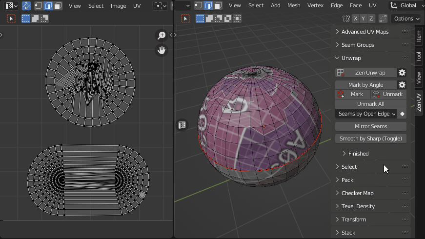

---

### Settings

!!! Properties
    
    
- **Unwrap Method** - Unwrapping method.
    - *Conformal* - Fast algorithm that gives good results.
    - *Angle-Based* - More accurate algorithm, but a bit slower.
    - *Minimum Stretch* - Uses Scalable Locally Injective Mapping (SLIM). This tries to minimize distortion for both areas and angles.

- **Mark Settings** - Operator settings to enable automatic seam marking. See [Mark Settings (Global Mode)](#mark-by-angle) for details.
- **Fill Holes** - Virtual fill holes in mesh before unwrapping, to avoid overlaps and preserve symmetry.
- **Texel Density** - Sets Texel Density. Works only if Pack Unwrapped option is disabled.
    - *Skip* - Do not make any texel density corrections.
    - *Global Preset* - Set value described in Texel Density panel as Global TD Preset. 
    - *Averaged* - Sets the averaged Texel Density for newly created islands. This keeps all islands about the same size as you work. 
- **Pack Unwrapped** - After the islands have been created, this option will start the **Packing** process of the islands. The [**Pack Engine**](pack.md/#pack-engine) specified in the **Pack System** will be used.
- **Sort Unwrapped** - After the islands have been created, this option will start the process of **Sorting** the islands by [**Finished**](#finishing-system) tag.
  
### Additional Options

You can change main Zen Unwrap settings before running the operator.  

!!!Panel
    

    - **Auto UV Sync**. Automatically enables the **UV Sync Selection** mode every time the operator starts.
    - **Processing Mode**. The main operating mode switch.
    - **Pack Unwrapped**. After the islands have been created, this option will start the **Packing** process of the islands. The [**Pack Engine**](pack.md/#pack-engine) specified in the **Pack System** will be used.
    - **Sort Unwrapped**. After the islands have been created, this option will start the process of **Sorting** the islands by [**Finished**](#finishing-system) tag.
---

## Unwrap Constraint

This operator unwraps Islands and Faces along selected axis.

!!! Properties
    

- **Mode** - Choose what to unwrap Islands or Faces.
        - *Islands* - Affect selected Islands.
        - *Faces* - Affect selected Faces only.
- **Method**. Unwrap method.
        - *Full Unwrap* - Unwrap Islands but keep it in BBox boundaries.
        - *Along Axis* - Unwrap Islands along Axis.
- **Fit Axis**
        - *U* - Unwrap / Fit along U axis.
        - *V* - Unwrap / Fit along V axis.
        - *Min* - The minimum length axis will be automatically determined.
        - *Max* - The maximum length axis will be automatically determined.
- **Current Axis** - Current Axis.
- **Mark Settings** - Mark Settings (Global and Local modes) to Mark Seams and Sharp Edges.
- **Fill Holes** - Virtual fill holes in meshes before unwrapping.
- **Correct Aspect** - Map UVs taking image aspect ratio into account.
- **Use Subsurf Modifier** - Map UVs taking vertex position after subsurf into account.

---

## Unwrap Inplace

Unwrap Islands and Faces keeping their Size, Orientation and Location in UV Space.

!!! Properties
    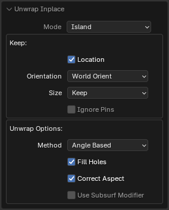

- **Mode** - Choose what to unwrap Islands or Faces.
        - *Islands* - Affect selected Islands.
        - *Faces* - Affect selected Faces only.
- **Location** - Restore Islands Location and gabarit.
- **Orientation** - What Orientation to use after unwrapping.
        - *Keep* - Use Initial Orientation. 
        - *World Orient* - Use World Orientation for the Islands.
        - *Skip* - Skip Orientation adjustments.
- **Size** - Restore Islands Size.
- **Ignore Pins** - Ignore Pins.
- **Fill Holes** - Virtual fill holes in meshes before unwrapping.
- **Correct Aspect** - Map UVs taking image aspect ratio into account.
- **Use Subsurf Modifier** - Map UVs taking vertex position after subsurf into account.

!!! Note
    Available only in UV Editor.

---

## Auto Unwrap

Automated UV unwrapper based on a utility written by Eskil Steenberg www.ministryofflat.com.

This operator is essentially a bridge for working with **MinistryOfFlat**.  
This software is designed **exclusively for Windows**, so this operator will not be available on **Linux** or **Mac OS**.

[https://www.quelsolaar.com/ministry_of_flat/](https://www.quelsolaar.com/ministry_of_flat/)

!!! warning
    The **Auto Unwrap** operator utilizes a third-party application, which has its own license terms.  
    Please review the license agreement of the external software before use and determine whether you can legally use it.

!!! warning
    Since this software is third-party, it is not distributed with **Zen UV**.  
    Therefore, we will outline the full activation process, starting from the first click on the **Auto Unwrap** button.

If you have just installed the add-on, go to the **Unwrap** tab in the **Zen UV** panel in any context (**UV Editor** or **3D View**).  
Find and click the **Auto Unwrap** button. You will see a popup like the one shown in the screenshot below.

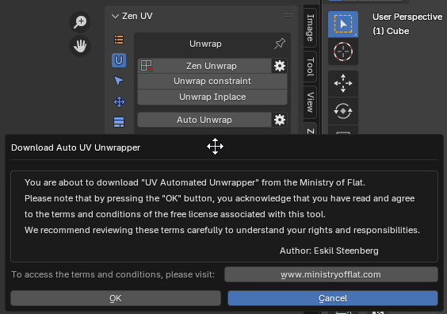

The message displayed will be:

    'You are about to download "UV Automated Unwrapper" from the Ministry of Flat.',
    'Please note that by pressing the "OK" button, you acknowledge that you have read and agree',
    'to the terms and conditions of the free license associated with this tool.',
    'We recommend reviewing these terms carefully to understand your rights and responsibilities.'

If you agree with the stated terms, press the **OK** button.  
The software will be automatically downloaded and installed into the Blender settings folder:  
`scripts\presets\zen_uv\auto_uv_unwrap\MinistryOfFlat_Release`.  
For more details, refer to the **Modules** section in [Addon Preferences](addon_prefs.md#modules).

The download time depends on your internet speed, but in general, it happens quite quickly.  
This software **does not require installation** and runs in the console, so **no special permissions** are typically needed.  
However, if any issues arise, ensure that **Blender has permission to write to disk**.  
Once the download is complete, the unwrapping process will start immediately using the parameters specified in the operator settings.

!!! tip
    You can configure the operator's properties before running it.  
    You can also save your own presets using Blender's standard preset system.  
    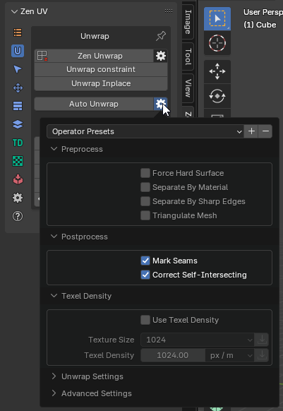

This utility is universal, so we have already set up some **default configurations** for better results.  
However, you can **create and save your own presets** for any specific needs.  
If you want to return to the default settings, use the **Restore Operator Defaults** function.

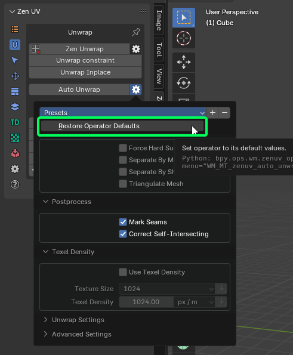

Below, we provide some explanations about **why there are so many settings** and **what to expect when changing them**.  
First of all, it’s important to understand that **we do not modify your geometry**, only the **current UV map**.  
Thus, **geometry attributes** (such as **Vertex Maps**, **Vertex Colors**) will remain **unchanged**.  
Inactive **UV Maps** will also stay the same.

1. **Preprocess** - These settings activate processes **before** sending data to MOF.
2. **Postprocess** - These settings activate processes **after** the UV map is returned from MOF.
3. **Texel Density** - Allows you to set TD for automatic unwrapping. This process is controlled **directly by MOF**.
4. **Unwrap Settings** - These settings configure **MOF’s core behavior**.
5. **Advanced Settings** - These settings provide additional controls inside **MOF** and are marked as **"Advanced"**.  
   Let's quote the original developer:

> **"All following settings are for debugging purposes only.  
> Making any change to these settings is likely to result in worse UV mapping and/or longer processing time."**  
> — Ministry of Flat

---

### **Preprocess Settings**

- **Force Hard Surface** - Forces the algorithm to treat the surface as a **hard surface**, ensuring precise handling of **sharp edges** and **rigid structures**.
- **Separate By Material** - Splits the **mesh by materials** before unwrapping.
- **Separate By Sharp Edges** - Splits the **mesh by sharp edges** before unwrapping.
- **Triangulate Mesh** - Converts **n-gons** (faces with 4+ vertices) into triangles.  
  If the mesh contains complex **n-gons**, they may be **internally split** within **MOF**,  
  while still being treated as a **single structure** in the mesh.  
  This can result in **gaps** in what should remain unified, appearing as **stretched polygons**.  
  **This issue must be corrected manually.**

---

### **Postprocess Settings**

- **Mark Seams** - Automatically assigns **seams**.
- **Correct Self-Intersecting** - Fixes **UV faces** that have **self-intersecting UV edges**.

---

### **Texel Density Settings**

- **Use Texel Density** - Scales the UVs to match the **specified texel density value**.
- **Texture Size** - Image size preset.
- **Texel Density** - The texel density value.

---

### **Unwrap Settings (MOF Core)**
The following settings were created by the **MOF developer**, so we present them **as they are**.

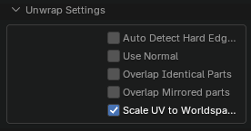

- **Auto Detect Hard Edges** - The UV unwrapper will try to **separate all hard edges**.  
  Useful for **lightmapping** and **normal mapping**.
- **Use Normal** - Uses the **model's normals** to help classify polygons.
- **Overlap Identical Parts** - Overlaps **identical parts** to save **texture space**.
- **Overlap Mirrored Parts** - Overlaps **mirrored parts** to save **texture space**.
- **Scale UV to Worldspace** - Scales the UVs to match their **real-world scale**, extending **beyond the 0-1 UV space**.

---

### **Advanced Settings**

- **Stretch** - Stretches islands **too wide** to fit within the texture.
- **Packing** - Packs **UV islands** into a **rectangular layout**.
- **Cut** - Cuts **awkward shapes** to **optimize layout coverage**.
- **Squares** - Identifies **individual polygons** with right angles.
- **Vertex Weld** - Merges **duplicate vertices**.  
  **Does not affect** the **output polygon** or **vertex data**.
- **Quads** - Detects **triangle pairs** that can form **quads**, improving **patch distribution**.

The **Advanced Settings** list is much larger.  
We have highlighted only a few **useful options**.  
You can manually enable **other options** using **Extra Arguments**.

- **Extra Arguments** - Allows **additional command-line arguments** to be passed to the **UV unwrapping application**.

For the **full list of arguments**, refer to: [MOF Arguments](MOF_Arguments.md).

---
## Mark System
!!! Panel
    

---
### Mark by Angle

Mark edges as Seams and/or Sharp edges by Angle.

!!! Global Mark Settings
    

    - **Use Global Mark Settings**. In this mode, all the operators from the Mark System use the settings below. If off, every operator uses its own settings.
    - **Mark Seams**. Automatically assign Seams
    - **Mark Sharp Edges**. Automatically assign Sharp edges

!!! Properties
    

- **Keep init marks** - Keep the state of intital Seams and Sharp edges.
- **Selection Respect** - Mark only within current selection.
- **Mark Settings** - Mark Settings (Global and Local modes) to Mark Seams and Sharp Edges.
---
### Mark 

Mark selected edges or face borders as Seams and/or Sharp edges.

!!! Properties
    

- **Clear** - Clear marking inside of selected Faces.
- **Mark Settings** - Mark Settings (Global and Local modes) to Mark Seams and Sharp Edges.

---
### Unmark 

Unmark selected edges or face borders as Seams and/or Sharp edges.

!!! Properties
    

- **Mark Settings** - Mark Settings (Global and Local modes) to Mark Seams and Sharp Edges.

---
### Unmark All

Remove all the Seams and/or Sharp edges from the mesh.

!!! Properties
    

- **Clear Pinned** - Clear all the Pins.
- **Mark Settings** - Mark Settings (Global and Local modes) to Mark Seams and Sharp Edges.

---
## Conversion System
!!! Panel
    

- **Seams by UV Borders** - Mark Seams by existing UV Borders.
- **Sharp by UV Borders** - Mark Sharp by existing UV Borders.
- **Seams by Sharp Edges** - Mark Seams by existing Sharp edges.
- **Sharp Edges by Seams** - Mark Sharp edges by existing Seams.
- **Seams by Open Edges** - Mark Seams by Open Edges. The way that looks in the viewport.

---
## Mirror Seams

Mirror Seams along selected Axis (`X`,`Y`,`Z`) in a given direction (`+` or `-`). If the source side has no seams, the operator will halt without performing any actions to prevent the loss of adjusted seams.

Instead of **Replacing** existing marked Seams you can **Add** them.

Holding `Shift` you can select both directions and flip Seams along the selected Axis and direction.

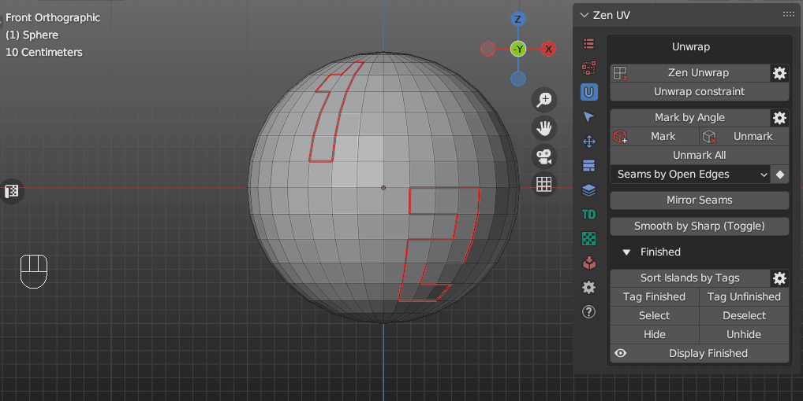

---
## Smooth by Sharp
Before Blender v 4.1.0 - Toggle between Auto Smooth 180° (with sharp edges) and regular smooth modes

Since Blender v 4.1.0: - Sets the "Shade Smooth" mode for all the mesh faces

For more details, refer to the ["Emergency Light Tutorial"](tutorial/emergency_light/emergency_light_eng.md#set-sharp-edges).

--- 

## Finishing System

Finishing system helps to Mark, Sort and Display Islands that you have already unwrapped. It can be used to check the progress of unwrapping as well as prevent Finished Islands from accidental Unwraping.

!!! Panel
    

---
### Sort Islands by Tags

Finished Islands move to the right side from Main UV Tile, Unfinished — to the left.

!!! Properties
    

- **Move Finished** - Determines whether to move islands marked as Finished
- **Move Unfinished** - Determines whether to move islands marked as Finished

||
|---|
|Sot Islands by Tags|

---
### Tag Finished

Tag Islands as Finished and move them to the right sied from main UV Tile. These Islands won't be unwrapped.

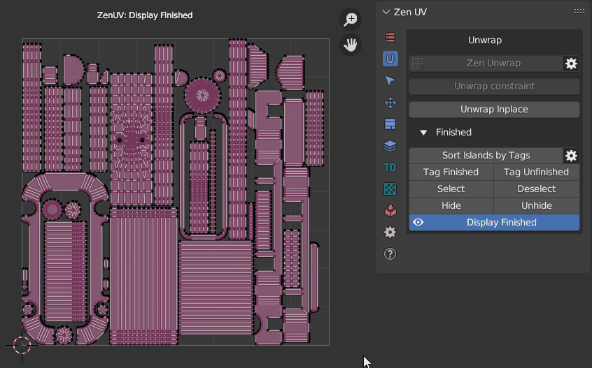

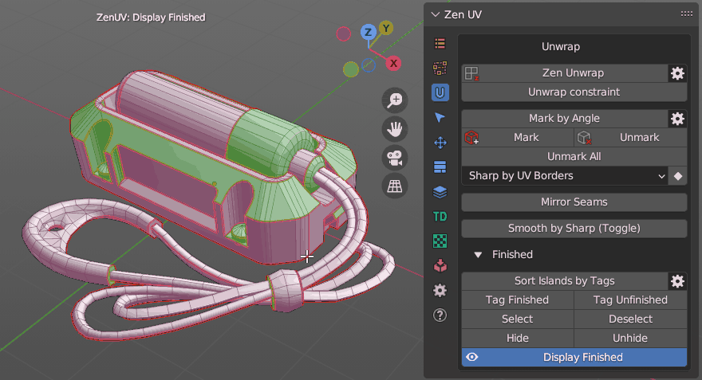

!!! Warning
    Islands tagged as Finished are locked for Unwrapping. To unlock them use **Tag Unfinished** operator.

---
### Tag Unfinished

Tag Islands as Unfinished and move them to the left sied from main UV Tile. 

---
### Select Finished

Select Islands tagged as Finished.

---
### Deselect Finished

Deselect Islands tagged as Finished.

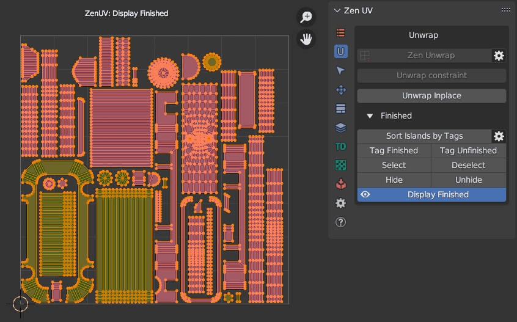

---
### Hide

Hide Islands tagged as Finished.

---
### Unhide

Unhide Islands tagged as Finished.

---
### Display Finished (Toggle)

Display Finished/Unfinished Islands in the viewport.

---
### Finished preferences

!!! Properties
    

- **Pin Finished** - Pin Islands after Tag Finished operation.
- **Auto Sort Islands** - Automatically Sort Islands by Tags. Finished Islands move to the right side from Main UV Tile, Unfinished — to the left
- **Auto Update Draw** - Update draw cache every time when mesh is changed.
- **Finished Color** - Finished Islands viewport display color.
- **Unfinished Color** - Unfinished Islands viewport display color.