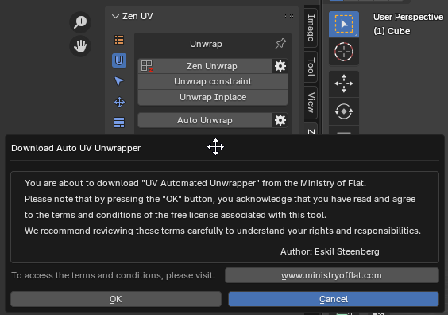
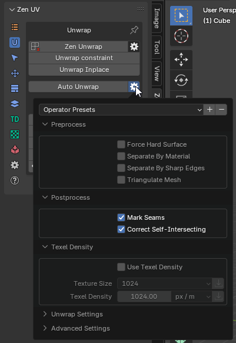
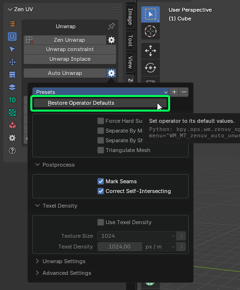
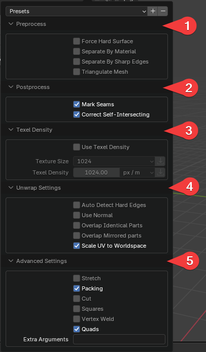
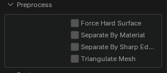
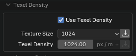
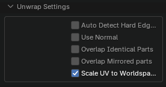
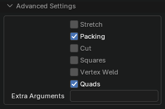

# Auto Unwrap

Automated UV unwrapper based on a utility written by Eskil Steenberg www.ministryofflat.com.

This operator is essentially a bridge for working with **MinistryOfFlat**.  
This software is designed **exclusively for Windows**, so this operator will not be available on **Linux** or **Mac OS**.

[https://www.quelsolaar.com/ministry_of_flat/](https://www.quelsolaar.com/ministry_of_flat/)

!!! warning
    The **Auto Unwrap** operator utilizes a third-party application, which has its own license terms.  
    Please review the license agreement of the external software before use and determine whether you can legally use it.

!!! warning
    Since this software is third-party, it is not distributed with **Zen UV**.  
    Therefore, we will outline the full activation process, starting from the first click on the **Auto Unwrap** button.

If you have just installed the add-on, go to the **Unwrap** tab in the **Zen UV** panel in any context (**UV Editor** or **3D View**).  
Find and click the **Auto Unwrap** button. You will see a popup like the one shown in the screenshot below.

The message displayed will be:

    'You are about to download "UV Automated Unwrapper" from the Ministry of Flat.',
    'Please note that by pressing the "OK" button, you acknowledge that you have read and agree',
    'to the terms and conditions of the free license associated with this tool.',
    'We recommend reviewing these terms carefully to understand your rights and responsibilities.'

If you agree with the stated terms, press the **OK** button.  
The software will be automatically downloaded and installed into the Blender settings folder:  
`scripts\presets\zen_uv\auto_uv_unwrap\MinistryOfFlat_Release`.  
For more details, refer to the **Modules** section in [Addon Preferences](../addon_prefs.md#modules).

The download time depends on your internet speed, but in general, it happens quite quickly.  
This software **does not require installation** and runs in the console, so **no special permissions** are typically needed.  
However, if any issues arise, ensure that **Blender has permission to write to disk**.  
Once the download is complete, the unwrapping process will start immediately using the parameters specified in the operator settings.

!!! tip
    You can configure the operator's properties before running it.  
    You can also save your own presets using Blender's standard preset system.  
    

This utility is universal, so we have already set up some **default configurations** for better results.  
However, you can **create and save your own presets** for any specific needs.  
If you want to return to the default settings, use the **Restore Operator Defaults** function.

Below, we provide some explanations about **why there are so many settings** and **what to expect when changing them**.  
First of all, it’s important to understand that **we do not modify your geometry**, only the **current UV map**.  
Thus, **geometry attributes** (such as **Vertex Maps**, **Vertex Colors**) will remain **unchanged**.  
Inactive **UV Maps** will also stay the same.

1. **Preprocess** - These settings activate processes **before** sending data to MOF.
2. **Postprocess** - These settings activate processes **after** the UV map is returned from MOF.
3. **Texel Density** - Allows you to set TD for automatic unwrapping. This process is controlled **directly by MOF**.
4. **Unwrap Settings** - These settings configure **MOF’s core behavior**.
5. **Advanced Settings** - These settings provide additional controls inside **MOF** and are marked as **"Advanced"**.  
   Let's quote the original developer:

> **"All following settings are for debugging purposes only.  
> Making any change to these settings is likely to result in worse UV mapping and/or longer processing time."**  
> — Ministry of Flat

---

## **Preprocess Settings**

- **Force Hard Surface** - Forces the algorithm to treat the surface as a **hard surface**, ensuring precise handling of **sharp edges** and **rigid structures**.
- **Separate By Material** - Splits the **mesh by materials** before unwrapping.
- **Separate By Sharp Edges** - Splits the **mesh by sharp edges** before unwrapping.
- **Triangulate Mesh** - Converts **n-gons** (faces with 4+ vertices) into triangles.  
  If the mesh contains complex **n-gons**, they may be **internally split** within **MOF**,  
  while still being treated as a **single structure** in the mesh.  
  This can result in **gaps** in what should remain unified, appearing as **stretched polygons**.  
  **This issue must be corrected manually.**

---

## **Postprocess Settings**

- **Mark Seams** - Automatically assigns **seams**.
- **Correct Self-Intersecting** - Fixes **UV faces** that have **self-intersecting UV edges**.

---

## **Texel Density Settings**

- **Use Texel Density** - Scales the UVs to match the **specified texel density value**.
- **Texture Size** - Image size preset.
- **Texel Density** - The texel density value.

---

## **Unwrap Settings (MOF Core)**
The following settings were created by the **MOF developer**, so we present them **as they are**.

- **Auto Detect Hard Edges** - The UV unwrapper will try to **separate all hard edges**.  
  Useful for **lightmapping** and **normal mapping**.
- **Use Normal** - Uses the **model's normals** to help classify polygons.
- **Overlap Identical Parts** - Overlaps **identical parts** to save **texture space**.
- **Overlap Mirrored Parts** - Overlaps **mirrored parts** to save **texture space**.
- **Scale UV to Worldspace** - Scales the UVs to match their **real-world scale**, extending **beyond the 0-1 UV space**.

---

## **Advanced Settings**

- **Stretch** - Stretches islands **too wide** to fit within the texture.
- **Packing** - Packs **UV islands** into a **rectangular layout**.
- **Cut** - Cuts **awkward shapes** to **optimize layout coverage**.
- **Squares** - Identifies **individual polygons** with right angles.
- **Vertex Weld** - Merges **duplicate vertices**.  
  **Does not affect** the **output polygon** or **vertex data**.
- **Quads** - Detects **triangle pairs** that can form **quads**, improving **patch distribution**.

The **Advanced Settings** list is much larger.  
We have highlighted only a few **useful options**.  
You can manually enable **other options** using **Extra Arguments**.

- **Extra Arguments** - Allows **additional command-line arguments** to be passed to the **UV unwrapping application**.

---

## Ministry OF Flat UnWrapConsole3.exe Documentation for version 3.7.2

It only takes .obj files, but most tools can import and export obj-files, so it should work for most usages.

### UI Version

To change the camera, press the right mouse button. Right + Left dollys, and Right + Middle pans. Multi-touch camera controls also work (two fingers to tumble/zoom and three to pan), as well as standard Maya camera controls by pressing **Alt + mouse buttons**.

Click in empty space to switch between 3D and UV view.

### Contact and Feedback

If you encounter any issues, please mail me, and if possible, send me the mesh you have problems with. If you can't send the mesh, a screenshot will also do. If you are having problems, you can turn on the **"validate"** option in the settings. This will run a bunch of validation steps and output any errors it finds in the `betray_stdout.txt` file. It only gets better if I know what’s wrong with it!

UV mapping is subjective, so if you have opinions, please let me know. If you think it sucks, **LET ME KNOW** and tell me why.  

> **Note:** I am more focused on hand-made meshes with good topology than on scanned meshes, so that will remain my focus for now.

Follow me on Twitter at **[@quelsolaar](https://twitter.com/quelsolaar)**. I will post when I release new versions and when issues are fixed.

If you are interested in **Licensing the full version**, contact **license@ministryofflat.com**.

---

## Settings

### Texture Resolution
- **Description:** Resolution of texture, to give the right amount of island gaps to prevent bleeds.
- **Command-line usage:** `-RESOLUTION <VALUE>`
- **Default value:** `1024`

### Separate Hard Edges
- **Description:** Guarantees that all hard edges are separated. Useful for lightmapping and normal mapping.
- **Command-line usage:** `-SEPARATE <TRUE/FALSE>`
- **Default value:** `FALSE`

### Aspect
- **Description:** Aspect ratio of pixels. For non-square textures.
- **Command-line usage:** `-ASPECT <VALUE>`
- **Default value:** `1.000000`

### Use Normal
- **Description:** Use the model’s normals to help classify polygons.
- **Command-line usage:** `-NORMALS <TRUE/FALSE>`
- **Default value:** `FALSE`

### UDIMs
- **Description:** Split the model into multiple UDIMs.
- **Command-line usage:** `-UDIMS <VALUE>`
- **Default value:** `1`

### Overlap Identical Parts
- **Description:** Overlap identical parts to take up the same texture space.
- **Command-line usage:** `-OVERLAP <TRUE/FALSE>`
- **Default value:** `FALSE`

### Overlap Mirrored Parts
- **Description:** Overlap mirrored parts to take up the same texture space.
- **Command-line usage:** `-MIRROR <TRUE/FALSE>`
- **Default value:** `FALSE`

### Scale UV Space to Worldspace
- **Description:** Scales the UVs to match their real-world scale, going beyond the zero-to-one range.
- **Command-line usage:** `-WORLDSCALE <TRUE/FALSE>`
- **Default value:** `FALSE`

### Texture Density
- **Description:** If worldspace is enabled, this value sets the number of pixels per unit.
- **Command-line usage:** `-DENSITY <VALUE>`
- **Default value:** `1024`

### Seam Direction
- **Description:** Sets a point in space that seams are directed toward. By default, it's the center of the model.
- **Command-line usage:** `-CENTER <X VALUE> <Y VALUE> <Z VALUE>`
- **Default value:** `0.000000 0.000000 0.000000`

---

### Debugging Settings

> **Warning:**  
> All following settings are for debugging purposes only.  
> Making any change to these settings is likely to result in worse UV mapping and/or longer processing time.

#### Suppress Validation Errors
- **Description:** Faulty geometry errors will not be printed to standard output.
- **Command-line usage:** `-SUPRESS <TRUE/FALSE>`
- **Default value:** `FALSE`

#### Quads
- **Description:** Searches the model for triangle pairs that make good quads. Improves the use of patches.
- **Command-line usage:** `-QUAD <TRUE/FALSE>`
- **Default value:** `TRUE`

#### Vertex Weld
- **Description:** Merges duplicate vertices. Does not affect the output polygon or vertex data.
- **Command-line usage:** `-WELD <TRUE/FALSE>`
- **Default value:** `TRUE`

#### Flat Soft Surface
- **Description:** Detects flat areas of soft surfaces in order to minimize distortion.
- **Command-line usage:** `-FLAT <TRUE/FALSE>`
- **Default value:** `TRUE`

#### Cones
- **Description:** Searches the model for sharp cones.
- **Command-line usage:** `-CONE <TRUE/FALSE>`
- **Default value:** `TRUE`

#### Cone Ratio
- **Description:** The minimum ratio of a triangle used in a cone.
- **Command-line usage:** `-CONERATIO <VALUE>`
- **Default value:** `0.500000`

#### Grids
- **Description:** Searches the model for grids of quads.
- **Command-line usage:** `-GRIDS <TRUE/FALSE>`
- **Default value:** `TRUE`

#### Strips
- **Description:** Searches the model for strips of quads.
- **Command-line usage:** `-STRIP <TRUE/FALSE>`
- **Default value:** `TRUE`

#### Tubes
- **Description:** Finds tube-shaped geometry and unwraps it using cylindrical projection.
- **Command-line usage:** `-TUBES <TRUE/FALSE>`
- **Default value:** `TRUE`

#### Packing
- **Description:** Packs islands into a rectangle.
- **Command-line usage:** `-PACKING <TRUE/FALSE>`
- **Default value:** `TRUE`

#### Packing Iterations
- **Description:** How many times the packer will pack the islands to find the optimal spacing.
- **Command-line usage:** `-PACKING_ITERATIONS <VALUE>`
- **Default value:** `4`

#### Validate
- **Description:** Validates geometry after each stage and prints out any issues found (**for debugging only**).
- **Command-line usage:** `-VALIDATE <TRUE/FALSE>`
- **Default value:** `FALSE`
