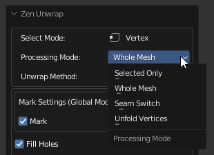
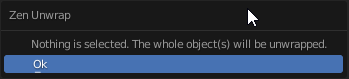
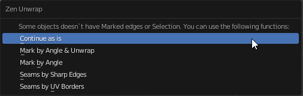
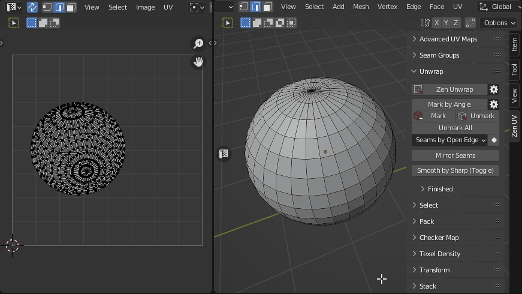
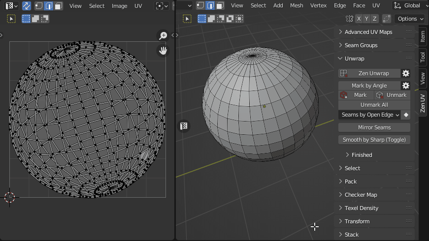
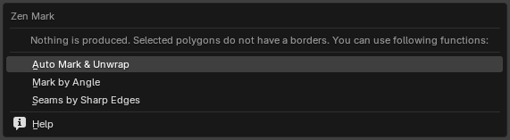
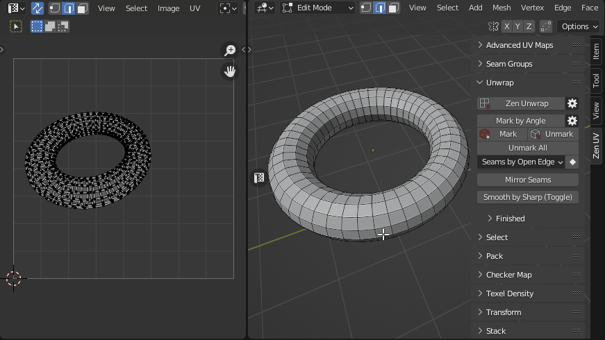
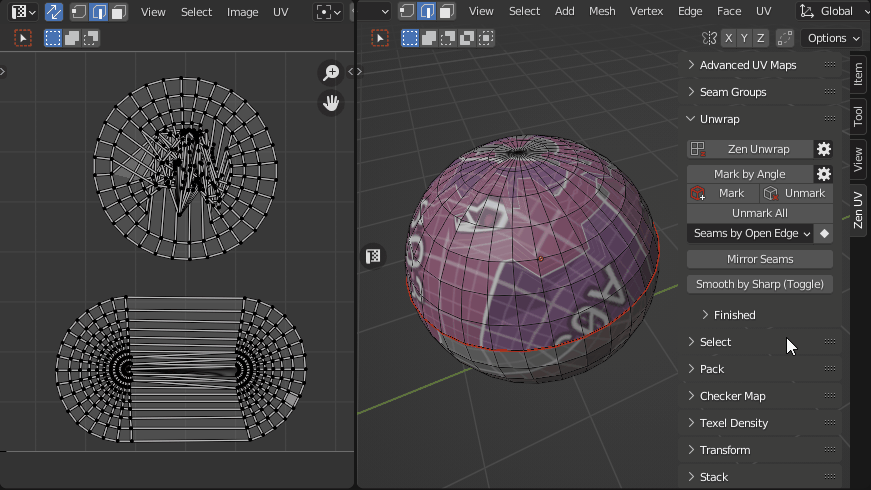
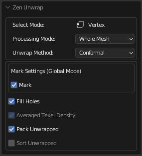
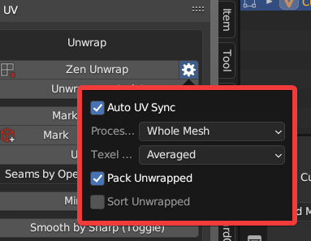

# Zen Unwrap

Magic button to Mark (Seams, Sharp), Set TD, Pack and Sort processed Islands. Zen Unwrap is a context-dependent operator and result of its operation depends on what was selected at the time it was run.

!!! Tip
    This operator supports the ability to [save default properties](../user_interface.md/#save-as-default-operator-properties).

---

## Basic rules:

- The operator does not work in the **UV Sync Selection Off** mode of the **UV Editor**.
- The properties of the operator show the current selection mode. It matches Blender's selection mode.
- Use only a single mesh selection Mode (Vert, Edge or Face). Multiple Selection Modes will not work (Vert + Edge, etc.).
- The operator works the same way in the **UV Editor** and in the **3D Viewport**.
- Zen Unwrap always operates on islands in the active UV Map.
- If the marking is disabled in the operator, the division into islands will still occur. Seams will remain and lead to desync of what is happening in **UV Editor** and **3D Viewport**.

!!! tip
    Zen Unwrap will ignore existing UV Borders if they are not marked as Seams.
    
    - To mark them use [**Seams by UV Borders**](../unwrap.md#conversion-system) operator.
    - To save not only UV Borders but Islands [**Tag Finished**](../unwrap.md#tag-finished) operator. 
  
---

## Processing Mode
The main operating mode switch.

!!!Panel
    

    - **Whole Mesh**. The processing will be done for the whole mesh. All already unwrapped islands will be re-unwrapped.
    - **Selected Only**. Processing will only be performed on the mesh selection.
    - **Seam Switch**. This mode will switch seams with subsequent unwrapping. Only selected edges with seams will be included in the switching process. The seams that are in the selection will be deleted (Unmarked). New seams will be assigned according to the selection mode (Face, Edge).
    - **Unfold Vertices**. In this case, regardless of the Select Mode, any selection will be treated as vertices. Selected vertices will be relaxed.

---

## The behavior of the operator if nothing is selected:

For using this just make sure you have no selection and press the Zen Unwrap button.

- If nothing is selected, the operator assumes that you want to unwrap the whole mesh. This mode can be used if you have already marked seams in some way and just want to unfold islands.
- When you start the operator, it may already be in **Processing Mode - Selected Only**. In this case, you will get a warning that the entire meshes will be unwrapped. If this suits you - confirm your action by pressing Ok.

- In case you have no marked seams and nothing selected, the operator will offer options for creating seams. Select the one you want.

---

## The behavior of the operator if something is selected:

The main modes of operation are **Face** and **Edge**. Vertex mode is used as an auxiliary mode.

### Face selection mode.

This mode will create seams around the selected polygons. The entire mesh will be unwrapped based on the existing (and newly added) seams, depending on the **Processing Mode**. In fact, you will create a new island from the selected polygons.

In case the object has no open edges (for example, a sphere), and you select all polygons before running the **Zen Unwrap** operator, the following situation may occur:  
the operator first removes all seams (since all polygons are selected) and cannot create new ones, because there are no borders available.  

As a result, you will receive a warning in the form of a popup message.

### Edge selection mode.

In this mode, all selected edges will be marked as seams and then the mesh will be unwrapped.

### Vertex selection mode.

Working in **Face** or **Edge** mode makes changes to the selected islands anyway. If you need to unwrap an island without adding seams or splittings it, use **Vertex** selection mode. You can select only one vertex or several. This will tell the operator which island you want to work with. It is most convenient to use this mode together with the **Processing Mode - Selected Only**.

---

## Settings

!!! Properties
    
    
- **Unwrap Method** - Unwrapping method.
    - *Conformal* - Fast algorithm that gives good results.
    - *Angle-Based* - More accurate algorithm, but a bit slower.
    - *Minimum Stretch* - Uses Scalable Locally Injective Mapping (SLIM). This tries to minimize distortion for both areas and angles.

- **Mark Settings** - Operator settings to enable automatic seam marking. See [Mark Settings (Global Mode)](../unwrap.md#mark-by-angle) for details.
- **Fill Holes** - Virtual fill holes in mesh before unwrapping, to avoid overlaps and preserve symmetry.
- **Texel Density** - Sets Texel Density. Works only if Pack Unwrapped option is disabled.
    - *Skip* - Do not make any texel density corrections.
    - *Global Preset* - Set value described in Texel Density panel as [Global TD Preset](../texel_density.md/#global-td-preset). 
    - *Averaged* - Sets the averaged Texel Density for newly created islands. This keeps all islands about the same size as you work. 
- **Pack Unwrapped** - After the islands have been created, this option will start the **Packing** process of the islands. The [**Pack Engine**](../pack.md/#pack-engine) specified in the **Pack System** will be used.
- **Sort Unwrapped** - After the islands have been created, this option will start the process of **Sorting** the islands by [**Finished**](../unwrap.md#finishing-system) tag.
  
## Additional Options

You can change main Zen Unwrap settings before running the operator.  

!!!Panel
    

    - **Auto UV Sync**. Automatically enables the **UV Sync Selection** mode every time the operator starts.
    - **Processing Mode**. The main operating mode switch.
    - **Pack Unwrapped**. After the islands have been created, this option will start the **Packing** process of the islands. The [**Pack Engine**](../pack.md/#pack-engine) specified in the **Pack System** will be used.
    - **Sort Unwrapped**. After the islands have been created, this option will start the process of **Sorting** the islands by [**Finished**](../unwrap.md#finishing-system) tag.
---