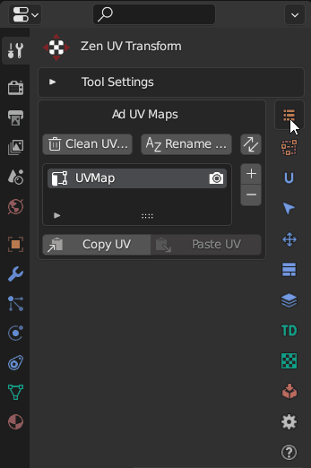
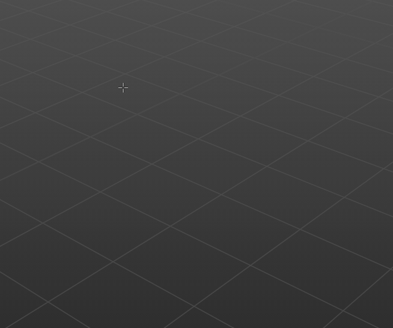
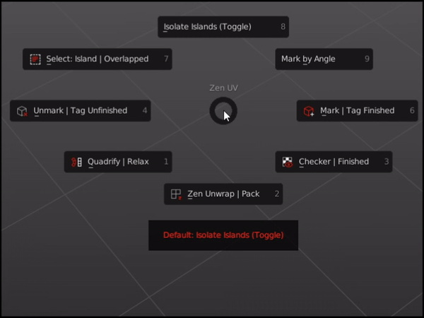
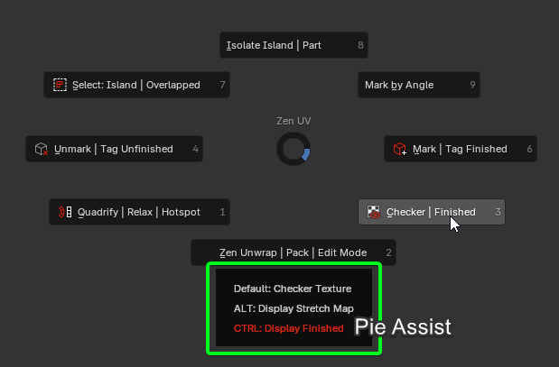
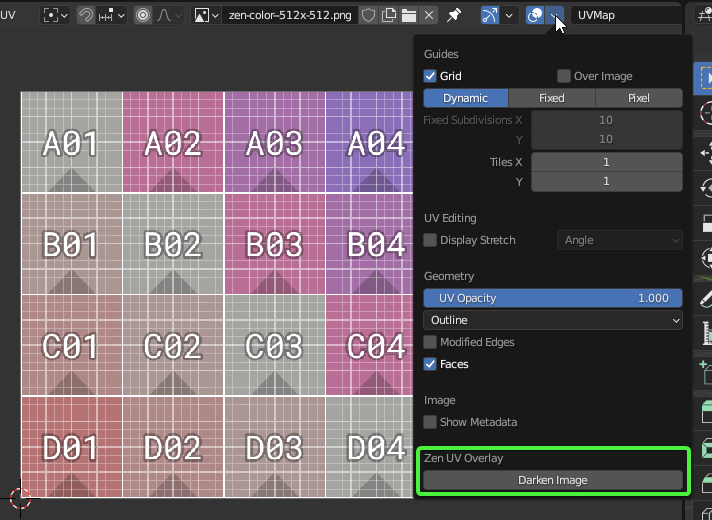
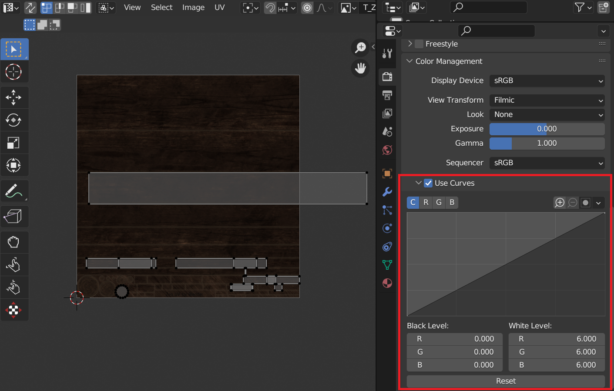

# Combo Panel

Combo Panel is a place where you can find all Zen UV operators.
Operators are divided into thematic sections on the left side.

The set of operators in the Combo Panel may vary depending on the context. 
Some operators do not work in UV Editor and present in 3D Viewport only.

It's on the N-Panel and you can [**customize the appearance of panels in Preferences**](preferences.md#panels).

!!! tip
    Watch the video explaining how **Combo Panels** works.

    

    <iframe src="https://www.youtube.com/embed/f9meGzMGx2k?start=26&end=142" style="position: absolute; top: 0; left: 0; width: 100%; height: 100%;" allowfullscreen="" seamless="" frameborder="0"></iframe>
    

## Multiple Panels

Open multiple panels with `SHIFT + LMB`.

## Panels Pinning

Pin some panels with `CTRL + LMB`

## Combo Panel in Properties

When Zen UV Transform Tool is active you can find Combo Panel in Properties.

## Popup Combo Panel

Combo Panel is the same in N-Panel and Pop-up menu  `Shift + U`.
You can call this menu anywhere.

!!! tip
    Don't forget to drink some good beer today!

# Pie Menu

## Operators

### Quadrify | Relax 

- `Default` — [**Quadrify Islands**](transform.md#quadrify-islands). Straighten rectangular-shaped Islands.
- `CTRL` — [**Relax**](transform.md#relax). Relax Selected Islands.
- `SHIFT` — [**Hotspot Mapping**](). Map Islands by matching Islands to predefined Trims from Trimsheet.
  
### Zen Unwrap | Pack 

- `Default` — [**Zen Unwrap**](unwrap.md#zen-unwrap). Unwrap by Marked edges. If you have selected edges or faces they will be Marked as Seams and/or Sharp Edges and Unwrapped after.
- `ALT` — [**Pack Islands**](pack.md#pack-islands). Pack Islands by chosen Pack Engine.
- `SHIFT` — [**Zen UV Transform Tool**](). Move, Rotate, Scale, Fit, Align and Flip Islands in 3D View and UV Editor using Zen UV Gizmo.

### Checker | Finished 

- `Default` — [**Checker Texture (Toggle)**](checker.md#checker-texture). Add/Remove Checker Texture to/from the mesh.
- `ALT` — [**Display Stretch Map**](checker.md#stretched). Display an angle-based stretching map.
- `CTRL` — [**Display Finished**](unwrap.md#display-finished-toggle). Display Finished Islands (Toggle).

### Unmark | Tag Unfinished 

- `Default` — [**Unmark**](unwrap.md#unmark). Unmark selected edges or face borders as Seams and/or Sharp edges.
- `ALT` — [**Unmark All**](unwrap.md#unmark-all). Remove all Seams and/or Sharp edges from the mesh.
- `CTRL` — [**Tag Unfinished**](unwrap.md#tag-unfinished). Tag selected Islands as Unfinished.

### Mark | Tag Finished 

- `Default` — [**Mark**](unwrap.md#mark). Mark selected edges or face borders as Seams and/or Sharp edges.
- `CTRL` — [**Tag Finished**](unwrap.md#tag-finished). Tag selected Islands as Finished. Islands Taged as Finished won't be unwrapped, recommended to Tag manually changed Islands (e.g. Quadrified Islands).

### Select: Islands | Overlapped 

- `Default` — [**Select Islands**](select.md#select-islands). Select Islands by selected edge/face of the Islands.
- `ALT` — [**Select Overlapped Islands**](select.md#select-overlapped).
- `CTRL` — [**Select Flipped Islands**](select.md#select-flipped).
- `SHIFT` — [**Select Similar Islands**](select.md#select-similar).

### Isolate Islands (Toggle)

- `Default` — [**Isolate Islands (Toggle)**](select.md#isolate-islands-toggle). Isolate Islands by selected edge/face of the Islands.

### Mark by Angle

- `Default` — [**Mark by Angle**](unwrap.md#mark-by-angle). Mark edges as Seams and/or Sharp edges by Angle.

---
## Pie Menu Assist

Pie Menu Assist is special help window, which is located below the Pie Menu. There you can find, highlight and execute all the alternative `ALT`, `CTRL`, `SHIFT` Pie Menu commands.

!!! Assist
    If you want to disable Pie Menu Assist, you can do it here **N-Panel** -> **Zen UV** -> **Preferences** -> **Display** -> **Display Pie Assist**.

## Default Shortcut
  Zen UV Pie Menu  --- `Alt + U`

!!! Shortcut
    If you don't like default Pie Menu Shortcut, it can be changed here **Edit** -> **Preferences** -> **Add-ons** -> **Zen UV** -> **Keymap**. Don't forget to change Shortcut for both contexts Mesh and UV Editor.

# Transform Tool

Move, Rotate, Scale, Fit, Align and Flip selected Islands or Faces/Edges/Vertices in 3D Viewport and UV Editor using Zen UV Gizmo.

[**Follow the link**](transform_tool.md#transform-tool) to find more information about Transform Tool.

# Darken Image

**Darken Image** operator is designed to adjust the darkening of an Image in the context of the UV Editor. It does not change the texture but uses color management curve to darken it.

!!! tip
    Watch the video explaining how **Darken Image** works.

    

    <iframe src="https://www.youtube.com/embed/f9meGzMGx2k?start=156&end=180" style="position: absolute; top: 0; left: 0; width: 100%; height: 100%;" allowfullscreen="" seamless="" frameborder="0"></iframe>
    

You can find this operator in UV Editor Overlay.

!!! Warning
    This option affects on current render settings. Do not forget to switch it off before rendering.