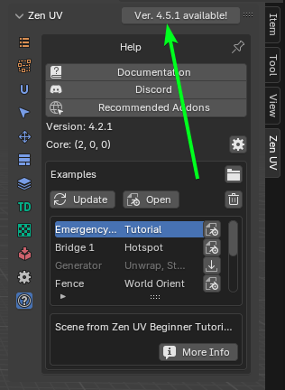
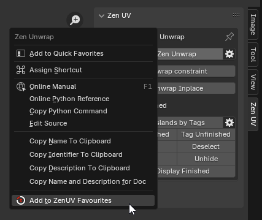
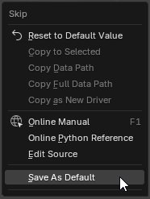
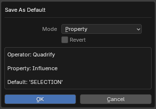

# Combo Panel

Combo Panel is a place where you can find all Zen UV operators.
Operators are divided into thematic sections on the left side.

The set of operators in the Combo Panel may vary depending on the context. 
Some operators do not work in UV Editor and present in 3D Viewport only.

It's on the N-Panel and you can [**customize the appearance of panels in Preferences**](preferences.md#panels).

!!! tip
    Watch the video explaining how **Combo Panels** works.

    

    <iframe src="https://www.youtube.com/embed/f9meGzMGx2k?start=26&end=142" style="position: absolute; top: 0; left: 0; width: 100%; height: 100%;" allowfullscreen="" seamless="" frameborder="0"></iframe>
    

## Multiple Panels

Open multiple panels with `SHIFT + LMB`.

## Panels Pinning

Pin some panels with `CTRL + LMB`

## Combo Panel in Properties

When Zen UV Transform Tool is active you can find Combo Panel in Properties.

## Popup Combo Panel

Combo Panel is the same in N-Panel and Pop-up menu  `Shift + U`.
You can call this menu anywhere.

!!! tip
    Don't forget to drink some good beer today!

---
## Update reminder

Reminds you that a new version has been released and you can update the addon.

---
# Pie Menu

## Pie Menu interaction

To use alternative commands in the Pie Menu, use a quick keypress. Avoid holding the Pie Menu hotkey for too long. Follow these steps:

Quick keypress:

- Press and immediately release the hotkey to open the Pie Menu.
- The Pie Menu will stay on the screen, and you can perform alternate actions using modifier keys (Ctrl, Alt, Shift).
- To do this, press a modifier key and then click the desired option in the Pie Menu.

If you press and hold the hotkey for just over 1 second, the Pie Menu will automatically close once you release it, unless you hover over a section.

## Operators

### Quadrify | Relax 

- `Default` — [**Quadrify Islands**](transform.md#quadrify-islands). Straighten rectangular-shaped Islands.
- `CTRL` — [**Relax**](transform.md#relax). Relax Selected Islands.
- `SHIFT` — [**Hotspot Mapping**](). Map Islands by matching Islands to predefined Trims from Trimsheet.
  
### Zen Unwrap | Pack 

- `Default` — [**Zen Unwrap**](unwrap.md#zen-unwrap). Unwrap by Marked edges. If you have selected edges or faces they will be Marked as Seams and/or Sharp Edges and Unwrapped after.
- `ALT` — [**Pack Islands**](pack.md#pack-islands). Pack Islands by chosen Pack Engine.
- `SHIFT` — [**Zen UV Transform Tool**](). Move, Rotate, Scale, Fit, Align and Flip Islands in 3D View and UV Editor using Zen UV Gizmo.

### Checker | Finished 

- `Default` — [**Checker Texture (Toggle)**](checker.md#checker-texture). Add/Remove Checker Texture to/from the mesh.
- `CTRL` — [**Display Finished**](unwrap.md#display-finished-toggle). Display Finished Islands (Toggle).
- `ALT` — [**Display Stretch Map**](checker.md#stretched). Display an angle-based stretching map.

### Unmark | Tag Unfinished 

- `Default` — [**Unmark**](unwrap.md#unmark). Unmark selected edges or face borders as Seams and/or Sharp edges.
- `CTRL` — [**Tag Unfinished**](unwrap.md#tag-unfinished). Tag selected Islands as Unfinished.
- `ALT` — [**Unmark All**](unwrap.md#unmark-all). Remove all Seams and/or Sharp edges from the mesh.

### Mark | Tag Finished 

- `Default` — [**Mark**](unwrap.md#mark). Mark selected edges or face borders as Seams and/or Sharp edges.
- `CTRL` — [**Tag Finished**](unwrap.md#tag-finished). Tag selected Islands as Finished. Islands Taged as Finished won't be unwrapped, recommended to Tag manually changed Islands (e.g. Quadrified Islands).

### Select: Islands | Overlapped 

- `Default` — [**Select Islands**](select.md#select-islands). Select Islands by selected edge/face of the Islands.
- `CTRL` — [**Select Flipped Islands**](select.md#select-flipped).
- `ALT` — [**Select Overlapped Islands**](select.md#select-overlapped).
- `SHIFT` — [**Select Similar Islands**](select.md#select-similar).

### Isolate Islands (Toggle)

- `Default` — [**Isolate Island (Toggle)**](select.md#isolate-islands-toggle). Isolate Islands by selected edge/face of the Islands.
- `CTRL` - [**Isolate Part (Toggle)**](select.md#isolate-part-toggle). Isolate mesh part by selected edge/face of the mesh.

### Mark by Angle

- `Default` — [**Mark by Angle**](unwrap.md#mark-by-angle). Mark edges as Seams and/or Sharp edges by Angle.

---
## Pie Menu Assist

Pie Menu Assist is special help window, which is located below the Pie Menu. There you can find, highlight and execute all the alternative `ALT`, `CTRL`, `SHIFT` Pie Menu commands.

!!! Assist
    If you want to disable Pie Menu Assist, you can do it here **N-Panel** -> **Zen UV** -> **Preferences** -> **Display** -> **Display Pie Assist**.
    Or in the **Addon Preferences** -> **UI tab**.

---
## Default Shortcut
  Zen UV Pie Menu  --- `Alt + U`

!!! Shortcut
    If you don't like default Pie Menu Shortcut, it can be changed here **Edit** -> **Preferences** -> **Add-ons** -> **Zen UV** -> **Keymap**. Don't forget to change Shortcut for both contexts Mesh and UV Editor.

---
# Progress Bar

**Progress Bar** is designed to display the progress of the operator execution process. Not all operators use the **Progress Bar**, only those that require complex calculations. On some operating systems of the **Linux** family, the **Progress Bar** can cause Blender to crash. To avoid this situation, you can disable the Progress Bar in [**Panel - Preferences - Display Progress Bar.**](preferences.md/#display)

---
# Transform Tool

Move, Rotate, Scale, Fit, Align and Flip selected Islands or Faces/Edges/Vertices in 3D Viewport and UV Editor using Zen UV Gizmo.

[**Follow the link**](transform_tool.md#transform-tool) to find more information about Transform Tool.

---

# Touch Tool

**Zen Touch Tool** is a universal UV transformation tool that provides fast and intuitive control over moving, scaling, and rotating UV islands in the UV Editor. It allows for quick and easy execution of both basic and advanced transformations.

[**Follow the link**](touch_tool.md#zen-touch-tool) to find more information about Transform Tool.

---

# Darken Image

**Darken Image** operator is designed to adjust the darkening of an Image in the context of the UV Editor. It does not change the texture but uses color management curve to darken it.

!!! tip
    Watch the video explaining how **Darken Image** works.

    

    <iframe src="https://www.youtube.com/embed/f9meGzMGx2k?start=156&end=180" style="position: absolute; top: 0; left: 0; width: 100%; height: 100%;" allowfullscreen="" seamless="" frameborder="0"></iframe>
    

You can find this operator in UV Editor Overlay.

!!! Warning
    This option affects on current render settings. Do not forget to switch it off before rendering.

---
### Right menu assist

- **Right Menu Assist** - Enables or disables the 'Add to ZenUV Favorites' option in the right-click menu.

||
|---|
|Right Menu Assist|

---
### Save As Default Operator Properties

Starting from **Zen UV 4.5.2**, the ability to save default properties for certain operators has been introduced. This feature allows you to customize operators to your preferences and eliminates the need to adjust them every time you restart **Blender**.

|Operators that support saving default properties|  
|---|  
|[Zen Unwrap](unwrap.md/#zen-unwrap)|  
|[Quadrify](transform.md/#quadrify-islands)|  

**How to Set Default Properties**

1. Run the operator normally.
2. Locate the property you want to save as default.
3. Adjust the property to the desired value.
4. Hover the mouse over the property.
5. Right-click on the property.
6. From the context menu, select **Save As Default**.  
   
7. In the confirmation dialog that appears, click **OK**.
8. Restart Blender to apply the saved default settings.

!!! Properties
    

- **Mode** - Defines what to save.
    - **Property** - Save only active property.
    - **Active Operator** - Save all properties of the active operator.
    - **All Operators** - Save default values of all available operators.
- **Revert** - Revert to the initial state as it was deployed with the addon.

