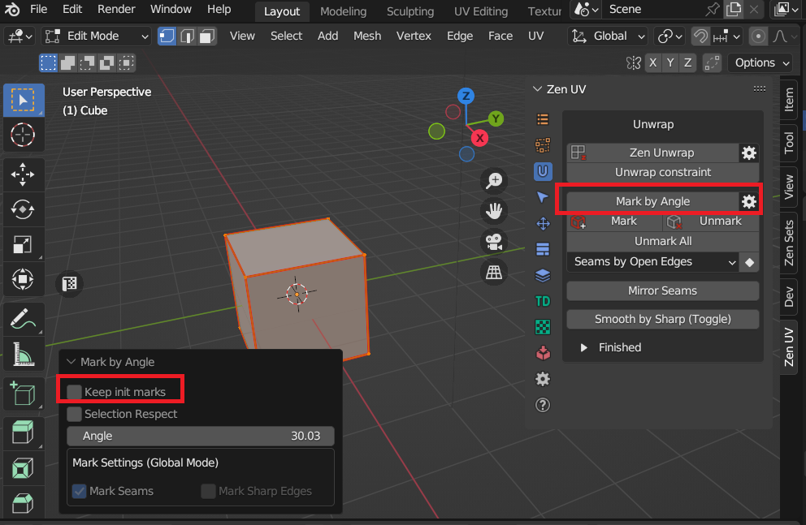
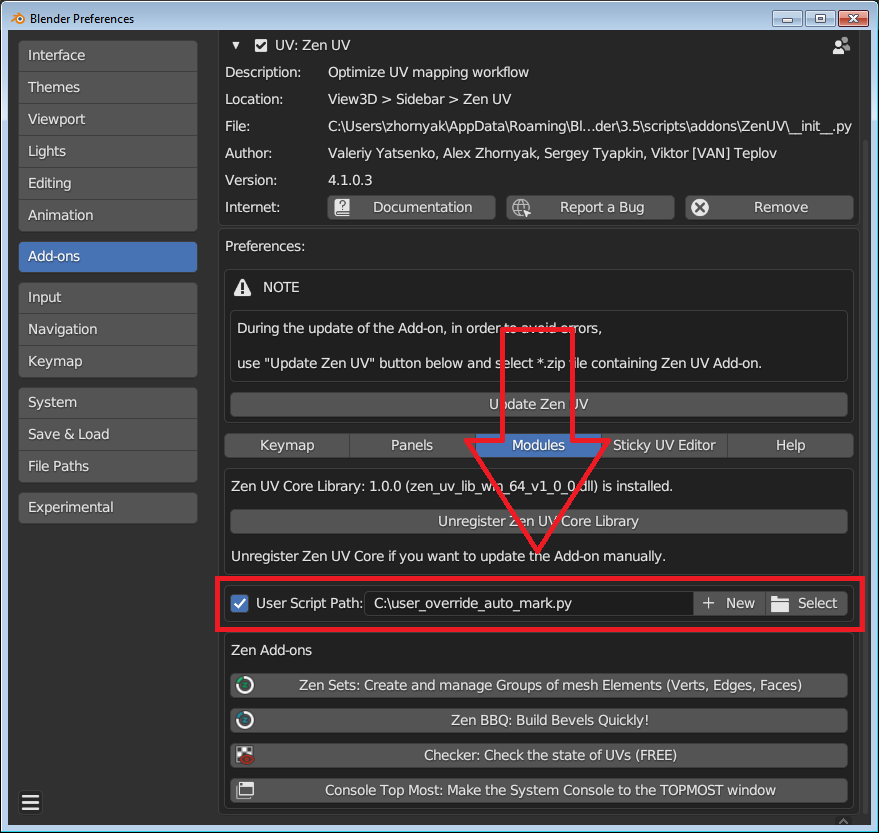
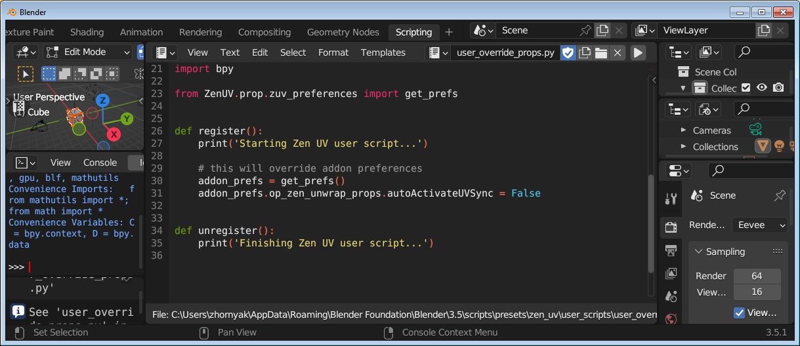

# User Script

## Prerequisites
Since the addon has grown to a large size, the question has arisen that there are many operator values, addon settings, etc., which different users need with different values. Also there are cases when user needs some other UI placement or re-ordering.

|  |
|---|
| **Mark by Angle operator example** |

There is a default `Keep init marks = False` operator value. The users' opinions on the initial value of this operator were divided: some wanted it to be set by default, others removed. From one side we could put this property to the addon preferences but this is only one example from one hundred of operators. It will be pretty unreadable and redundant to put everything into preferences. Previously the only option in such cases was to correct the source code everytime after addon has been released. But now we would like to present an option to execute user python code after addon was loaded

## Structure
User script must be a valid Python script with the corresponding Blender API and must have at least exactly two functions: `register` and `unregister`. Function `register` is called after ZenUV addon will be fully loaded and `unregister` function is called before ZenUV addon is unloaded.

|  |
|---|

## Declaration
User script could be placed everywhere in your PC filesystem. In the addon preferences you should select the file and enable the checkbox.

!!! Note
    We only recommend to use the place somewhere outside of the addon folder because it will be overwritten with every upgrade of the addon

|  |
|---|

## Creation
You can create your script by yourself or ask developers in [the discord support](https://discord.gg/wGpFeME) (it is free for licensed users)

- Press `New` button and select a template

|  |
|---|

- Switch to `Scripting` workspace and edit the selected template

|  |
|---|

- Restart Blender application when your script is finished
  